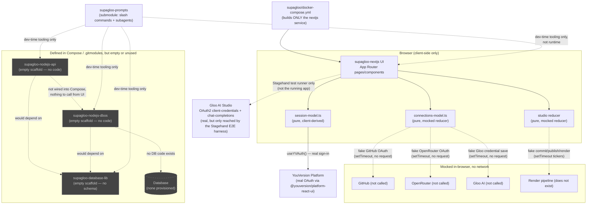
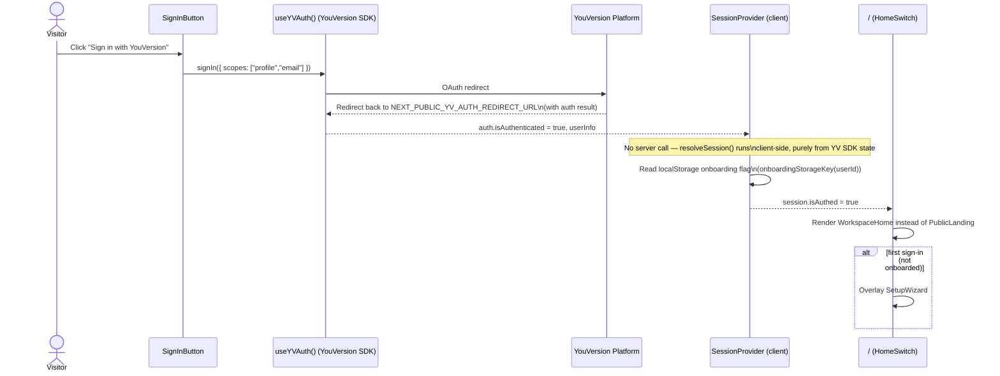
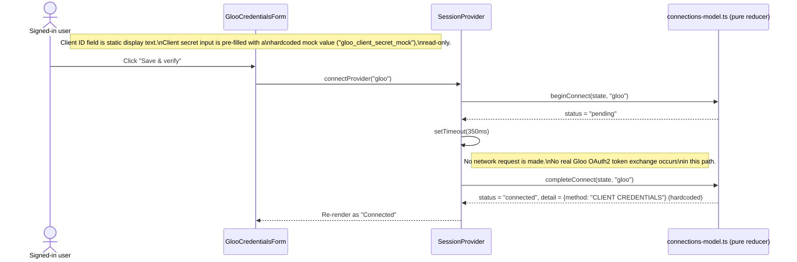
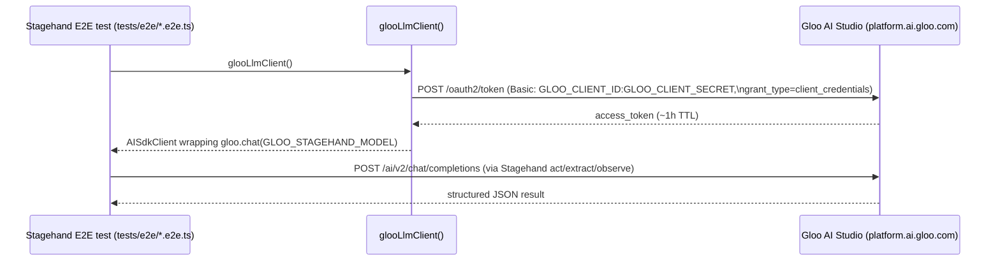
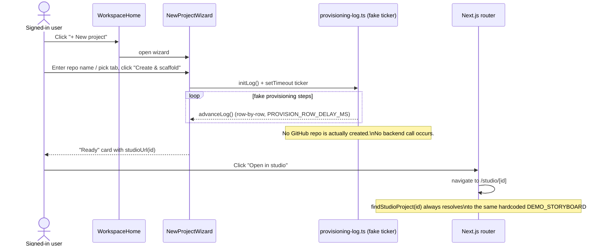
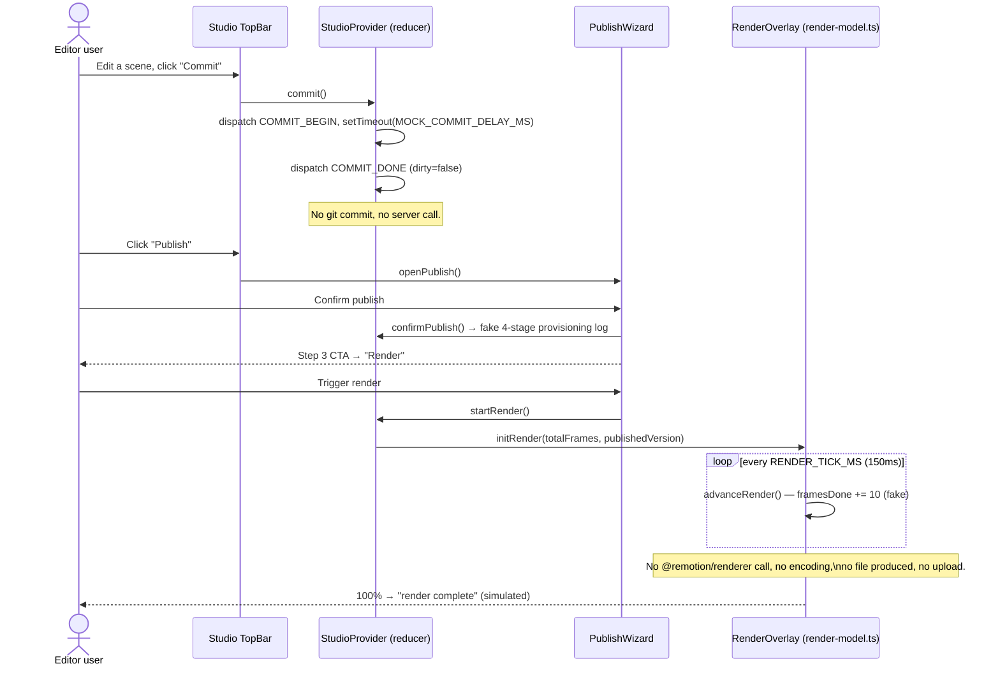

# Supagloo — Current System Design

*Generated 2026-07-17. Describes the system AS IT EXISTS TODAY in the code, not the intended end state.*

## 1. Overview

Supagloo is meant to be a Scripture-based video generator/editor: sign in with
YouVersion, connect GitHub / OpenRouter / Gloo AI Studio, describe or pick a
verse, and get a storyboarded, narrated, scored short video you can edit and
publish. The intended architecture is a Next.js UI backed by a Node.js CRUD
API, a DBOS durable-execution layer for long-running AI/render jobs, and a
shared Prisma/Zod database library — all orchestrated locally via Docker
Compose and deployed to Railway.

**Maturity today: a single, richly-built, entirely frontend-mocked prototype.**

- `supagloo-nextjs` is a real, deployed (https://supagloo.com/) Next.js 16 app
  with a large, well-tested UI: landing page, real YouVersion sign-in, an
  onboarding wizard, a workspace, a project wizard, and a Remotion-preview
  video studio.
- Every *data* behavior behind that UI — connecting GitHub/OpenRouter/Gloo,
  creating/importing projects, editing a storyboard, committing, publishing,
  rendering — is a **pure client-side mock**: in-memory reducers, `setTimeout`
  fake latency, and one hardcoded demo storyboard. There are no API routes, no
  database, no queue, no render pipeline.
- `supagloo-database-lib`, `supagloo-nodejs-api`, and `supagloo-nodejs-dbos`
  are **empty scaffolding** — repos with only a README/LICENSE/`.claude`
  config and submodule wiring, no source code.
- `supagloo` (this repo) wires the submodules together and runs only the
  Next.js container via Docker Compose; the API and DBOS services are not
  wired into Compose because they don't have anything to run yet.
- `supagloo-prompts` holds the Claude Code slash-command workflow
  (`/code`, `/design`) and subagent definitions (`tech-lead`,
  `fabulous-tech-lead`) that drive development across all repos — it's
  process tooling, not application code.

## 2. Repo Inventory

### 2.1 `supagloo-prompts` — shared prompts library (submodule everywhere)

- Git submodule embedded in `supagloo`, `supagloo-nextjs`,
  `supagloo-database-lib`, `supagloo-nodejs-api`, `supagloo-nodejs-dbos`.
- `code.md` — the **`/code` workflow**: an 18-step gated pipeline (spawn
  subagents to gather current-design/design-delta/plan context in parallel →
  tech-lead plans TDD → tech-lead writes failing tests → user approval gate →
  tech-lead implements → revision-review loop → mark task done in
  `docs/plan.md` → open/merge PRs per changed repo in dependency order,
  triggering Railway deploys).
- `design.md` — the **`/design` workflow**: this is the 10-step process this
  very task is Step 1 of (current-design → Claude-Design-project pull →
  design-delta → commit → plan.md → revision-review loop → commit).
- `recode.md`, `redesign.md` — **empty files** (0 bytes); presumably
  placeholders for re-entrant variants of the above, not yet written.
- `.claude/agents/tech-lead.md`, `fabulous-tech-lead.md` — hands-on
  architect/coder subagent personas (Opus vs. a faster engine) shared across
  repos via a memory store.
- `.claude/commands/release.md` — a `/release` slash command.

### 2.2 `supagloo` — Docker Compose orchestration root (this repo)

- Pure orchestration repo: no application code of its own.
- `.gitmodules` wires in four submodules: `supagloo-nextjs`,
  `supagloo-nodejs-api`, `supagloo-nodejs-dbos`, `supagloo-prompts`.
- `docker-compose.yml` defines **one service**: `nextjs`, building
  `./supagloo-nextjs/Dockerfile` and mapping host `8000` → container `3000`.
  The API and DBOS services are **not** defined in Compose at all yet — the
  README explicitly says so.
- `docs/` existed but was empty prior to this task (this file is the first
  doc written into it).
- `README.md` accurately describes the intended 3-app architecture
  (UI → API → DBOS) but that data flow does not exist in code yet (see §4/§5).

### 2.3 `supagloo-database-lib` — Prisma & Zod types (intended)

- **Effectively empty scaffolding.** Contents: `README.md` (one line),
  `LICENSE`, `.claude/agents`, `.claude/commands`, `.gitignore`, `docs/`
  (empty), and a `supagloo-prompts` submodule.
- No `package.json`, no `prisma/schema.prisma`, no source directory, no
  migrations, no exported types of any kind.
- Also embedded as a nested submodule inside `supagloo-nodejs-api` and
  `supagloo-nodejs-dbos` (same empty state there).

### 2.4 `supagloo-nextjs` — Next.js UI (the fleshed-out project)

**Stack**: Next.js 16.2 (App Router), React 19, Tailwind CSS 4, TypeScript,
Vitest (unit + e2e), Stagehand v3 (AI-driven E2E browser testing).
Dependencies of note: `@youversion/platform-core` /
`@youversion/platform-react-ui` (real YouVersion auth SDK), `@remotion/player`
+ `remotion` (client-side video **preview** only — no `@remotion/renderer`,
`@remotion/lambda`, or `@remotion/cli`), `@ai-sdk/openai` + `@browserbasehq/stagehand`
(used only to drive Gloo-backed LLM calls for E2E test automation, not by the
running app).

`CLAUDE.md`/`AGENTS.md` are almost entirely **Stagehand testing framework
docs** (how to init Stagehand, wire Gloo AI Studio as its LLM backend via
OAuth2 client-credentials, use `act`/`extract`/`observe`/`agent`) plus a short
Next.js 16 "read the docs, don't trust training data" note — they are not a
project architecture overview.

**Pages/flows that exist** (`app/`):
- `/` (`app/page.tsx`) — branches at render time (via `HomeSwitch`, a client
  component) between `PublicLanding` (signed-out, SSR'd for SEO) and
  `WorkspaceHome` (signed-in). No server-side session check — the branch is
  entirely client-resolved after mount.
- `/profile` — connections/profile page; redirects to `/` if not signed in or
  mid-first-onboarding.
- `/studio` and `/studio/[id]` — the video editor (storyboard tree, scene
  inspector, timeline, player panel via `@remotion/player`, top bar with
  Commit/Publish/version-history/render menus).
- Onboarding: a 5-step first-sign-in wizard (`welcome → github → openrouter →
  gloo → done`) that overlays the workspace once, gated by a `hasOnboarded`
  flag.
- Project creation: "New project" wizard (create-new-repo / use-existing-empty-repo
  tabs) and "Import repo" wizard, both driving a fake provisioning/verification
  log then landing in `/studio/[id]`.
- Connect flows/modals for GitHub, OpenRouter, and Gloo AI (client-secret
  paste form).

**No API routes exist** (`app/**/route.ts` — none found) and **no
middleware/proxy** — confirmed by search. All "backend" behavior is
client-side.

**Auth/session mechanism actually wired up**:
- Real integration: `@youversion/platform-react-ui`'s `YouVersionProvider`
  (`app/providers.tsx`) + `useYVAuth()` hook drive real YouVersion OAuth
  sign-in (`signIn({ scopes: ["profile","email"] })` in `sign-in-button.tsx`).
  Requires `YV_APP_KEY` (throws at layout render if unset) and
  `NEXT_PUBLIC_YV_AUTH_REDIRECT_URL`.
- Session state (`lib/session/session-model.ts`, `session-provider.tsx`) is
  derived **entirely client-side** from `useYVAuth()` — there is no server
  session, no cookie, no JWT issued by Supagloo itself.
- "Has onboarded" is a `localStorage` stopgap keyed by YouVersion user id
  (`onboardingStorageKey`), not persisted server-side.
- A flag-gated **mock-session seam** exists purely for Stagehand E2E testing:
  when `NEXT_PUBLIC_SUPAGLOO_DEMO === "1"`, a `?mock=<scenario>` query param
  forces a deterministic signed-in session (`authed-fresh` /
  `authed-returning` / `authed-unlinked`) with a canned demo user, bypassing
  real OAuth (which Stagehand can't complete). Hard no-op when the flag is
  unset (prod).

**Connections (GitHub / OpenRouter / Gloo) are fully mocked**
(`lib/connections/connections-model.ts`): a pure, immutable in-memory reducer
with `connected` / `not-linked` / `pending` states. "Connecting" is
`beginConnect` → `pending`, then a caller-owned `setTimeout`
(`MOCK_OAUTH_DELAY_MS = 350ms`) calls `completeConnect` → `connected`, filling
in **hardcoded fake detail** (e.g. GitHub username `@ashsrinivas`, a fake
masked OpenRouter key). No network calls, no real OAuth redirect for any of
these three providers from the running app.

**Gloo AI Studio integration that IS real** (`lib/gloo/llm-client.ts`): a
working OAuth2 client-credentials token exchange
(`POST https://platform.ai.gloo.com/oauth2/token`) and a chat-completions
client (`platform.ai.gloo.com/ai/v2`) — but this is used **only to power the
Stagehand E2E test harness's own LLM calls** (`act`/`extract`/`observe`
during automated browser testing), gated by `GLOO_CLIENT_ID` /
`GLOO_CLIENT_SECRET` / `GLOO_STAGEHAND_MODEL` env vars. It is not invoked by
the in-app "Connect Gloo AI" flow, which is the mocked credentials-paste form
described above.

**Studio/editor state** (`lib/studio/*`): a large, well-unit-tested pure
reducer (`reducer.ts`, 276 lines + 300-line test) covering scene selection,
edits, commit, publish, version history, and render — but every project
(`lib/studio/project.ts`) resolves to the **same single hardcoded
`DEMO_STORYBOARD`**, differing only in id/name/repo/version-branch. Commit,
Publish, and Render are all `setTimeout`-driven fakes:
- `commit()` — flips a `committing` flag, clears `dirty` after a delay.
- Publish wizard — a 4-stage fake provisioning log.
- Render (`lib/studio/render-model.ts`) — a fake frame counter ticking toward
  a total with a 4-stage checklist ("Bundled composition", "Synthesized
  narration & music", "Encoding video", "Upload & finalize share link"); no
  actual encoding happens.

**Testing**: extensive Vitest unit tests co-located with almost every `lib/`
module, plus Stagehand-driven `.e2e.ts` specs in `tests/e2e/` covering
landing, onboarding wizard, project wizards, studio, studio-publish, and
workspace/profile — all exercised against the mock-session seam, not real
YouVersion OAuth.

**Deploy**: multi-stage `Dockerfile` (Node 22-alpine, `npm run build` with
`YV_APP_KEY`/`NEXT_PUBLIC_YV_AUTH_REDIRECT_URL` build args) — this is the
image the root `supagloo` Compose file and Railway both build from the
`main` branch (README claims live CI/CD to Railway at supagloo.com).

### 2.5 `supagloo-nodejs-api` — CRUD API layer (intended)

- **Effectively empty scaffolding**, same shape as `supagloo-database-lib`:
  `README.md`, `LICENSE`, `.claude/agents`, `.claude/commands`,
  `.claudeignore`, `.gitignore`, plus two nested submodules
  (`supagloo-database-lib`, `supagloo-prompts`).
- No `package.json`, no server code, no routes, no Dockerfile — despite the
  root README's claim of a "Dockerfile IaC" for this service.

### 2.6 `supagloo-nodejs-dbos` — DBOS durable-execution layer (intended)

- **Effectively empty scaffolding**, identical shape to `supagloo-nodejs-api`:
  `README.md`, `LICENSE`, `.claude/agents`, `.claude/commands`,
  `.claudeignore`, `.gitignore`, plus the same two nested submodules.
- No DBOS workflows/steps/queues, no `package.json`, no Dockerfile.

## 3. Architecture — Current State

## 4. Sequence Diagrams (as implemented today)

### 4.1 Sign-in flow (real)

### 4.2 "Connect Gloo AI" flow (as built — fully mocked)

For contrast, the **real** Gloo OAuth2 client-credentials exchange that does
exist in the codebase (`lib/gloo/llm-client.ts`) is only ever invoked by the
Stagehand E2E test runner to obtain an LLM for `act`/`extract`/`observe` —
never by this in-app UI flow:

### 4.3 New project → studio flow (mocked)

### 4.4 Studio commit / publish / render (mocked)

## 5. Gaps / Not Yet Implemented

Concrete absences, for the follow-up design-delta task:

- **No database.** `supagloo-database-lib` has no Prisma schema, no models,
  no Zod types, no migrations — it's an unpopulated repo shell. Nothing in
  any repo persists data server-side.
- **No CRUD API.** `supagloo-nodejs-api` has no `package.json` or source —
  zero HTTP endpoints exist anywhere in the system (confirmed: no
  `app/**/route.ts` in Next.js either).
- **No DBOS durable-execution layer.** `supagloo-nodejs-dbos` has no
  workflows/steps/queues/code at all — the README's "queues DBOS jobs for
  LLM calls" data flow is aspirational only.
- **No real OAuth for GitHub, OpenRouter, or Gloo AI Studio from the running
  app.** All three "Connect" flows are pure client-side reducers with
  `setTimeout` fake latency and hardcoded success data; no redirect, no
  token exchange, no credential storage occurs. (The one real Gloo OAuth2
  flow in the codebase powers only the Stagehand E2E test harness, not the
  product UI.)
- **No server-side session.** Auth state lives entirely in the browser via
  the YouVersion SDK's client state + a `localStorage` onboarding flag; there
  is no Supagloo-issued cookie/JWT and no session store.
- **No rendering pipeline.** Only `@remotion/player` (playback preview) is
  present; there's no `@remotion/renderer`/lambda/CLI, no encoding, no
  storage/upload of rendered video. "Render" in the UI is a fake progress
  ticker.
- **No real projects/storyboards.** Every `/studio/[id]` route resolves to
  one hardcoded `DEMO_STORYBOARD`; "New project" and "Import repo" never
  touch GitHub or any backend — they run a fake log and hand back a
  synthetic id.
- **No AI script/image/music generation.** Nothing in the UI calls an LLM,
  image model, or music model to actually generate content; the only working
  LLM call path (`lib/gloo/llm-client.ts`) exists solely to power AI-driven
  browser testing (Stagehand `act`/`extract`/`observe`), not product
  features.
- **No scripture/YouVersion content API usage.** No calls to a YouVersion
  scripture/Bible-content API were found — only the auth SDK is integrated.
- **Docker Compose only runs the UI.** `supagloo-nodejs-api` and
  `supagloo-nodejs-dbos` services are not defined in `docker-compose.yml` (no
  Dockerfiles exist for them yet either).
- **CI/CD gap vs. README claims.** The root README says API/DBOS deploy to
  Railway with "Dockerfile IaC," but neither repo has a Dockerfile or any
  deployable code; only `supagloo-nextjs` has a working `Dockerfile` and live
  deployment (supagloo.com).
- **`recode.md` / `redesign.md` in `supagloo-prompts` are empty** — the
  re-entrant code/design workflows they're presumably meant to define don't
  exist yet.
- **No inter-service wiring exists to describe.** The intended
  UI → API → DBOS → DB request chain in the root README is entirely
  prospective; today the UI is a closed, self-contained client app.
