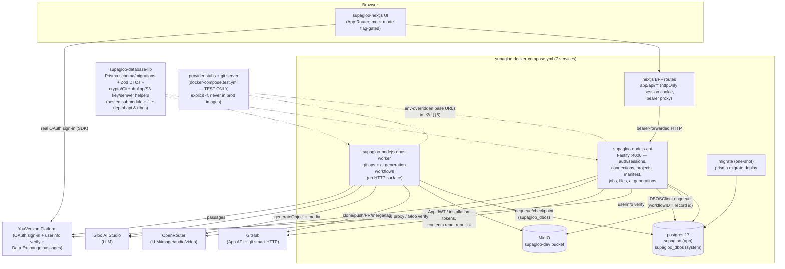
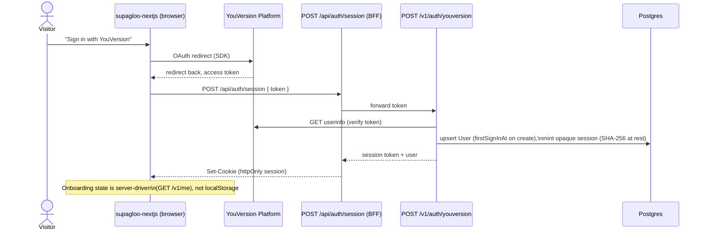

# Supagloo — Current System Design

*Generated 2026-07-17; wholesale refresh 2026-07-22. Describes the system AS IT
EXISTS TODAY in the code, not the intended end state.*

## 1. Overview

Supagloo is a Scripture-based video generator/editor: sign in with YouVersion,
connect GitHub / OpenRouter / Gloo AI Studio, describe or pick a passage, and
get a storyboarded, narrated, scored short video you can edit and publish. The
architecture is a Next.js UI (with a BFF layer) backed by a Node.js CRUD API, a
DBOS durable-execution worker for long-running git-ops/AI jobs, and a shared
Prisma/Zod database library — orchestrated locally via Docker Compose and
deployed to Railway.

**Maturity today: a real, working full-stack system through AI generation;
rendering and the gallery are not built yet.** Per `docs/plan.md`'s task table,
tasks 1–34 (milestones M1–M5's backend, and M4's UI wiring) are done; tasks
35–54 are not.

What is REAL and working end to end today:

- **Infra**: Compose runs Postgres 17 (two logical DBs: `supagloo` app +
  `supagloo_dbos` system), MinIO (S3 parity), a one-shot Prisma `migrate`
  service, the Fastify API, the DBOS worker, and the Next.js app — 7 services.
- **Database**: a full Prisma schema + migrations in `supagloo-database-lib`
  (User/Session/connections/Project/ProjectVersion/RenderJob/AiGeneration/
  GalleryItem/GalleryUpvote/ProjectJob), plus shared Zod schemas, AES-256-GCM
  secret crypto, GitHub App JWT helpers, S3 key helpers, and a CI-checkable
  exact Prisma-version pin.
- **API**: real auth/sessions (opaque DB-backed tokens, SHA-256 at rest),
  GitHub App / OpenRouter / Gloo connections (secrets encrypted at rest),
  projects/versions CRUD, manifest read, job creation + polling, S3 presigned
  downloads, and the 4 AI-generation endpoints.
- **DBOS worker**: all four git-ops workflows (scaffold / import / commit /
  publish — real clone/push/PR/merge/tag against git), all four AI-generation
  workflows (script/storyboard, image, audio narration+music, video with
  durable submit-then-poll), and a Remotion template/manifest→code generator.
- **UI**: sign-in/session, onboarding, all three connect flows, workspace +
  project wizards, studio hydration from the real manifest, commit, publish,
  and version history are wired to the real backend (a flag-gated mock mode
  remains for pure-UI tests).

What is genuinely NOT built yet (see §6): the render pipeline/API/UI, the
gallery, the studio's AI-generation controls (the backend endpoints exist; the
UI doesn't call them), the cleanup workflow, prod deploy wiring for api/dbos,
CI of any kind, and a set of code-review-surfaced hardening follow-ups.

## 2. Repo Inventory

### 2.1 `supagloo-prompts` — shared prompts library (submodule everywhere)

- Git submodule embedded in `supagloo`, `supagloo-nextjs`,
  `supagloo-nodejs-api`, `supagloo-nodejs-dbos`, `supagloo-database-lib`.
- Workflow prompts: `design.md` (the `/design` process this doc is maintained
  by), `designtocode.md` (design→implementation), `fix-code.md`, `redesign.md`
  (re-entrant design; now a real prompt, no longer an empty placeholder).
- `.claude/agents/` — `tech-lead.md` / `fabulous-tech-lead.md` personas plus
  the shared `tech-lead-memory/` store used across repos.
- `.claude/commands/release.md` — the `/release` slash command.
- Dev-time process tooling only; never runs in any deployed service.

### 2.2 `supagloo` — Compose orchestration root + shared e2e harness (this repo)

- `.gitmodules` wires four submodules: `supagloo-nextjs`,
  `supagloo-nodejs-api`, `supagloo-nodejs-dbos`, `supagloo-prompts`.
  (`supagloo-database-lib` is NOT a root submodule — it is nested inside the
  api and dbos repos, which consume it as a `file:` dependency.)
- `docker-compose.yml` defines **seven services**:
  - `postgres` (postgres:17-alpine) — `infra/pg-init` creates both logical
    DBs: `supagloo` (app) and `supagloo_dbos` (DBOS system).
  - `minio` + one-shot `minio-init` (creates the `supagloo-dev` bucket).
  - one-shot `migrate` — runs `prisma migrate deploy` from the api image
    (db-lib's schema/migrations ship inside it); `api` and `dbos` wait on it.
  - `api` (Fastify, host :4000) and `dbos` (worker, **no ports** — work
    arrives only via DBOSClient enqueue against the system DB). Both require
    the same `SECRETS_ENCRYPTION_KEY` (64-hex; decryption fails if they
    drift) and share S3 config with dual endpoints (`S3_ENDPOINT` internal,
    `S3_PUBLIC_ENDPOINT` for host-consumable presigned URLs).
  - `nextjs` (host 8000 → container 3000).
- `docker-compose.test.yml` — an **explicit-`-f`-only** test overlay adding
  the five provider-stub services and pointing the `api` service's provider
  base URLs at them (see §5). Never merged into a plain `docker compose up`.
- A gitignored `docker-compose.override.yml` redirects api/dbos build contexts
  at sibling checkouts to build in-flight code before submodule bumps.
- Root test harness: `tests/{unit,e2e,stubs,support}` + split Vitest configs —
  stack smoke tests, the stub-harness self-tests, and the stub server sources.
- `docs/` — this file, `design-delta.md`, `plan.md`, review artifacts.

### 2.3 `supagloo-database-lib` — shared Prisma + Zod library (real)

Consumed as a nested submodule + `file:` dependency by api and dbos.

- `prisma/schema.prisma` + migrations: `User`, `Session`, `GithubConnection`
  (stores `installationId` only — never a token), `OpenRouterConnection` /
  `GlooConnection` (1:0..1 per user, ciphertext secret columns), `Project`
  (composite unique `(ownerId, slug)`, soft delete), `ProjectVersion`,
  `RenderJob`, `AiGeneration` (incl. `providerJobId`), `GalleryItem`,
  `GalleryUpvote`, `ProjectJob` (staged git-ops jobs), plus status/kind enums.
- `src/`: AES-256-GCM `encryptSecret`/`decryptSecret`; domain Zod schemas
  (`ProjectManifestSchema` — translation is a free string, any
  YouVersion-licensed translation, KJV/BSB as defaults; storyboard/spec
  schemas; all API wire DTOs); GitHub App JWT signing +
  `mintInstallationToken`; S3 key-layout helpers; real-semver helpers; the
  ProjectJob stage catalogue; the API↔DBOS workflow-name/queue contract; and
  the exported `PRISMA_VERSION` pin + `check-prisma-version` CLI (consumers
  must pin the exact Prisma version; CI enforcement itself is task 44, not
  done).
- No render/gallery-specific logic yet beyond the schema rows.

### 2.4 `supagloo-nextjs` — Next.js UI + BFF (wired to the real backend)

**Stack**: Next.js 16.2 (App Router), React 19, Tailwind 4, TypeScript,
Vitest, Stagehand v3 (AI-driven browser e2e), `@remotion/player` (preview
only), `@youversion/platform-react-ui` (real YouVersion OAuth sign-in).

**BFF layer (real API routes now exist)** — `app/api/**/route.ts`:
`auth/session` (verifies the YouVersion token with the API, sets an httpOnly
session cookie), a generic bearer-forwarding proxy to the API, `me`,
`connections`, `connect/{github,openrouter,gloo}` (+ callbacks), `github`
(repo listing), `projects` (create / create-repo JIT user-auth hop / import /
`[id]` manifest·commit·publish·jobs·versions), and a double-gated `test` seam.

**Flows wired to the real stack**: sign-in → server session (no more
client-only session; onboarding state is server-driven, `localStorage` flag
retired); GitHub App install (popup + poll); OpenRouter browser-side PKCE →
key POST; Gloo save-&-verify form with live error surfacing; profile page with
masked key + live credits; workspace project grid, create/import wizards with
a provisioning log rendered from polled real `ProjectJob.stages`;
create-new-repo's JIT GitHub user-auth redirect; studio hydration from
`GET /v1/projects/:id` + Zod-parsed manifest (bidirectional
manifest⇄storyboard adapter); commit → real `POST …/commit` + job polling;
publish wizard → real `POST …/publish` with stage polling; version-history
dropdown from `GET …/versions`.

**Still mocked / not wired in the UI**: the studio's AI-generation controls
("→ AI" script, reroll visual, narrator/music) do not call
`POST /v1/ai/generations` (task 35); the render overlay is still the fake
frame-ticker (`render-model.ts`, task 38); there is no gallery UI (task 41).
A flag-gated mock mode (`NEXT_PUBLIC_SUPAGLOO_DEMO` + `?mock=`) keeps the
original all-client demo behavior for pure-UI regression specs; real-stack
Stagehand specs use the extended `?seed=` seam instead (§5).

**Deploy**: multi-stage Dockerfile; Railway builds `main` and serves
https://supagloo.com/ (the UI is the only deployed service today).

### 2.5 `supagloo-nodejs-api` — Fastify CRUD API (real)

Fastify (CJS, node:22-slim) with the zod type provider and a Zod-validated env
loader; consumes db-lib via nested submodule + `file:` dep. Routes (all under
`/v1` except `/healthz`):

- **Auth/sessions**: `POST /v1/auth/youversion` (verifies the token against a
  YouVersion userinfo endpoint, upserts User, mints an opaque session token —
  SHA-256 at rest, sliding expiry), bearer plugin, `GET /v1/me`,
  `PATCH /v1/me/onboarding`, `POST /v1/auth/signout`, and a flag-gated
  `POST /v1/test/seed` (hard-404 unless `NODE_ENV !== 'production'` AND
  `SUPAGLOO_ENABLE_TEST_SEED=1`; seeds Users + session tokens only).
- **Connections**: GitHub App install-url/callback/disconnect + repo listing
  (fresh installation token per request; only `installationId` stored);
  `POST /v1/connections/openrouter` (encrypts + stores the posted key,
  `keyLast4` for display — **no server-side verify**; PKCE happens in the
  browser) + live `GET …/credits` proxy; `PUT /v1/connections/gloo`
  (**verify-then-store**: mints a real client-credentials token before
  writing); merged `GET /v1/connections`.
- **Projects**: grid list, get/rename/soft-delete, versions list,
  `POST /v1/projects` (create + scaffold enqueue) / `…/import`, per-project
  409 git-ops concurrency guard, job polling (`stages` JSON),
  `GET …/manifest?ref=` (synchronous GitHub Contents read + Zod parse),
  commit/publish endpoints, create-new-repo JIT user-token exchange.
- **Files**: `GET /v1/files/presign-download` (ownership-scoped, signs against
  `S3_PUBLIC_ENDPOINT`).
- **AI generations**: `POST /v1/ai/generations` (kind-specific input schemas +
  kind→provider compatibility matrix → 422 before row creation), get/list,
  API-authoritative cancel.

The API never runs the DBOS runtime — it enqueues via `DBOSClient`
(`workflowID` = domain-record id, e.g. jobId) against `DBOS_DATABASE_URL`.
Because Railway can't init submodules, the Dockerfile git-clones db-lib at a
pinned `DATABASE_LIB_REF` ARG (a guardrail test keeps it in lockstep with the
submodule pointer).

### 2.6 `supagloo-nodejs-dbos` — DBOS durable-execution worker (real)

Same skeleton conventions as the api (env loader, Dockerfile, db-lib nested
submodule). Statically-registered workflows only (registered before
`DBOS.launch()`; queues `git-ops`, `ai-generation`, `render` declared in a
single `registry.ts` source of truth). Two DBs: app rows via `DATABASE_URL`,
checkpoints/queues in `supagloo_dbos` via `DBOS_DATABASE_URL`. No HTTP surface.

- **Git-ops workflows** (all start by minting a short-lived installation
  token; all stage-writes idempotent under replay):
  `scaffoldProjectWorkflow` (clone → write Remotion scaffold → commit v0.0.0 →
  PR + merge → cut working v0.0.1 → finalize), `importProjectWorkflow`
  (verify a repo is a Supagloo project, typed non-retryable failure),
  `commitVersionWorkflow` (shallow clone → `applyManifest` regeneration →
  commit+push with jobId-trailer idempotency), `publishVersionWorkflow`
  (merge working→main via PR, tag `v<semver>`, cut next working branch —
  patch-bump of the highest existing version).
- **AI-generation workflows**: `generateScriptWorkflow` (optional YouVersion
  passage fetch → AI SDK `generateObject` with a bounded schema-repair loop;
  every attempt checkpointed), `generateImageWorkflow` (first real S3 write;
  fetch+upload as ONE step so bytes are never checkpointed),
  `generateAudioWorkflow` (narration TTS + music, byte-stream handling),
  `generateVideoClipWorkflow` (async submit — `providerJobId` persisted in the
  same step — then a durable ~30s-sleep poll loop, download, upload; the
  design's flagship crash/replay case: resume never re-submits).
- **Provider layer** (`src/providers/`): per-run credential decrypt (inside
  steps, never checkpointed), AI SDK wrapper (OpenRouter `/api/v1`, Gloo
  `/ai/v2`, `maxRetries: 0` so DBOS owns retry), plain-`fetch` media client,
  model-discovery helpers with TTL cache (no hardcoded model ids — lint-test
  enforced), Gloo token minting, and the YouVersion Data Exchange client
  (see §5 — its route shapes are unverified against the live API).
- **Remotion generator** (`src/remotion/`): pure manifest→source generator
  (deterministic, idempotent; the manifest is the sole source of truth —
  regeneration overwrites scene sources); e2e-verified with a real
  `@remotion/bundler` bundle. **No `@remotion/renderer` usage yet** — the
  render workflow is task 36 (not done).

## 3. Architecture — Current State



All provider base URLs default to the **real** hosts in both services' env
loaders (`https://openrouter.ai`, `https://platform.ai.gloo.com`,
`https://api.youversion.com`, `https://api.github.com` / `https://github.com`)
— "real-by-default ⇒ prod needs zero config". Only test setup overrides them
(§5). Per-user OpenRouter/Gloo credentials live encrypted in Postgres rows,
never in env config.

## 4. Sequence Diagrams (as implemented today)

### 4.1 Sign-in → server session (real)



### 4.2 Create project → scaffold workflow (real git-ops)

```mermaid
sequenceDiagram
    actor U as Signed-in user
    participant UI as NewProjectWizard
    participant API as supagloo-nodejs-api
    participant DB as Postgres
    participant W as dbos worker (git-ops queue)
    participant GH as GitHub (App API + git)

    opt create-new-repo path
        UI->>GH: JIT user-auth redirect (zero-storage\ntoken hop, API-side exchange) → repo created
    end
    UI->>API: POST /v1/projects (via BFF)
    API->>DB: create Project + ProjectJob\n(409 if a git-ops job is already in flight)
    API->>DB: DBOSClient.enqueue(scaffoldProjectWorkflow,\nworkflowID = jobId)
    W->>GH: mint installation token → verify repo access
    W->>GH: clone → write Remotion scaffold →\ncommit v0.0.0 → push → PR → merge →\ncut working branch v0.0.1
    W->>DB: idempotent stage writes; finalize\nProject/ProjectVersion rows
    loop poll
        UI->>API: GET /v1/projects/:id/jobs/:jobId
        API-->>UI: stages JSON → provisioning log rows
    end
    UI-->>U: land in /studio/[slug]
```

### 4.3 AI generation — video clip (real backend; UI wiring is task 35)

```mermaid
sequenceDiagram
    participant C as Caller (HTTP; the studio UI\ndoes NOT call this yet — task 35)
    participant API as POST /v1/ai/generations
    participant DB as Postgres
    participant W as dbos worker (ai-generation queue)
    participant OR as OpenRouter
    participant S3 as MinIO/S3

    C->>API: { kind: video, provider: openrouter, input }
    API->>API: kind-specific Zod input +\nkind→provider matrix (422 before any row)
    API->>DB: create AiGeneration; enqueue\n(workflowID = generation id)
    W->>DB: load request; decrypt the user's\nOpenRouter key INSIDE the step
    W->>OR: submit video job (202) —\nproviderJobId persisted in the SAME step
    loop durable poll (~30s DBOS.sleep, bounded)
        W->>OR: GET job status
    end
    W->>OR: download completed clip
    W->>S3: upload under projects/{id}/assets/…
    W->>DB: persist resultAssetKey → succeeded
    Note over W: Crash/replay between submit and completion\nresumes polling — the submit step is memoized,\nnever re-executed (exactly-once submission)
    C->>API: GET /v1/ai/generations/:id (poll)
```

Script/image/audio follow the same enqueue-and-poll shape; script adds an
optional YouVersion passage fetch and a bounded LLM schema-repair loop (every
attempt checkpointed), and all media workflows fetch+upload bytes in a single
step so raw bytes are never checkpointed.

### 4.4 Studio commit / publish (real)

```mermaid
sequenceDiagram
    actor U as Editor
    participant UI as Studio
    participant API as supagloo-nodejs-api
    participant W as dbos worker
    participant GH as GitHub

    U->>UI: edit scenes (manifest⇄storyboard adapter)
    U->>UI: Commit
    UI->>API: POST /v1/projects/:id/commit { manifest, message }
    API->>W: enqueue commitVersionWorkflow
    W->>GH: shallow clone working branch →\napplyManifest (regenerate scene sources) →\ncommit + push (jobId-trailer idempotency)
    W-->>UI: (via polled ProjectJob stages) done;\nProjectVersion updated in place

    U->>UI: Publish
    UI->>API: POST /v1/projects/:id/publish { message }
    API->>W: enqueue publishVersionWorkflow
    W->>GH: commit pending → PR working→main →\nmerge → tag v<semver> → cut next working\nbranch (patch-bump of highest version)
    W-->>UI: stages mirror the publish wizard;\nversion states flip working→published,\nnew working version created
```

## 5. Testing & E2E Conventions — provider stubs (current practice)

This section documents how testing actually works today. The governing policy
is stated in `docs/plan.md` §1 ("Test strategy"): provider egress in e2e is
deterministic — all outbound provider base URLs are env-overridable and
pointed at the provider-stub harness — and **"Live-provider smoke tests are
manual/optional, never part of the gating suite."** Every gating e2e suite in
every repo runs against stubs, never the real YouVersion/Gloo/OpenRouter/
GitHub APIs.

### 5.1 Layered test strategy (as practiced)

- **Unit**: Vitest in every repo, co-located, network/DB mocked.
- **db-lib e2e**: real migrations + generated client against Compose Postgres.
- **api e2e**: real HTTP against a running API + Compose Postgres/MinIO, with
  provider egress at the stubs.
- **dbos e2e**: real `DBOSClient` enqueue (workflowID = record id) to
  completion against the real system DB + app DB + MinIO, including
  crash/replay tests (kill worker mid-workflow, restart, assert no duplicated
  side effects — verified via stub call counts).
- **nextjs UI e2e**: Stagehand v3 (browser AI testing; its own LLM is Gloo via
  client-credentials) — mock-mode specs for pure-UI regressions, plus
  real-stack specs that obtain a real session via the seed seam. Playwright is
  not used; non-UI e2e never uses a browser.

### 5.2 The provider-stub harness (plan task 9)

`docker-compose.test.yml` (explicit `-f` only; stubs never ship in production
images) adds five services from one shared zero-dependency image
(`tests/stubs`, selected by `STUB_KIND`): `github-stub` (:4801, App-JWT
enforcing), `openrouter-stub` (:4802), `gloo-stub` (:4803), `youversion-stub`
(:4804), and `git-server` (:4805) — a local git smart-HTTP server so
clone/push/PR/merge flows run against *real git*. Stubs serve canned +
stateful responses (PKCE key exchange, async video-job state machine, Bible
passage fixtures), support `/__admin` seeding routes (e.g. programmable chat
scripts, contents), and expose `/__stub/health`, `/__stub/reset`, and a
`/__stub/calls` call-count introspection endpoint that e2e assertions rely on.

### 5.3 How tests force stubs (the base-URL override pattern)

The app itself is **real-by-default**: `supagloo-nodejs-api/src/config/env.ts`
and `supagloo-nodejs-dbos/src/config/env.ts` define every provider base URL
with the real host as the zod `.default()` — only test code redirects egress:

- `docker-compose.test.yml` overrides the `api` service's
  `OPENROUTER_BASE_URL` / `GLOO_BASE_URL` / `YOUVERSION_BASE_URL` /
  `GITHUB_*_BASE_URL` to the in-network stub containers.
- Both backend repos' `tests/e2e/global-setup.ts` bring the stub containers up
  as a prerequisite and default every provider var to its localhost stub port
  (`process.env.X_STUB_URL ?? "http://localhost:480N"`).
- The e2e specs themselves (`supagloo-nodejs-api/tests/e2e/auth.e2e.ts`,
  `supagloo-nodejs-dbos/tests/e2e/{generate-*,providers}.e2e.ts`) hardcode the
  same fallback and pass stub URLs explicitly into client constructors;
  `providers.e2e.ts` goes further and asserts in `beforeAll` that
  `env.OPENROUTER_BASE_URL` literally equals the stub URL.

### 5.4 Known couplings and gaps in the stub convention (facts, not proposals)

These are load-bearing properties of today's test suite that any future change
to provider-testing policy would have to contend with:

1. **Credential seeding bypasses the real connect flows.** The DBOS workflow
   e2e tests fabricate provider credentials by calling
   `prisma.openRouterConnection.create()` directly with
   `encryptSecret("sk-or-test-key", …)` — the real OpenRouter connect path
   (browser PKCE; the API stores without server-side verification) and the
   real Gloo path (verify-then-store, which mints a live token before writing
   a row) are never exercised in dbos e2e. The flag-gated `POST /v1/test/seed`
   (api only; requires BOTH `NODE_ENV !== 'production'` AND
   `SUPAGLOO_ENABLE_TEST_SEED=1`) seeds only Users + session tokens — nothing
   about provider connections — and no seed route exists in dbos at all.
2. **Two YouVersion contracts are unverified against the live API.** The Data
   Exchange client (`supagloo-nodejs-dbos/src/providers/youversion.ts`)
   carries an explicit ROUTE-SHAPE DISCREPANCY comment: three sources disagree
   on the real API's paths, none verifiable from the dev environment, so the
   client is deliberately built to the STUB's routes
   (`/data-exchange/v1/bibles`, `/data-exchange/v1/passages`) "so the e2e is
   real and passes", to be reconciled when app licensing is wired. The API's
   userinfo verifier (`supagloo-nodejs-api/src/auth/youversion.ts`,
   `GET /auth/v1/userinfo`) is likewise self-described as an invented
   contract. Real interactive YouVersion OAuth is a browser login flow and is
   not automatable in the e2e harness — `auth.e2e.ts` tests session/bearer
   mechanics via the stub plus the seed bypass, never real OAuth.
3. **The flagship crash/replay test depends on stub-only introspection.**
   `generateVideoClipWorkflow`'s exactly-once-submit-across-crash/replay e2e
   (task 34) proves no-re-submission by reading the openrouter-stub's
   `/__stub/calls` `videoJobsCreated` counter, keyed on the `Idempotency-Key`
   header. Real OpenRouter has no such introspection endpoint, and there is no
   confirmation the real video endpoint honors `Idempotency-Key` the way the
   stub does.
4. **No CI exists in any of the five repos** (no `.github/workflows`
   anywhere), so there is no secrets-into-CI story. Live-API key placeholders
   were added to `.env.example` files (`OPENROUTER_E2E_TEST_API_KEY`,
   `GLOO_CLIENT_ID`/`GLOO_CLIENT_SECRET`, `YOUVERSION_APP_KEY`) but only
   `YOUVERSION_APP_KEY` is wired into any code (optional header on the Data
   Exchange client). Naming caveat: in `supagloo-nextjs`,
   `GLOO_CLIENT_ID`/`GLOO_CLIENT_SECRET` configure **Stagehand's own LLM**
   (test-harness AI), an unrelated collision with the app's per-user Gloo
   connections.

## 6. Gaps / Not Yet Implemented

Per `docs/plan.md` (tasks 35–54 not done):

- **Studio AI wiring (35).** The `/v1/ai/generations` endpoints and all four
  workflows are real, but the studio's generation controls ("→ AI" script,
  reroll visual, narrator voice, music bed) do not call them yet.
- **Render pipeline (36–38).** No `renderWorkflow`, no `@remotion/renderer`
  usage, no render API endpoints; the UI render overlay is still the fake
  frame-ticker. `RenderJob` exists only as a schema row.
- **Gallery (39–41).** No gallery endpoints, upvotes, or UI; `GalleryItem` /
  `GalleryUpvote` exist only as schema rows.
- **Cleanup workflow (42).** No scheduled orphaned-asset / expired-session
  purge.
- **Ops/hardening (43–47).** Boot-time env hardening incomplete; Prisma-pin
  CI enforcement not wired (no CI exists at all); render load/perf validation
  not run; **api/dbos are not deployed** (Railway serves only the Next.js
  app; task 46 is the prod wiring); the full golden-path acceptance run
  doesn't exist.
- **Code-review-surfaced follow-ups (48–54)**, deliberately deferred:
  installation-token plaintext in DBOS step checkpoints (48); repo-creation
  TOCTOU race — no DB constraint backs the one-repo-one-project check (49);
  git-ops merge-sha fallback + ProjectJob/DBOS status reconciliation (50);
  GitHub install-callback CSRF/state-nonce (51); connect-flow UX/e2e polish
  (52); wizard robustness — untested inline state machines, no repo-creation
  compensation, client-guessed studio slug (53); publish sends a static
  hardcoded string as the real PR body (54).
- **Live-provider verification.** By policy (§5), nothing in the gating
  suites talks to the real YouVersion/Gloo/OpenRouter APIs; the two invented
  YouVersion contracts and the video `Idempotency-Key` assumption remain
  unverified against the live services.
