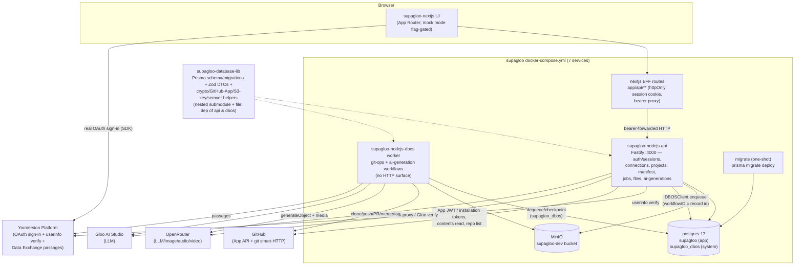
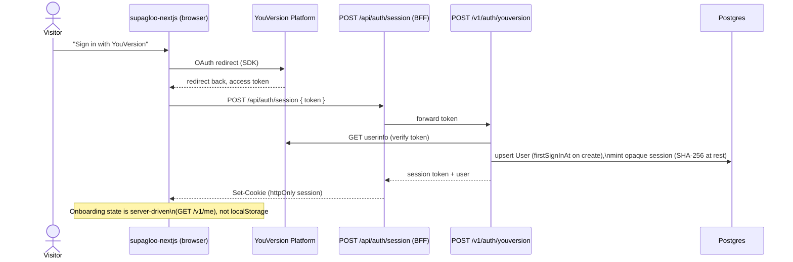

# Supagloo — Current System Design

*Generated 2026-07-17; wholesale refresh 2026-07-22; §5 rewritten wholesale
2026-07-25 (design-delta §11 / plan task 62) with the §1/§2/§3/§4/§6 staleness it
depended on; **gallery + DBOS-lane-isolation pass 2026-07-26** (plan rows 39/40/41
shipped, so ten "the gallery does not exist" assertions were false; the api/dbos e2e
lanes gained a per-lane DBOS system schema, closing the "stop the Compose `dbos`
container" precondition). Describes the system AS IT EXISTS TODAY in the code, not
the intended end state.*

## 1. Overview

Supagloo is a Scripture-based video generator/editor: sign in with YouVersion,
connect GitHub / OpenRouter / Gloo AI Studio, describe or pick a passage, and
get a storyboarded, narrated, scored short video you can edit and publish. The
architecture is a Next.js UI (with a BFF layer) backed by a Node.js CRUD API, a
DBOS durable-execution worker for long-running git-ops/AI jobs, and a shared
Prisma/Zod database library — orchestrated locally via Docker Compose and
deployed to Railway.

**Maturity today: a real, working full-stack system through AI generation,
rendering **and the public gallery**.** Per `docs/plan.md`'s task table, tasks 1–41
plus 57, 58 and 62–68 are done — milestones M1–M6 in full. Everything from 42 on
(M7: cleanup workflow, boot hardening, CI, load validation, api/dbos deploy,
golden-path acceptance) is not.

What is REAL and working end to end today:

- **Infra**: Compose runs Postgres 17 (two logical DBs: `supagloo` app +
  `supagloo_dbos` system), MinIO (S3 parity), a one-shot Prisma `migrate`
  service, the Fastify API, the DBOS worker, and the Next.js app — 7 services.
- **Database**: a full Prisma schema + migrations in `supagloo-database-lib`
  (User/Session/connections/Project/ProjectVersion/RenderJob/AiGeneration/
  GalleryItem/GalleryUpvote/ProjectJob), plus shared Zod schemas, AES-256-GCM
  secret crypto, GitHub App JWT helpers, S3 key helpers, and a CI-checkable
  exact Prisma-version pin.
- **API**: real auth/sessions (opaque DB-backed tokens, SHA-256 at rest),
  GitHub App / OpenRouter / Gloo connections (secrets encrypted at rest),
  projects/versions CRUD, manifest read, job creation + polling, S3 presigned
  downloads, the 4 AI-generation endpoints, the render endpoints, and the
  **gallery endpoints** (publish / public listing with three sorts + book filter +
  search + cursors / single-item detail / stream-url presign / upvotes / delete).
- **DBOS worker**: all four git-ops workflows (scaffold / import / commit /
  publish — real clone/push/PR/merge/tag against **real github.com**), all four
  AI-generation workflows (script/storyboard, image, audio narration+music,
  video with durable submit-then-poll), a Remotion template/manifest→code
  generator, and `renderWorkflow` (real `@remotion/renderer` encode → mp4 +
  thumbnail in S3).
- **UI**: sign-in/session, onboarding, all three connect flows, workspace +
  project wizards, studio hydration from the real manifest, the studio's
  AI-generation controls, commit, publish, version history, and the 14c render
  overlay are wired to the real backend (a flag-gated mock mode remains for
  pure-UI tests). The **public `/gallery` grid**, the **`/gallery/[id]` watch
  page** and **"Your videos"** are wired to the real gallery endpoints.
- **Testing**: every e2e lane in every repo runs against the **real** providers —
  YouVersion, Gloo, OpenRouter **and GitHub**. There are no provider stubs left
  (§5). Since 2026-07-26 the fourteen e2e lanes that boot an in-process DBOS
  runtime each own a **per-lane DBOS system schema**, so they no longer require
  the Compose `dbos` container to be stopped (§5.4 item 9).

What is genuinely NOT built yet (see §6): the cleanup workflow, prod deploy
wiring for api/dbos, CI of any kind, a set of code-review-surfaced hardening
follow-ups, and two *designed but deliberately out-of-scope* gallery screens
(Turn 17a's creator profile and Turn 17b's three moderation states).

## 2. Repo Inventory

### 2.1 `supagloo-prompts` — shared prompts library (submodule everywhere)

- Git submodule embedded in `supagloo`, `supagloo-nextjs`,
  `supagloo-nodejs-api`, `supagloo-nodejs-dbos`, `supagloo-database-lib`.
- Workflow prompts: `design.md` (the `/design` process this doc is maintained
  by), `designtocode.md` (design→implementation), `fix-code.md`, `redesign.md`
  (re-entrant design; now a real prompt, no longer an empty placeholder).
- `.claude/agents/` — `tech-lead.md` / `fabulous-tech-lead.md` personas plus
  the shared `tech-lead-memory/` store used across repos.
- `.claude/commands/release.md` — the `/release` slash command.
- Dev-time process tooling only; never runs in any deployed service.

### 2.2 `supagloo` — Compose orchestration root + shared e2e harness (this repo)

- `.gitmodules` wires four submodules: `supagloo-nextjs`,
  `supagloo-nodejs-api`, `supagloo-nodejs-dbos`, `supagloo-prompts`.
  (`supagloo-database-lib` is NOT a root submodule — it is nested inside the
  api and dbos repos, which consume it as a `file:` dependency.)
- `docker-compose.yml` defines **seven services**:
  - `postgres` (postgres:17-alpine) — `infra/pg-init` creates both logical
    DBs: `supagloo` (app) and `supagloo_dbos` (DBOS system). **Still exactly
    two, verified 2026-07-26**: the e2e lane isolation added that day works by
    SCHEMA (`dbos_e2e_*` siblings of `dbos`) *inside* `supagloo_dbos`, precisely
    so this sentence stays true — `psql -c "select datname from pg_database"`
    returns `postgres, supagloo, supagloo_dbos, template0, template1` and no
    third database was created (§5.4 item 9).
  - `minio` + one-shot `minio-init` (creates the `supagloo-dev` bucket).
  - one-shot `migrate` — runs `prisma migrate deploy` from the api image
    (db-lib's schema/migrations ship inside it); `api` and `dbos` wait on it.
  - `api` (Fastify, host :4000) and `dbos` (worker, **no ports** — work
    arrives only via DBOSClient enqueue against the system DB). Both require
    the same `SECRETS_ENCRYPTION_KEY` (64-hex; decryption fails if they
    drift) and share S3 config with dual endpoints (`S3_ENDPOINT` internal,
    `S3_PUBLIC_ENDPOINT` for host-consumable presigned URLs).
  - `nextjs` (host 8000 → container 3000).
- `docker-compose.test.yml` — an **explicit-`-f`-only** **test-enablement**
  overlay. It stubs nothing (the five stub services are deleted); it carries the
  api's `NODE_ENV: development` + `SUPAGLOO_ENABLE_TEST_SEED: "1"` test-seed
  gates and its MinIO `S3_*` wiring (see §5.2). Never merged into a plain
  `docker compose up`.
- A gitignored `docker-compose.override.yml` redirects api/dbos build contexts
  at sibling checkouts to build in-flight code before submodule bumps.
- Root test harness: `tests/{unit,e2e,support}` + split Vitest configs — stack
  smoke tests (including a DBOS-worker boot proof), the shared real-GitHub e2e
  harness and repo-naming module in `tests/support/` (§5.2), and the guards that
  keep stubs from creeping back. `tests/stubs/` is **deleted**.
- `scripts/cleanup-e2e-repos.mjs` (`npm run cleanup:github-e2e`) — the
  interactive, archive-only reclamation path for e2e fixture repos (§5.3).
- `docs/` — this file, `design-delta.md`, `plan.md`, review artifacts.

### 2.3 `supagloo-database-lib` — shared Prisma + Zod library (real)

Consumed as a nested submodule + `file:` dependency by api and dbos.

- `prisma/schema.prisma` + migrations: `User`, `Session`, `GithubConnection`
  (stores `installationId` only — never a token), `OpenRouterConnection` /
  `GlooConnection` (1:0..1 per user, ciphertext secret columns), `Project`
  (composite unique `(ownerId, slug)`, soft delete), `ProjectVersion`,
  `RenderJob`, `AiGeneration` (incl. `providerJobId`), `GalleryItem`,
  `GalleryUpvote`, `ProjectJob` (staged git-ops jobs), plus status/kind enums.
- `src/`: AES-256-GCM `encryptSecret`/`decryptSecret`; domain Zod schemas
  (`ProjectManifestSchema` — translation is a free string, any
  YouVersion-licensed translation, KJV/BSB as defaults; storyboard/spec
  schemas; all API wire DTOs); GitHub App JWT signing +
  `mintInstallationToken`; S3 key-layout helpers; real-semver helpers; the
  ProjectJob stage catalogue; the API↔DBOS workflow-name/queue contract; and
  the exported `PRISMA_VERSION` pin + `check-prisma-version` CLI (consumers
  must pin the exact Prisma version; CI enforcement itself is task 44, not
  done).
- **Gallery logic now exists beyond the schema rows**: `GalleryItemSchema` /
  `PublishGalleryItemRequestSchema` / the listing + cursor DTOs, the
  `scriptureBook` derivation contract, and (since `525ae49`, released as
  `f608951` on 2026-07-26) **`GalleryItem.makingOf`** — a `jsonb` publish-time
  manifest snapshot with a `version: 1` literal in `GalleryMakingOfSchema`, plus
  the `GalleryItemDetailDto` the watch page reads. Both api and nextjs carry
  committed pin bumps to `f608951` (`a360c07`, `2d6f5ae`).

### 2.4 `supagloo-nextjs` — Next.js UI + BFF (wired to the real backend)

**Stack**: Next.js 16.2 (App Router), React 19, Tailwind 4, TypeScript,
Vitest, Stagehand v3 (AI-driven browser e2e), `@remotion/player` (preview
only), `@youversion/platform-react-ui` (real YouVersion OAuth sign-in).

**BFF layer (real API routes now exist)** — `app/api/**/route.ts`:
`auth/session` (verifies the YouVersion token with the API, sets an httpOnly
session cookie), a generic bearer-forwarding proxy to the API, `me`,
`connections`, `connect/{github,openrouter,gloo}` (+ callbacks), `github`
(repo listing), `projects` (create / create-repo JIT user-auth hop / import /
`[id]` manifest·commit·publish·jobs·versions), `renders` (`[id]`, `[id]/cancel`,
`[id]/download`, `[id]/gallery`), `ai/generations`, `files/presign-download`,
the **gallery** group (`gallery`, `gallery/[id]`, `gallery/[id]/stream-url`,
`gallery/[id]/upvote`), and a double-gated `test` seam. `GET /api/gallery/[id]`
was deliberately absent while no detail page existed; Turn 16a's watch page is
that page, so the handler was re-added on 2026-07-26 — the original comment
named its own reversal condition.

**Flows wired to the real stack**: sign-in → server session (no more
client-only session; onboarding state is server-driven, `localStorage` flag
retired); GitHub App install (popup + poll); OpenRouter browser-side PKCE →
key POST; Gloo save-&-verify form with live error surfacing; profile page with
masked key + live credits; workspace project grid, create/import wizards with
a provisioning log rendered from polled real `ProjectJob.stages`;
create-new-repo's JIT GitHub user-auth redirect; studio hydration from
`GET /v1/projects/:id` + Zod-parsed manifest (bidirectional
manifest⇄storyboard adapter); commit → real `POST …/commit` + job polling;
publish wizard → real `POST …/publish` with stage polling; version-history
dropdown from `GET …/versions`.

**Also wired since**: the studio's AI-generation controls ("→ AI" script, reroll
visual, narrator/music) call `POST /v1/ai/generations` and poll (task 35); the
14c render overlay polls `GET /api/renders/:id` for real stages, frame counts and
output spec, with cancel, "run in background" and a presigned download link (task
38) — the fake frame-ticker is gone.

**Gallery UI (rows 39–41, plus the 2026-07-26 Turn-16a pass)**: the public,
unauthenticated `/gallery` grid (segmented Most-popular/Newest/Trending sort,
"All books ▾", search, Load more, duration + rank badges, filled/outlined upvote
pills, a sign-in prompt for anonymous voters), `/your-videos` from
`GET /v1/renders?mine=1` with a publish form, and — new on 2026-07-26 —
**`/gallery/[id]`, the watch page**: a server shell with data-driven
`generateMetadata` (no `openGraph.images`, because every image URL here is a
short-lived presign) hosting a mount-gated client island of
`watch-player`/`watch-details`. It renders the 9:16 player, the creator line, the
upvote pill, `↗ Share`, a **disabled** `⑂ Remix this`, and the SCRIPTURE / HOW IT
WAS MADE sections off `GalleryItemDetailDto.makingOf`. `GalleryPlayerModal` was
**deleted** — a card's ▶ now navigates to the page.

Turn **16b**'s real publish dialog is wired too —
`app/_components/gallery/publish-to-gallery-dialog.tsx`, ONE dialog behind a
PROJECT picker, which **deleted** both placeholders (`share-yours-dialog.tsx`
and the inline form in `your-videos-list.tsx`) — as is Turn **17b**'s card 4a,
the `GALLERY · NO RESULTS` empty state. **Still not wired in the UI**: Turn 17a's
creator profile and Turn 17b's other three (moderation) states, both out of scope
by explicit decision — §6. A flag-gated
mock mode (`NEXT_PUBLIC_SUPAGLOO_DEMO` + `?mock=`) keeps the original all-client
demo behavior for pure-UI regression specs — including a mock render ticker —
while real-stack Stagehand specs use the extended `?seed=` seam instead (§5).

**Deploy**: multi-stage Dockerfile; Railway builds `main` and serves
https://supagloo.com/ (the UI is the only deployed service today).

### 2.5 `supagloo-nodejs-api` — Fastify CRUD API (real)

Fastify (CJS, node:22-slim) with the zod type provider and a Zod-validated env
loader; consumes db-lib via nested submodule + `file:` dep. Routes (all under
`/v1` except `/healthz`):

- **Auth/sessions**: `POST /v1/auth/youversion` (verifies the token against a
  YouVersion userinfo endpoint, upserts User, mints an opaque session token —
  SHA-256 at rest, sliding expiry), bearer plugin, `GET /v1/me`,
  `PATCH /v1/me/onboarding`, `POST /v1/auth/signout`, and a flag-gated
  `POST /v1/test/seed` (hard-404 unless `NODE_ENV !== 'production'` AND
  `SUPAGLOO_ENABLE_TEST_SEED=1`; seeds Users + session tokens only).
- **Connections**: GitHub App install-url/callback/disconnect + repo listing
  (fresh installation token per request; only `installationId` stored);
  `POST /v1/connections/openrouter` (encrypts + stores the posted key,
  `keyLast4` for display — **no server-side verify**; PKCE happens in the
  browser) + live `GET …/credits` proxy; `PUT /v1/connections/gloo`
  (**verify-then-store**: mints a real client-credentials token before
  writing); merged `GET /v1/connections`.
- **Projects**: grid list, get/rename/soft-delete, versions list,
  `POST /v1/projects` (create + scaffold enqueue) / `…/import`, per-project
  409 git-ops concurrency guard, job polling (`stages` JSON),
  `GET …/manifest?ref=` (synchronous GitHub Contents read + Zod parse),
  commit/publish endpoints, create-new-repo JIT user-token exchange.
- **Files**: `GET /v1/files/presign-download` (ownership-scoped, signs against
  `S3_PUBLIC_ENDPOINT`; recognises the `render-thumbnail` key kind).
- **AI generations**: `POST /v1/ai/generations` (kind-specific input schemas +
  kind→provider compatibility matrix → 422 before row creation), get/list,
  API-authoritative cancel.
- **Renders**: `POST /v1/projects/:id/renders` (versionId, output spec,
  `runInBackground` as a UI hint), `GET /v1/renders/:id`, `POST /:id/cancel`,
  `GET /v1/renders?mine=1`, `GET /:id/download` (presigned).
- **Gallery** (rows 39/40, extended 2026-07-26): `POST /v1/renders/:id/gallery`
  (owner-only publish — plain CRUD returning **201 with the live item**,
  deliberately not a workflow), `DELETE /v1/gallery/:id`, public
  `GET /v1/gallery?sort=popular|newest|trending&book=&q=&cursor=`,
  `GET /v1/gallery/:id` (`optionalAuth`; now returns `GalleryItemDetailDto` —
  the card DTO widened by `makingOf` and `owner.publicVideoCount`),
  `GET /v1/gallery/:id/stream-url` (short-TTL presign), and
  `POST|DELETE /v1/gallery/:id/upvote` (authed). The publish path builds the
  `makingOf` snapshot from the project manifest at publish time
  (`src/gallery/making-of.ts`) — a **snapshot**, not a page-view manifest read,
  so a watch page never depends on the creator's GitHub repo still existing.
  `viewCount` is persisted but surfaced by **no** endpoint (§6).

The API never runs the DBOS runtime — it enqueues via `DBOSClient`
(`workflowID` = domain-record id, e.g. jobId) against `DBOS_DATABASE_URL`.
Because Railway can't init submodules, the Dockerfile git-clones db-lib at a
pinned `DATABASE_LIB_REF` ARG (a guardrail test keeps it in lockstep with the
submodule pointer).

### 2.6 `supagloo-nodejs-dbos` — DBOS durable-execution worker (real)

Same skeleton conventions as the api (env loader, Dockerfile, db-lib nested
submodule). Statically-registered workflows only (registered before
`DBOS.launch()`; queues `git-ops`, `ai-generation`, `render` declared in a
single `registry.ts` source of truth). Two DBs: app rows via `DATABASE_URL`,
checkpoints/queues in `supagloo_dbos` via `DBOS_DATABASE_URL`. No HTTP surface.
**Still two — confirmed 2026-07-26.** `DBOS.setConfig` now also forwards an
optional `systemDatabaseSchemaName` from `DBOS_SYSTEM_DATABASE_SCHEMA`
(`src/dbos/runtime.ts`), which selects a SCHEMA *inside* `supagloo_dbos`. The key
is **unset in every Compose file**, so the SDK default `"dbos"` is the shipped
configuration and behaviour is byte-identical to before; it exists for the
single-database deployment fallback design-delta §4/§9-Q7b already contemplates,
and the e2e lanes pass a per-lane value explicitly (§5.4 item 9). It is a
production configuration key, not a test hook — see §5.3.

- **Git-ops workflows** (all start by minting a short-lived installation
  token; all stage-writes idempotent under replay):
  `scaffoldProjectWorkflow` (clone → write Remotion scaffold → commit v0.0.0 →
  PR + merge → cut working v0.0.1 → finalize), `importProjectWorkflow`
  (verify a repo is a Supagloo project, typed non-retryable failure),
  `commitVersionWorkflow` (shallow clone → `applyManifest` regeneration →
  commit+push with jobId-trailer idempotency), `publishVersionWorkflow`
  (merge working→main via PR, tag `v<semver>`, cut next working branch —
  patch-bump of the highest existing version).
- **AI-generation workflows**: `generateScriptWorkflow` (optional YouVersion
  passage fetch → AI SDK `generateObject` with a bounded schema-repair loop;
  every attempt checkpointed), `generateImageWorkflow` (first real S3 write;
  fetch+upload as ONE step so bytes are never checkpointed),
  `generateAudioWorkflow` (narration TTS + music, byte-stream handling),
  `generateVideoClipWorkflow` (async submit — `providerJobId` persisted in the
  same step — then a durable ~30s-sleep poll loop, download, upload; the
  design's flagship crash/replay case: resume never re-submits).
- **Provider layer** (`src/providers/`): per-run credential decrypt (inside
  steps, never checkpointed), AI SDK wrapper (OpenRouter `/api/v1`, Gloo
  `/ai/v2`, `maxRetries: 0` so DBOS owns retry), plain-`fetch` media client,
  model-discovery helpers with TTL cache (no hardcoded model ids — lint-test
  enforced), Gloo token minting, and the YouVersion Data Exchange client
  (see §5 — its route shapes are unverified against the live API).
- **Remotion generator** (`src/remotion/`): pure manifest→source generator
  (deterministic, idempotent; the manifest is the sole source of truth —
  regeneration overwrites scene sources); e2e-verified with a real
  `@remotion/bundler` bundle.
- **Render workflow** (`renderWorkflow`, queue `render`, 1/worker — task 36):
  clone at version → `npm ci --ignore-scripts` → download scene assets →
  synthesize narration/music **before** bundling (Remotion snapshots assets at
  bundle time) → `@remotion/bundler` → `@remotion/renderer` (real headless
  Chromium, monotonic `framesDone` progress) → thumbnail → upload
  `renders/{jobId}/output.mp4` + `thumb.jpg` to S3. Bundle and render run in a
  **scrubbed-env child process**; cancel is a DBOS cancel on
  `workflowID = renderJobId`.

## 3. Architecture — Current State

```mermaid
graph TD
    subgraph Browser
        UI["supagloo-nextjs UI\n(App Router; mock mode flag-gated)"]
    end

    subgraph Compose["supagloo docker-compose.yml (7 services)"]
        BFF["nextjs BFF routes\napp/api/** (httpOnly session cookie,\nbearer proxy)"]
        API["supagloo-nodejs-api\nFastify :4000 — auth/sessions,\nconnections, projects, manifest,\njobs, files, ai-generations"]
        DBOS["supagloo-nodejs-dbos worker\ngit-ops + ai-generation workflows\n(no HTTP surface)"]
        PG[("postgres:17\nsupagloo (app)\nsupagloo_dbos (system)")]
        S3[("MinIO\nsupagloo-dev bucket")]
        MIG["migrate (one-shot)\nprisma migrate deploy"]
    end

    DBLib["supagloo-database-lib\nPrisma schema/migrations + Zod DTOs +\ncrypto/GitHub-App/S3-key/semver helpers\n(nested submodule + file: dep of api & dbos)"]

    YV["YouVersion Platform\n(OAuth sign-in + userinfo verify +\nData Exchange passages)"]
    GH["GitHub\n(App API + git smart-HTTP)"]
    OR["OpenRouter\n(LLM/image/audio/video)"]
    Gloo["Gloo AI Studio\n(LLM)"]

    UI --> BFF
    BFF -->|"bearer-forwarded HTTP"| API
    API --> PG
    API --> S3
    API -->|"DBOSClient.enqueue\n(workflowID = record id)"| PG
    DBOS -->|"dequeue/checkpoint\n(supagloo_dbos)"| PG
    DBOS --> S3
    MIG --> PG

    UI -->|"real OAuth sign-in (SDK)"| YV
    API -->|"userinfo verify"| YV
    API -->|"App JWT / installation tokens,\ncontents read, repo list"| GH
    API -->|"credits proxy / Gloo verify"| OR
    API --> Gloo
    DBOS -->|"clone/push/PR/merge/tag"| GH
    DBOS -->|"generateObject + media"| OR
    DBOS --> Gloo
    DBOS -->|"passages"| YV

    DBLib -.-> API
    DBLib -.-> DBOS
```

All provider base URLs default to the **real** hosts in both services' env
loaders (`https://openrouter.ai`, `https://platform.ai.gloo.com`,
`https://api.youversion.com`, `https://api.github.com` / `https://github.com`)
— "real-by-default ⇒ prod needs zero config". The provider-stub harness this
diagram used to carry a `Stubs` node for is deleted in full (§5), and **no lane
overrides a provider base URL** any more — with exactly one deliberate exception,
added by plan row 66 and named so it cannot be mistaken for stub wiring: the api
also takes **`GITHUB_OAUTH_INTERNAL_BASE_URL`**, the SERVER-side half of the
user-authorization host, which the test overlay points at the api itself
(`http://api:4000`) so the containerised api can complete the create-new-repo
code→token hop against its own double-gated test-only route. The PUBLIC
`GITHUB_OAUTH_BASE_URL` — the URL the *browser* opens — is still overridden
nowhere, which is the property that keeps row 62 item (e)'s
`DNS_PROBE_FINISHED_NXDOMAIN` dissolved. Unset, the internal one resolves to the
public one, so production still needs zero config. Per-user OpenRouter/Gloo
credentials live encrypted in Postgres rows, never in env config.

## 4. Sequence Diagrams (as implemented today)

### 4.1 Sign-in → server session (real)

```mermaid
sequenceDiagram
    actor U as Visitor
    participant UI as supagloo-nextjs (browser)
    participant YV as YouVersion Platform
    participant BFF as POST /api/auth/session (BFF)
    participant API as POST /v1/auth/youversion
    participant DB as Postgres

    U->>UI: "Sign in with YouVersion"
    UI->>YV: OAuth redirect (SDK)
    YV-->>UI: redirect back, access token
    UI->>BFF: POST /api/auth/session { token }
    BFF->>API: forward token
    API->>YV: GET userinfo (verify token)
    API->>DB: upsert User (firstSignInAt on create),\nmint opaque session (SHA-256 at rest)
    API-->>BFF: session token + user
    BFF-->>UI: Set-Cookie (httpOnly session)
    Note over UI: Onboarding state is server-driven\n(GET /v1/me), not localStorage
```

### 4.2 Create project → scaffold workflow (real git-ops)

```mermaid
sequenceDiagram
    actor U as Signed-in user
    participant UI as NewProjectWizard
    participant API as supagloo-nodejs-api
    participant DB as Postgres
    participant W as dbos worker (git-ops queue)
    participant GH as GitHub (App API + git)

    opt create-new-repo path
        UI->>GH: JIT user-auth redirect (zero-storage\ntoken hop, API-side exchange) → repo created\n(auto_init: true — the repo has a real main)
    end
    UI->>API: POST /v1/projects (via BFF)
    API->>DB: create Project + ProjectJob\n(409 if a git-ops job is already in flight)
    API->>DB: DBOSClient.enqueue(scaffoldProjectWorkflow,\nworkflowID = jobId)
    W->>GH: mint installation token → verify repo access
    W->>GH: clone → bootstrap main if the repo is\ncommit-less (existing-empty path) → write\nRemotion scaffold → commit v0.0.0 → push →\nPR → merge → cut working branch v0.0.1
    W->>DB: idempotent stage writes; finalize\nProject/ProjectVersion rows
    loop poll
        UI->>API: GET /v1/projects/:id/jobs/:jobId
        API-->>UI: stages JSON → provisioning log rows
    end
    UI-->>U: land in /studio/[slug]
```

### 4.3 AI generation — video clip (real end to end)

```mermaid
sequenceDiagram
    participant C as Caller (HTTP; the studio's\ngeneration controls call this — task 35)
    participant API as POST /v1/ai/generations
    participant DB as Postgres
    participant W as dbos worker (ai-generation queue)
    participant OR as OpenRouter
    participant S3 as MinIO/S3

    C->>API: { kind: video, provider: openrouter, input }
    API->>API: kind-specific Zod input +\nkind→provider matrix (422 before any row)
    API->>DB: create AiGeneration; enqueue\n(workflowID = generation id)
    W->>DB: load request; decrypt the user's\nOpenRouter key INSIDE the step
    W->>OR: submit video job (202) —\nproviderJobId persisted in the SAME step
    loop durable poll (~30s DBOS.sleep, bounded)
        W->>OR: GET job status
    end
    W->>OR: download completed clip
    W->>S3: upload under projects/{id}/assets/…
    W->>DB: persist resultAssetKey → succeeded
    Note over W: Crash/replay between submit and completion\nresumes polling — the submit step is memoized,\nnever re-executed (exactly-once submission)
    C->>API: GET /v1/ai/generations/:id (poll)
```

Script/image/audio follow the same enqueue-and-poll shape; script adds an
optional YouVersion passage fetch and a bounded LLM schema-repair loop (every
attempt checkpointed), and all media workflows fetch+upload bytes in a single
step so raw bytes are never checkpointed.

### 4.4 Studio commit / publish (real)

```mermaid
sequenceDiagram
    actor U as Editor
    participant UI as Studio
    participant API as supagloo-nodejs-api
    participant W as dbos worker
    participant GH as GitHub

    U->>UI: edit scenes (manifest⇄storyboard adapter)
    U->>UI: Commit
    UI->>API: POST /v1/projects/:id/commit { manifest, message }
    API->>W: enqueue commitVersionWorkflow
    W->>GH: shallow clone working branch →\napplyManifest (regenerate scene sources) →\ncommit + push (jobId-trailer idempotency)
    W-->>UI: (via polled ProjectJob stages) done;\nProjectVersion updated in place

    U->>UI: Publish
    UI->>API: POST /v1/projects/:id/publish { message }
    API->>W: enqueue publishVersionWorkflow
    W->>GH: commit pending → PR working→main →\nmerge → tag v<semver> → cut next working\nbranch (patch-bump of highest version)
    W-->>UI: stages mirror the publish wizard;\nversion states flip working→published,\nnew working version created
```

## 5. Testing & E2E Conventions — real providers everywhere (current practice)

This section documents how testing actually works today. **There are no provider
stubs left in this project.** The governing policy is design-delta §10 (round 2:
OpenRouter, Gloo, YouVersion) as extended by **§11** (round 3: GitHub), and it is
now uniform across all four providers:

> **An e2e test either exercises the real provider or does not exercise that
> provider at all.** Deterministic provider *misbehavior* — injected failures,
> controlled timing, error-status handling — is by definition a simulation, so it
> is a **unit** concern with an injected `fetch`, never an e2e one.

Real-provider e2e **is** the gating suite. The round-1 line plan.md used to carry
("live-provider smoke tests are manual/optional, never gating") is superseded for
every provider. The narrow, named exception is **interactive browser logins**
(YouVersion OAuth sign-in, OpenRouter's PKCE page, GitHub's create-new-repo user
authorization): a spec may shim *only that hop*, and everything after it is real.

### 5.1 Layered test strategy (as practiced)

- **Unit**: Vitest in every repo, co-located, network/DB mocked. **Zero real
  egress** — this is where every stub and injected-fetch mock lives, and it is
  load-bearing: it is what lets the e2e lanes be fully real without losing
  failure-path coverage.
- **db-lib e2e**: real migrations + generated client against Compose Postgres.
- **api e2e**: real HTTP against a running API + Compose Postgres/MinIO, with
  **all** provider egress at the real hosts (OpenRouter, Gloo, YouVersion,
  github.com / api.github.com).

  **Four of these specs boot a DBOS runtime in-process, and this is the fact
  that most surprises a reader.** `renders.e2e.ts`, `ai-generations.e2e.ts`,
  `project-jobs.e2e.ts` and `repo-provisioning.e2e.ts` each call `DBOS.launch()`
  inside the test process and register a **STAND-IN** workflow — a fast local
  function — under the **REAL production workflow name** on the **REAL
  production queue** (`renderWorkflow` on `render`, the generate-* workflows on
  `ai-generation`, `scaffoldProjectWorkflow` on `git-ops`, …). That is
  deliberate, and it is the point: exercising the real API↔DBOS
  name/queue/`workflowID` contract from db-lib's registry is exactly what these
  specs exist to prove, and a real render or a real clone here would add ~10
  minutes for zero new information. Static registration and the one frozen
  `registry.ts` are a hard constraint (§2.6), so runtime-invented queue or
  workflow names are not an option. The consequence — a second executor polling
  the same queues under the same names — is what §5.4 item 9 handles.
- **dbos e2e**: real `DBOSClient` enqueue (workflowID = record id) to completion
  against the real system DB + app DB + MinIO, including crash/replay tests (kill
  or cancel the worker mid-workflow, resume, assert no duplicated side effects —
  verified by DBOS system-DB step-execution counts **plus** real-host artifact
  reads; see §5.4). All ten specs run their own in-process runtime under the real
  registry names, so they carry the same coupling as the api four — and worse
  before the fix, since an in-process worker's auto-computed application version
  *matches* the container's, leaving nothing to tell the two apart. The heavy
  render spec is a separate `test:e2e:render` lane.
- **nextjs UI e2e**: Stagehand v3 (browser AI testing; its own LLM is Gloo via
  client-credentials), split into **three lanes** with a unit guard asserting
  every spec belongs to exactly one:
  - `test:e2e` — **mock lane**: pure-UI regressions, no Docker, no secrets, no
    network.
  - `test:e2e:real` — the real-stack specs against the full Compose stack.
  - `test:e2e:render` — the heavy Remotion render spec, alone and independently
    re-runnable.

  Playwright is not used; non-UI e2e never uses a browser.

### 5.2 The real-provider harness (what replaced the stubs)

`tests/stubs/**` is **deleted** — all five stub kinds (`github-stub`,
`openrouter-stub`, `gloo-stub`, `youversion-stub`) and the local `git-server`
smart-HTTP server, plus the shared `STUB_KIND` image and their root self-tests.
The three AI-provider stubs went in task 34-E8; GitHub's two went in task 62.

`docker-compose.test.yml` **survives**, re-identified as the **test-enablement
overlay** (still explicit-`-f` only, never auto-merged into a plain
`docker compose up`). It no longer stubs anything. What it carries, and why:

- `NODE_ENV: development` + `SUPAGLOO_ENABLE_TEST_SEED: "1"` — the two gates the
  api's `POST /v1/test/seed` route requires, which every nextjs real-stack spec
  obtains its session through. The base compose pins `NODE_ENV: production` and
  the Dockerfile bakes it in, so without both lines that route hard-404s.
- the six `S3_*` values pointing the api at MinIO. `S3_PUBLIC_ENDPOINT:
  http://localhost:9000` is load-bearing: the render spec's presigned download
  runs **in the browser**, which cannot resolve the `minio` hostname.

- **two** GitHub variables, both from plan row 66 and both named in the overlay's
  own header: `GITHUB_OAUTH_INTERNAL_BASE_URL: http://api:4000` (the SERVER-side
  half of the user-authorization host — the api calls itself; deliberately no new
  container) and `GITHUB_E2E_EXCHANGE_TOKEN: ${GITHUB_E2E_EXCHANGE_TOKEN}`, the
  narrow credential its double-gated test-only exchange route hands back. Neither
  is a stub: everything after the exchange, including `POST /user/repos`, is real.

No OTHER GitHub variable appears in it. In particular the PUBLIC
`GITHUB_OAUTH_BASE_URL` is still absent everywhere — it is the browser's redirect
target and must resolve from the user's machine. `docker-compose.yml` already
substitutes the five real `GITHUB_APP_*` from the untracked root `.env`, and the
base URLs default to the real hosts. `GITHUB_E2E_PAT_TOKEN` still never enters any
container; row 66 minted a SECOND, SEPARATE token precisely so that stayed true.
"Separate" is the accurate word, not "narrower": no GitHub credential can create
repositories without also being able to delete them, so the exchange token is a
classic `repo` PAT like the harness one — a distinct, independently revocable value,
gated behind a route that does not exist in production and that checks the caller's
App client secret. Design-delta §11.8 carries the full accounting and the residual
risk.

What stands in for the stubs, per provider:

- **OpenRouter / Gloo / YouVersion**: real credentials from `.env`, seeded through
  the app's own connect routes (api) or a live-verifying setup helper (dbos).
- **GitHub**: a shared, zero-dependency ESM harness in **root**, dynamic-imported
  by api, dbos and nextjs through the established root-resolution seam
  (`SUPAGLOO_ROOT_DIR` ?? sibling `../supagloo`):
  - `tests/support/e2e-github-naming.mjs` — the **single authored home** of the
    throwaway-repo prefix `supagloo-e2e-delete-me-`, plus the per-process run id
    and the `isE2eRepoName` hard gate. A root unit test greps all four checkouts
    and fails if the literal appears anywhere else. It is a constant, never an
    env var: a mistyped prefix in someone's `.env` would make the cleanup gate
    match a real repo.
  - `tests/support/e2e-github-api.mjs` — the **single** network harness:
    installation discovery, fixture-repo creation, the readiness/visibility
    gates, ref + content seeding, the assertion readers, `Link: rel=next`
    walking, and `Retry-After` / `x-ratelimit-reset` backoff.
  - `scripts/cleanup-e2e-repos.mjs` (`npm run cleanup:github-e2e`) — the only
    lifecycle-ending path for fixture repos (§5.3).

### 5.3 How tests reach real providers (there is no override pattern any more)

The app is **real-by-default**: `supagloo-nodejs-api/src/config/env.ts` and
`supagloo-nodejs-dbos/src/config/env.ts` define every provider base URL with the
real host as the zod `.default()`. Today that default is simply *used* — the
delta was **removing** the test-side overrides, not adding config. Plan row 66 is
the one place that adds any back, and it adds exactly two lines to the api service
(§8, the OAuth public/internal split); it is called out here rather than left to be
rediscovered as drift.

**`DBOS_SYSTEM_DATABASE_SCHEMA` (added 2026-07-26) is named here under the same
convention, and it is NOT a test-side override.** It is an optional key on *both*
`supagloo-nodejs-api/src/config/env.ts` and `supagloo-nodejs-dbos/src/config/env.ts`
(identical zod shape: a lowercase Postgres identifier, `.optional()`), read by
production code from production env exactly as `DBOS_DATABASE_URL` is, and handed
to the SDK's own real config key `systemDatabaseSchemaName` — on the api's
`DBOSClient.create` path via `makeDbosEnqueuer`, and on the worker's
`DBOS.setConfig` path via `launchDbos`. Three properties are what make it
configuration rather than a test hook:

- it mirrors a first-class SDK config key that exists for a real deployment shape
  — the single-Postgres-database fallback in design-delta §4/§9-Q7b, where DBOS's
  schema-level isolation stands in for the two-logical-database topology;
- **no spec reads it.** The e2e lanes do not set the env var; they pass their
  per-lane schema **explicitly at the call site** (§5.4 item 9). Deleting the env
  key would not change a single test's behaviour;
- it is **unset in every Compose file**, so the SDK default `"dbos"` is the
  shipped configuration and today's runtime behaviour is byte-identical to before
  the key existed (`translateDbosConfig` resolves `undefined` → `"dbos"`).

The one operational rule it carries: **api and dbos must carry the same value, or
neither.** A schema set on one side only would leave the api enqueueing into a
namespace the worker never polls — silent, total breakage. That pairing is now
**machine-enforced in the root repo**: `tests/unit/compose-config.test.ts`
"PART V invariant 6" asserts per-file api/dbos parity, MERGED-stack parity, and
that the key is unset everywhere today; `tests/unit/compose-test-overlay.test.ts`
asserts the test overlay sets it on **no** service.

Back to the provider base URLs: two permanent unit guards keep *those*
real-by-default — an inverted overlay test asserting
`docker-compose.test.yml` defines no stub service and — over **every** `GITHUB_*`
key present, not a fixed forbidden list — no GitHub variable beyond the two row-66
exceptions it names explicitly, plus positive assertions that the internal base is
set and the PUBLIC one is not; and a `providers.e2e.ts` `beforeAll` asserting the
AI-provider base URLs carry no stub override, and that no dbos-visible GitHub
variable names a local host (dbos has no OAuth base URL at all — the row-66
variable is api-only, by design).

What tests *do* need is **credentials and fixtures**:

- **Secrets** come from the gitignored root `.env`, documented by name only in
  `.env.example`: `OPENROUTER_E2E_TEST_API_KEY`, `GLOO_CLIENT_ID`/
  `GLOO_CLIENT_SECRET`, `YOUVERSION_APP_KEY`, optional
  `YOUVERSION_E2E_ACCESS_TOKEN`, the five `GITHUB_APP_*`, plus
  `GITHUB_E2E_PAT_TOKEN` and optional `SUPAGLOO_E2E_GITHUB_OWNER`. A missing
  required var **throws** with a message naming the var and the file — never a
  `console.warn` + skip, which vitest's default reporter collapses into
  invisibility. Because vitest runs `globalSetup` in the main process and specs
  in workers, each backend lane loads root's `.env` into the worker via a
  `setupFiles` entry (the nextjs **mock** lane deliberately does not — it must
  stay runnable with no secrets).
- **GitHub identity is discovered, never hardcoded.** The harness signs a real
  App JWT (api and dbos pass **db-lib's own `signAppJwt`**, so the product signer
  is what gets exercised), calls `GET /app/installations`, and resolves the
  installation and owner login at run time, with five distinct fail-fast throws
  each naming its remediation. No installation id, owner login or repo name is a
  literal anywhere.
- **GitHub fixtures are real, private, per-run throwaway repos.** The PAT creates
  them (`private: true`, `auto_init: true`, stamped description); the
  **installation token** does everything else — branch/file seeding and every
  assertion read — because a PAT is a stronger credential than production ever
  holds and reading with it could green-light a permission the product lacks.
  `auto_init` is load-bearing: the scaffold opens its base PR with `base:
  "main"`, and a commit-less repo has none. Per-run names are mandatory: the
  scaffold's v0.0.0 commit is byte-deterministic, so a reused repo rejects a
  second run. Two ordered gates (repo-ready ≤20 s, installation-visibility ≤60 s)
  run before any enqueue, because the workflow classifies repo absence as
  *permanent*.
- **Nothing is torn down in-suite, ever** — not even on success. A red run's repo
  is usually the only way to debug it, and automated mutation in an account that
  also holds the user's real repos is unacceptable. Reclamation is a **human**
  action: `npm run cleanup:github-e2e` prompts per repo, re-checks the prefix gate
  *at the mutation site*, and **archives — never deletes**. It has `--dry-run`
  and deliberately no `--yes-to-all`.

### 5.4 Known couplings and gaps in the current convention (facts, not proposals)

These are load-bearing properties of today's test suite:

1. **Exactly-once is proven along two axes, and one of them is provider-side.**
   Crash/replay specs assert (a) the DBOS system-DB step-execution count for the
   target step — one `StepInfo` row per `functionID`, so neither an internal
   retry nor a replayed resume inflates it — and (b) a real-host artifact read.
   For **GitHub** both axes exist: exactly one merged PR (queried `state: "all"`
   — a merged PR is `closed`, so `state=open` would be a green lie), exactly one
   `refs/tags/v<semver>`, an unchanged commit count across a resume. For
   **OpenRouter** only (a) plus `providerJobId` stability exists: the provider
   offers no introspection, so the sub-second submit-vs-checkpoint window is not
   empirically observed (design-delta §10.5's accepted risk). `importProject` has
   only axis (a) by nature — it is read-only, so there is no artifact to count.
2. **Real GitHub leaves durable third-party side effects.** Every full sweep
   creates ~18-23 private `supagloo-e2e-delete-me-*` repos in a **personal
   account that also holds the project's real repos**, reclaimed only by a human
   running the interactive cleanup script. Mitigated only by the unmistakable
   prefix, private visibility, the stamped description, archive-never-delete, and
   the hard gate re-checked at the mutation site. Tracked as plan row 67.
3. **git-ops e2e is no longer hermetic or offline.** §4's `docker compose up`
   promise no longer covers it: clone/push/PR/merge need github.com. Reintroducing
   a stub, marking the lane optional, and adding a "fast mode" are all explicitly
   **not** acceptable mitigations (design-delta §10.9 / §11.9). Suite runtime is
   bound by real latency — the wizard's readiness wait is 240 s against wireframe
   12a's designed ~20 s local ideal — and the gating suite can go red for reasons
   no code change caused: provider outages, rate limits, GitHub incidents.
4. ~~**The create-new-repo BROWSER leg is uncovered end to end**~~ — **CLOSED by
   plan rows 63 and 66; the product defect underneath it is fixed too.** The defect
   was real: `createUserRepo` sent no `auto_init`, so the repo it created had no
   `main` and the scaffold's `base: "main"` PR 422'd against real GitHub — masked for
   a year by the stub claiming `default_branch: "main"` while a *separate* git-server
   fixture seeded an actual `main`. **Plan row 63 closed the defect with both
   halves**: the api sends `auto_init: true`, and `scaffoldProjectWorkflow`
   bootstraps an unborn base ref itself, so the *existing*-empty-repo path (wireframe
   13a) — which has no create call at all — works too. `dbos
   scaffold-project.e2e.ts` now scaffolds a deliberately commit-less repo to
   `succeeded`. **Plan row 66 then closed the BROWSER coverage gap**, by splitting
   the overloaded seam rather than working around it: `GITHUB_OAUTH_BASE_URL` stays
   PUBLIC (the browser's redirect target, still real github.com) and a new
   `GITHUB_OAUTH_INTERNAL_BASE_URL` carries the SERVER-side exchange, which the test
   overlay points at the api itself so a double-gated test-only route answers it.
   `nextjs project-wizards-real.e2e.ts` **E-RNP1b** now drives the full 11-hop round
   trip green, with exactly one hop simulated — a human clicking "Authorize", the
   same §10.2 exception the OpenRouter/YouVersion helpers use. `POST /user/repos`
   and the whole scaffold are real. The residual cost is that this puts one GitHub
   credential inside the api container under the test overlay; see design-delta
   §11.8 for what that credential can actually do and what limits it.
5. **Two YouVersion contracts remain imperfectly verified.** The Data Exchange
   client's routes were corrected against the live API (task 34-E5), but the
   sign-in verifier is still built to an invented `GET /auth/v1/userinfo`
   contract; the real API is JWT-claims-based with a JWKS endpoint (plan row 56
   item 1). `auth.e2e.ts` tests session/bearer mechanics with **zero** YouVersion
   egress; the live round trip is an env-gated spec that skips when its token is
   unset.
6. ~~**Repo emptiness is derived from `size === 0`**~~ — **CLOSED by plan row
   65.** GitHub reports `size` in KB and computes it asynchronously, so it lags
   upward: `size > 0` is definitive not-empty, `size === 0` is only a candidate.
   The api now resolves candidates with `GET /repos/:o/:r/commits?per_page=2`
   (409 or ≤1 commit ⇒ empty; ≥2 ⇒ not empty; any other answer ⇒ fall back to
   `size`), bounded at 8 in flight and skipped entirely when there are no
   candidates. The `≤1 commit ⇒ empty` clause is deliberate: an `auto_init` repo
   (one README commit) is still a valid scaffold target, which is what wireframe
   13a's selectable "Empty · created just now" designs.
7. **No CI exists in any of the five repos** (no `.github/workflows` anywhere),
   so there is no secrets-into-CI story and nothing is gated automatically —
   every suite is run by a human. Design-delta §9-Q12. Naming caveat that still
   holds: in `supagloo-nextjs`, `GLOO_CLIENT_ID`/`GLOO_CLIENT_SECRET` configure
   **Stagehand's own LLM**, and the app-under-test's Gloo credentials use
   distinct names.
8. **The nextjs mock lane was flaky, and the originally-recorded diagnosis was
   wrong on both counts.** The two signatures (a CDP `-32000 Node does not have a
   layout object`, and `data-dirty="false" never became "true" within 6000ms`)
   were **one bug**, not two, and neither was a timeout being too tight: the
   spec's `gotoStudio` waited on `studio-frame`, which is **SSR'd**
   (`app/studio/[id]/page.tsx` → `studio-app.tsx`), so its presence is in the
   first HTML byte and is not a post-hydration signal. It returned while React
   was cold, and from there a dispatched `input` event reached no `onChange` (so
   the dirty flag never flipped — the event was LOST, not slow; the mock commit
   path is 320 ms and the observed flip latency 0–16 ms, so raising the 6 s
   constant would have been a no-op) and a click measured a node with no layout
   box. Measured 2/16 navigations against a warm `next dev`, 100 % correlated
   with the frame having no `__reactProps$` key. Fixed under plan row 68 by a
   shared hydration gate in `supagloo-nextjs/tests/e2e/helpers.ts` — poll for a
   non-zero bounding box **and** a `__reactProps$` key — applied to both
   `gotoStudio` copies and the three latent fixed-sleep sites in
   `studio.e2e.ts`. The standing rule it encodes: **wait on a mount-gated testid
   or an explicit hydration predicate, never on an SSR'd one.**
9. **Fourteen e2e lanes are isolated by a per-lane DBOS system SCHEMA, and that
   config is load-bearing.** Because the api's four specs and the dbos repo's ten
   specs all register stand-in workflows under the REAL shared names on the REAL
   shared queues (§5.1), and because the api enqueues with **no** `appVersion` —
   so every row lands `application_version = NULL`, and the SDK's dequeue
   predicate is `status = $1 AND queue_name = $2 AND (application_version IS NULL
   OR application_version = $3)` — a NULL-version row is dequeuable by *any*
   executor polling that queue. With the Compose `dbos` container up, the real
   containerised worker raced the in-process stand-in and usually won.

   The fix is the SDK's own **`systemDatabaseSchemaName`**, pointing each lane's
   runtime *and* enqueuer at a private schema inside the same `supagloo_dbos`
   database. The two executors then read and write disjoint `workflow_status`
   tables and cannot see each other's rows **in either direction**. Specifics a
   future reader needs:

   - Schemas are `dbos_e2e_<lane>`. The literal prefix **`dbos_e2e_`** has
     exactly one authored home per repo — `LANE_SCHEMA_PREFIX` in
     `src/testing/dbos-lane-isolation.ts` — alongside `DBOS_DEFAULT_SYSTEM_SCHEMA
     = "dbos"`, pinned so an SDK bump that changes the default fails a unit test
     instead of silently re-coupling. The api and dbos copies of that module are
     **deliberate duplicates, not drift**: routing them through the root checkout
     would make specs that need no root checkout today depend on one, and the two
     repos must not share a lane schema regardless.
   - The 14 lanes: **api** — `dbos_e2e_api_render`, `dbos_e2e_api_ai`,
     `dbos_e2e_api_jobs`, `dbos_e2e_api_repo_prov`; **dbos** —
     `dbos_e2e_dbos_noop`, `_dbos_commit`, `_dbos_publish`, `_dbos_import`,
     `_dbos_scaffold`, `_dbos_script`, `_dbos_image`, `_dbos_audio`,
     `_dbos_video`, `_dbos_render`. All 14 verified present as siblings of `dbos`
     inside `supagloo_dbos`.
   - **`SUPAGLOO_DBOS_E2E_SCHEMA_SUFFIX`** is the escape hatch for genuinely
     parallel runs (two CI jobs, one Postgres). Unset by default, because
     `fileParallelism: false` means specs within a repo never overlap. A name that
     would exceed 63 bytes is **rejected**, not truncated — Postgres truncates
     silently, which would re-share a schema between two lanes without saying so.
   - The schema self-provisions (`CREATE SCHEMA IF NOT EXISTS` is the SDK's first
     system migration), so no Compose or Postgres change was needed.
   - Isolation is asserted **positively**, never skipped around: each lane throws
     unless its schema differs from `"dbos"`, `"<schema>".workflow_status` exists
     after launch, and `"<schema>".queues` exists and is non-empty. Note the
     table: `queues` is the SDK's REGISTERED-queue table (written by
     `registerQueue`); `workflow_queue` holds *enqueued workflows* and is
     legitimately empty at `beforeAll`, so asserting on it would fail always.
     A second assertion folds into each lane's first real enqueue and proves the
     row exists once in the lane schema and **zero** times in shared `dbos`.
   - What was deliberately **not** done, and why: not `appVersion` pinning (the
     `IS NULL` disjunction means a pinned stand-in would still steal real
     NULL-versioned enqueues — worse than the bug); not a third database (it would
     falsify §2.2's two-logical-database sentence); not runtime-constructed
     queue/workflow names (static registration is a hard constraint and the real
     shared names are the point); not a conditional skip or warn (a lane must
     never mark itself optional — design-delta §10.9/§11.9).
10. ~~**The api and dbos e2e lanes require the root Compose `dbos` container to be
    stopped**~~ — **CLOSED 2026-07-26 by item 9.** The precondition was recorded
    only in spec header comments, never here, and it was **never satisfiable
    across a full sweep**: the root repo's own e2e lane and the nextjs render lane
    both bring `dbos` **UP** and deliberately leave it up. It reproduced live on
    the day it was fixed — `renders.e2e.ts` failed 3 of 7 with the container
    running (E-R2 got `failed` instead of `completed`; E-R4/E-R6 never reached
    `completed` within 25 s) because the containerised worker dequeued the
    stand-in's render workflow and failed to clone a fixture repo that exists only
    in the test's imagination. Both states now pass: the api's four specs are
    green **with the container up** (36/36) and with it stopped.

    **Honest residual, recorded rather than smoothed over.** The
    container-stopped proof for the *full* dbos e2e lane is not clean: two runs
    each ended `3 failed | 39 passed (42)`. None of the three is isolation-related
    — two are `ProviderHttpError: speech failed: 402` in `generate-audio` (the
    external TTS provider is out of credit, reproduced identically with the
    container UP while that spec's own isolation assertion passes) and one is a
    90 s timeout in `scaffold-project`'s real-GitHub happy path. The stopped half
    was therefore satisfied with a clean subset (noop + commit-version +
    scaffold-project, 12/12) plus the clean api run. The container was never
    stopped to make a test pass.

## 6. Gaps / Not Yet Implemented

Per `docs/plan.md` (tasks 42–56 and 59–61 not done; **39–41 and 63–68 are now
DONE** — see the closed-out entries at the end of this list):

- **The Turn 16/17 gallery screens (2026-07-26).** Turn 15's "try next" list
  flagged three follow-on screens; Turns **16** and **17** (added by the design
  author on 2026-07-26) **designed all three**, plus a fourth (17b). Three of the
  four surfaces are now built; the remaining two are out of scope by explicit
  decision, not merely unscheduled. Precisely:
  - **16a — watch page: BUILT** (`/gallery/[id]`, §2.4). Transcribed from the
    wireframe, not invented.
  - **16b — the "Share yours" publish-to-gallery dialog: BUILT**
    (`app/_components/gallery/publish-to-gallery-dialog.tsx`), ONE dialog behind a
    PROJECT picker. It **deleted** both placeholders it replaces —
    `app/_components/gallery/share-yours-dialog.tsx` (the 440px modal that just
    sent you to `/your-videos`) and the second publish surface inside
    `app/_components/your-videos/your-videos-list.tsx`.

    > *Corrected at release, 2026-07-26.* This bullet previously read
    > `DESIGNED, NOT BUILT` with a "verify before trusting it" hedge, because at
    > the time of the doc pass `lib/gallery/publish-options.test.ts` and
    > `tests/unit/publish-to-gallery-dialog.test.tsx` existed and were **red**
    > (red-first TDD, modules not yet written) — which is also why the nextjs unit
    > lane then reported `2 failed | 52 passed` file-level while all 746 collected
    > tests passed. The hedge did its job: 16b landed, the lane is clean at
    > 789/789, and the bullet is now settled rather than provisional.
  - **17a — creator profile: DESIGNED, OUT OF SCOPE** by explicit decision, and
    not buildable as drawn. It needs a `@handle`, a location, a bio, per-creator
    totals, a follow graph and a per-creator listing endpoint; none of those exist
    at any layer.
  - **17b — gallery empty + moderation states: card 4a BUILT, the other three
    DESIGNED and OUT OF SCOPE** by explicit decision — and those three
    **contradict the shipped system**. `PENDING REVIEW`, `REMOVED FROM GALLERY`
    and `REPORT THIS VIDEO` assert a moderation subsystem (review queue, appeals,
    reports, email-on-approval) that exists in no schema, no endpoint and no plan
    row, and they presume publish is asynchronous when
    `POST /v1/renders/:id/gallery` returns **201 with the live item**
    (design-delta §7). `GalleryVisibility` is `public|unlisted` only — there is
    no `in_review`/`removed` state to render, so building them is a product
    decision about whether publishing stops being immediate. Card **4a**, the
    `GALLERY · NO RESULTS` empty state, was the only one buildable against
    today's contract and it **shipped** in `gallery-grid.tsx`.
- **Named data gaps the built watch page renders around** (it omits rather than
  invents, which is why they are gaps and not bugs): no `@handle` column anywhere
  on `User`, so the design's `@maryk` ships as `displayName`; no global
  visual-style field, so `🎬 Cosmic visuals` is omitted (the manifest carries only
  per-scene `visualPrompt`); no cover-frame selection at any layer
  (`thumbnailAssetKey` is server-recomputed and never client-supplied); and
  nothing enumerates valid translations (`TranslationSchema` is
  `z.string().min(1)`, and §9-Q10 forbids hardcoding bible ids).
- **`viewCount` is surfaced by no endpoint.** The column exists on `GalleryItem`
  and design-delta §2.7 designs it; §8 exposes it nowhere and the DTO omits it on
  purpose. The watch page is its natural home, but adding a write path is new API
  design that was explicitly kept out of the 2026-07-26 cycle. Recorded as
  still-unsurfaced rather than quietly built.
- **`unlisted` is still not choosable at publish time.** The enum is two-valued
  and the api honours both, but the publish UI hard-codes `"public"` — and the
  design agrees: 16b draws no visibility control. `/gallery/[id]` is the first
  surface on which "unlisted, reachable by id" means anything.
- ~~**`supagloo-nodejs-dbos` is UNRELEASED, and the release is no longer a pure
  pin bump.**~~ **RELEASED 2026-07-26** (PR #36, merge `da194db`; next branch
  `v0.0.35`). Recorded here because the release was *not* a pure pin bump and the
  four-part checklist this bullet demanded is what was actually executed: branch
  `v0.0.34`'s two db-lib pin bumps (`971c3e7` → `0688ec6`, `1001bd8` → `f608951`)
  merged **together with** the product code — the optional
  `DBOS_SYSTEM_DATABASE_SCHEMA` key in `src/config/env.ts` and the
  `systemDatabaseSchemaName` passthrough in `src/dbos/runtime.ts` — root's
  submodule pointer bumped *and* its checkout fast-forwarded, the Dockerfile's
  `ARG DATABASE_LIB_REF` verified in lockstep with the db-lib pointer at
  `f608951` (in **both** api and dbos), and the `dbos` image rebuilt, since a
  pin-bump-only release would have shipped a worker binary without the
  passthrough. Behaviour remains byte-identical while the key is unset
  (`translateDbosConfig` resolves `undefined` → `"dbos"`). The api's mirror-image
  change shipped in the same sweep (PR #41, merge `4a6e4ec`; next branch
  `v0.0.40`).
- **Cleanup workflow (42).** No scheduled orphaned-asset / expired-session
  purge.
- **Ops/hardening (43–47).** Boot-time env hardening incomplete; Prisma-pin
  CI enforcement not wired (no CI exists at all); render load/perf validation
  not run; **api/dbos are not deployed** (Railway serves only the Next.js
  app; task 46 is the prod wiring); the full golden-path acceptance run
  doesn't exist.
- **Code-review-surfaced follow-ups (48–61)**, deliberately deferred:
  installation-token plaintext in DBOS step checkpoints (48); repo-creation
  TOCTOU race — no DB constraint backs the one-repo-one-project check (49);
  git-ops merge-sha fallback + ProjectJob/DBOS status reconciliation (50);
  GitHub install-callback CSRF/state-nonce (51); connect-flow UX/e2e polish
  (52); wizard robustness — untested inline state machines, no repo-creation
  compensation, client-guessed studio slug (53); publish sends a static
  hardcoded string as the real PR body (54); YouVersion production-readiness
  (55) and the JWT-claims sign-in contract (56); render failure-card copy
  fidelity (59); render driver lifecycle — cancel during the start window (60);
  a zero-egress heavy-lane render fixture with real duration (61).
- ~~**Real-GitHub follow-ups (63–68)**~~ — **ALL SIX CLOSED**, and they are no
  longer gaps. They are listed here only so a reader arriving at this section from
  an older revision is not left believing otherwise; §5.4 above carries the detail
  for each:
  - **63 — CLOSED.** `createUserRepo` sends `auto_init: true` **and**
    `scaffoldProjectWorkflow` bootstraps an unborn base ref, so both the create-new
    and the existing-empty (wireframe 13a) paths scaffold against real GitHub. No
    `ProjectVersion` schema change was involved — `prNumber` was already nullable at
    every layer.
  - **64 — CLOSED.** `403 + Retry-After` / `429` handling lives in db-lib's
    `withGithubRetry`, consumed by four callers (the API's user-auth client is a
    fifth and is deliberately unwrapped — design-delta §7).
  - **65 — CLOSED.** `empty` is no longer `size === 0`; `size === 0` is a candidate
    resolved by a bounded commits probe.
  - **66 — CLOSED.** The OAuth public/internal base-URL split plus a double-gated,
    client-secret-checked test-only exchange route; `nextjs` E-RNP1b drives the whole
    browser round trip green.
  - **67 — CLOSED as documentation**, the accepted operational cost re-measured
    rather than re-argued (design-delta §11.9). The first reading found 180 of 563
    owned repos matching the fixture prefix, all created inside a ~14-hour window,
    **0 archived** — the cleanup script had never been run. It has since been run:
    **199 archived** interactively, leaving 19 active of 218 prefixed. The
    reclamation path is therefore demonstrated, not just documented.
  - **68 — CLOSED.** The nextjs mock-lane flake was one bug, not two: a shared
    hydration gate replaced waiting on an SSR'd testid.
- ~~**Gallery (39–41)**~~ — **ALL THREE CLOSED** (commits `d319046`/`ed36fb9` in
  the api, `e1ea979`/`d1071c4` in nextjs). Publish, the public listing with three
  sorts, book filter, search and cursors, `GET /v1/gallery/:id`, the short-TTL
  stream-url presign, transactional upvotes, the `/gallery` grid, "Your videos",
  and — added 2026-07-26 — the `/gallery/[id]` watch page and its `makingOf`
  snapshot. Listed here only so a reader arriving from an older revision of §1 or
  §2.4 is not left believing the gallery is unbuilt. What *remains* open is the
  screen list at the top of this section, not the feature.
- **Live-provider verification.** The remaining gaps are narrow and named: the
  invented YouVersion sign-in contract (plan row 56 item 1) and the video
  `Idempotency-Key` assumption (design-delta §10.5's accepted risk). Everything
  else in the gating suites now runs against the live services (§5).
