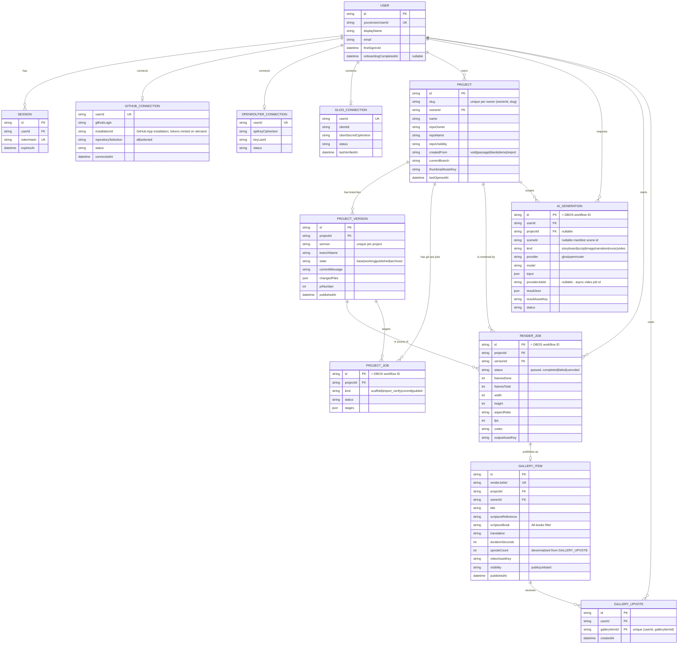
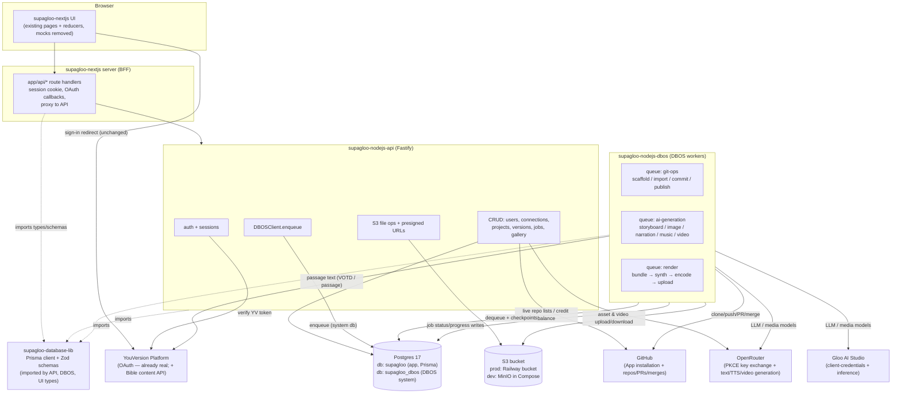
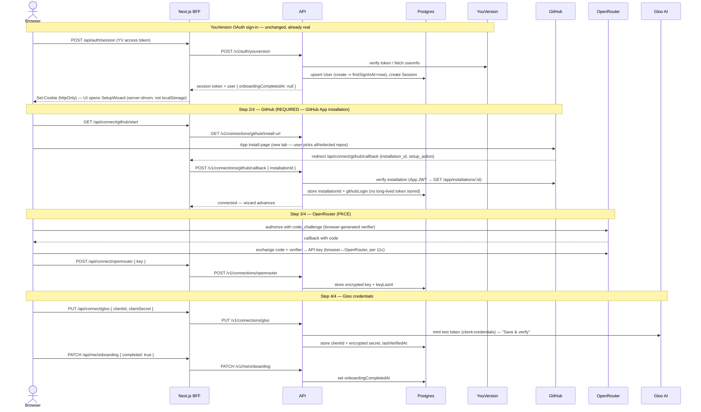
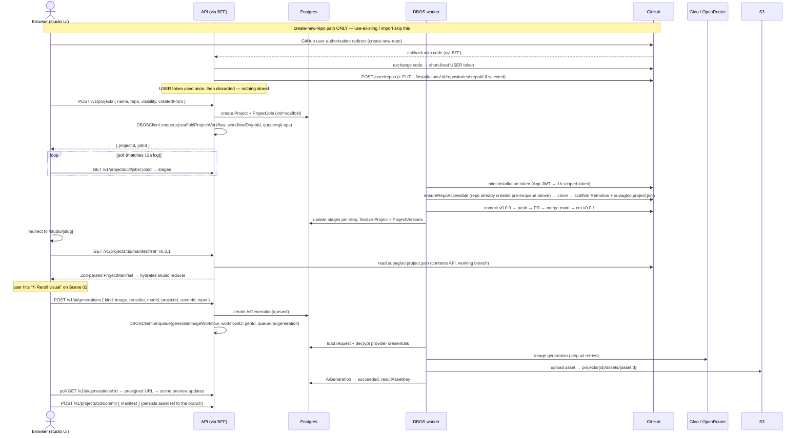
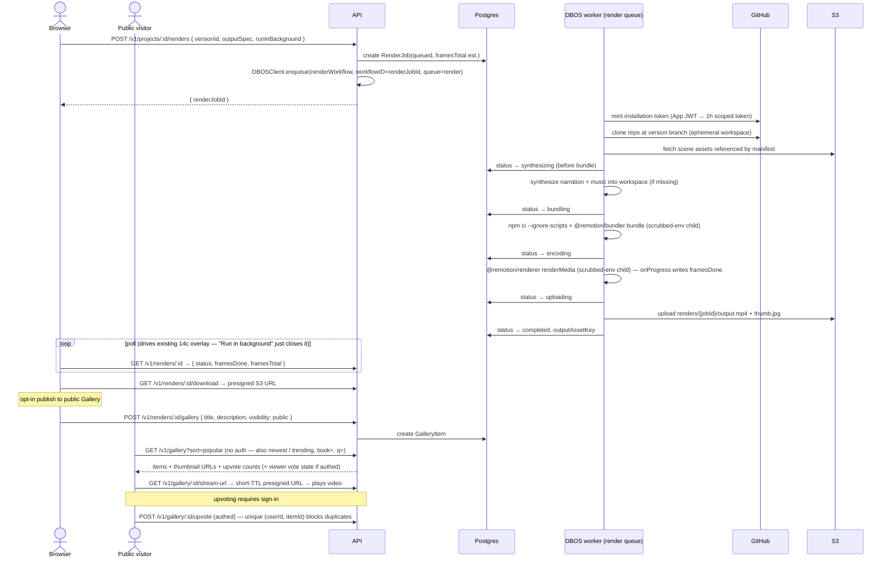
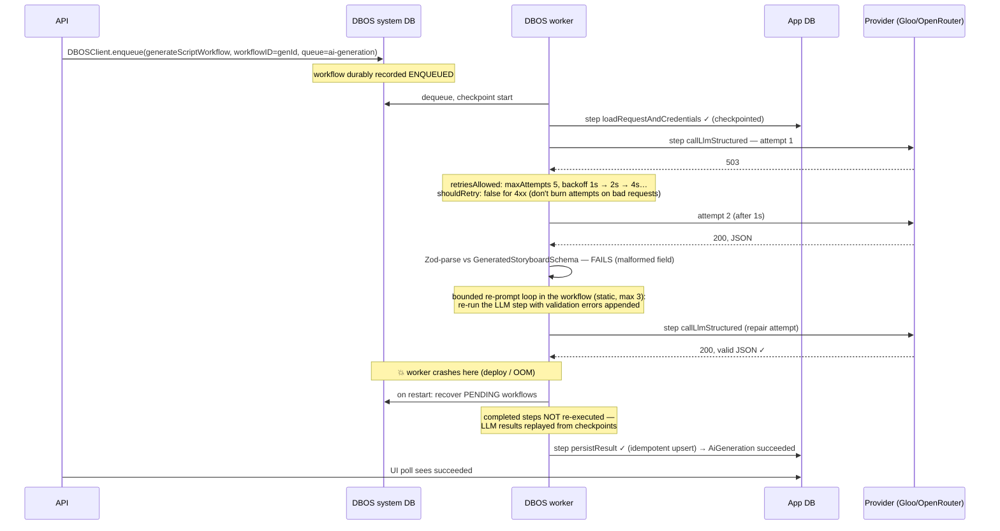

# Supagloo — Design Delta (mocks → real system)

*Written 2026-07-17 as Step 3 of the `/design` workflow. Builds on
[`current-design.md`](./current-design.md) (what exists) and
[`claude-design-review.md`](./claude-design-review.md) (canonical wireframes,
Turns 7–14). This is a delta: what to add/change to get from the mocked
prototype to the real system. It is a design for review — no code is written
by this step.*

---

## 1. Scope & mapping to the requested features

The good news first: the existing `supagloo-nextjs` UI is not throwaway. Its
client state machines (connections reducer with `connected/not-linked/pending`,
render model with the 4-stage checklist, publish provisioning log, studio
reducer) already match the wireframes *and* the job-stage models this delta
proposes. The delta is therefore mostly **replacing the `setTimeout` effect
layer behind those reducers with real HTTP calls**, plus building the three
empty repos and the local infra.

| # | Requested feature | Current state (current-design.md) | Wireframe basis (claude-design-review.md) | Delta |
|---|---|---|---|---|
| 1 | Postgres + Prisma + Zod in `supagloo-database-lib` | Empty scaffold; zero persistence anywhere | Entities implied across Turns 7–14 (consolidated data-model section) | New Prisma schema + migrations + shared Zod schemas (§2, §3) |
| 2 | Local dev parity via `docker compose up` | Compose runs only the `nextjs` service | n/a (infra) | Add `postgres`, `minio`, `minio-init`, `migrate`, `api`, `dbos` services (§4) |
| 3 | Node.js CRUD/queue API in `supagloo-nodejs-api` | Empty scaffold; no HTTP endpoint exists in any repo | Provisioning logs, status strips, job polling all imply an API | New Fastify service: CRUD + S3 + DBOS enqueue via `DBOSClient` (§8) |
| 4 | DBOS durable layer in `supagloo-nodejs-dbos` | Empty scaffold | 12a scaffold log, 14a publish log, 14c render overlay map 1:1 onto workflow stages | New DBOS app; statically-registered workflows only (§7) |
| 5 | Wire the Next.js UI to the real stack | Every data behavior is an in-memory mock | Wireframes are the target UX; UI already implements them visually | Replace mock seams; add BFF route handlers; server-side session (§5.3, §6a) |
| 6 | Real AI generation (Gloo / OpenRouter) | None in-app (the one real Gloo client only powers Stagehand tests) | Scene inspector: visual prompt "→ AI", "↻ Reroll visual", narrator voice, music bed | `AiGeneration` model + per-modality DBOS workflows + provider abstraction (§2.8, §7) |
| 7 | Real rendering + public Gallery | Fake frame ticker; Gallery exists only as a nav link | 14c render overlay (stages, frames, output spec, cancel, background); Gallery designed in **Turn 15** (15a) | `@remotion/renderer` in DBOS worker → S3 → `RenderJob` + `GalleryItem` + `GalleryUpvote` per Turn 15 (§2.7) |

Explicitly **out of scope** for this delta: the version-compare ("⇄ Compare")
screen (14b, not designed yet), the `recode.md`/`redesign.md` prompt files,
and any change to YouVersion sign-in itself (already real; we only add a
server-side session on top of it).

**Descoped for v1 — VOTD / passage / demo creation origins.** Of the five
`createdFrom` origins (Turn 9), v1 ships only **`blank`** and **`import`**.
`votd`, `passage`, and `demo` remain **reserved enum values** (so no
data-model churn when they land), but their project-creation entry points
render as **disabled "coming soon"** cards — the actual creation flows
(VOTD/passage passage-fetch + storyboard generation, demo seeding) are not
built in v1.

---

## 2. Data model (`supagloo-database-lib`)

Prisma schema + migrations live in `supagloo-database-lib`, published as
`@supagloo/database-lib` (git submodule + npm package consumed by the API,
DBOS, and Next.js repos). The package exports the generated Prisma client,
the Prisma types, and the shared Zod schemas. Consuming repos **must pin the
exact same Prisma version** as `database-lib` — exact version, not a semver
range; see §9-Q11 for the enforcement mechanism.

### Guiding decision: the repo is the source of truth for composition content

The wireframes state it outright (10a): *"Projects live in your GitHub repos…
Nothing is stored on our servers."* So **there are no `Composition`/`Scene`
tables in Postgres.** Instead:

- Each project repo carries a **`supagloo.project.json` manifest** at its
  root (alongside `remotion.config.ts`), Zod-validated by
  `ProjectManifestSchema` from `database-lib`. It holds the composition
  metadata, ordered scenes (script text + reference + translation, visual
  prompt, duration, captions flag, visual-asset reference), the
  project-scoped narrator-voice descriptor, the music bed, and the end card.
  The studio editor reads/writes this manifest; commit/publish write it back
  to the version branch.
- **Generated binary assets (scene images/video clips, narration audio,
  music) go to S3**, referenced from the manifest by asset key — *not*
  committed to git. Rationale: GitHub's 100 MB file limit, repo bloat, and
  render workers need them fetched anyway. This slightly softens the
  "nothing on our servers" marketing claim (composition *source* stays in
  the repo; generated *media* lives in Supagloo's bucket). **Resolved
  (§9-Q4):** the landing/workspace copy changes to the honest version —
  *"Your Remotion code lives in your GitHub repo, not our database.\*"* with
  the footnote *"\* Rendered videos are stored in Supagloo's S3 bucket."*
  (see the copy directive in §5.3).

Postgres therefore stores: identity/session, connections, project *metadata
and pointers*, version-branch records, job records (scaffold/import/commit/
publish/render/AI-generation), and gallery entries.

### v1 stated limitations (manifest ⇄ generated code ⇄ preview)

Two consequences of the manifest-as-source-of-truth model are **accepted
limitations for v1**, called out here so they are not mistaken for bugs:

1. **Hand-edits to generated scene sources are NOT preserved.**
   `applyManifest` (§7, workflow 3) **overwrites** the generated scene source
   files on every commit — the `supagloo.project.json` manifest is the *sole*
   source of truth in v1. A user who hand-edits `src/scenes/*.tsx` directly in
   their repo will see those edits regenerated away on the next studio commit.
   Round-tripping arbitrary hand-written Remotion code back into the manifest
   is explicitly out of scope for v1.
2. **Studio preview and the DBOS renderer are separate code paths, NOT
   guaranteed to produce identical output.** The studio preview uses
   `@remotion/player` (browser, live manifest state); the render pipeline uses
   `@remotion/renderer` (DBOS worker, committed branch). They are wired
   independently in v1 and may diverge (fonts, asset timing, codec-specific
   rendering). Unifying them behind one shared composition path is **v2 work**.

### 2.1 `User` — identity + first-time sign-in tracking

| Field | Notes |
|---|---|
| `id` | cuid PK |
| `youversionUserId` | unique — the external YouVersion account id |
| `displayName`, `email`, `avatarInitials` | from YouVersion profile at sign-in |
| `firstSignInAt` | set on row creation (this *is* the first-time-sign-in tracker) |
| `onboardingCompletedAt` | nullable; replaces today's `localStorage` `hasOnboarded` flag |
| `lastSeenAt`, `createdAt`, `updatedAt` | |

### 2.2 `Session` — server-side session (new; none exists today)

Opaque token, hashed at rest; issued by the API after verifying the
YouVersion access token; held by the browser as an httpOnly cookie set by the
Next.js BFF.

| Field | Notes |
|---|---|
| `id` | PK |
| `userId` | FK → User |
| `tokenHash` | unique; SHA-256 of the opaque bearer token |
| `expiresAt`, `createdAt`, `lastUsedAt` | sliding expiry |

### 2.3 `GithubConnection` (1:0..1 with User) — GitHub App installation

**Confirmed design (§9-Q1): a GitHub App with per-repo installation**, not a
classic OAuth app. The user installs the app via GitHub's hosted picker
(choosing "all repos" or specific repos); GitHub redirects back to our
callback with `installation_id` (+ `setup_action`), and that installation id
is what we store. **No long-lived repo token is ever stored.** Whenever the
API or a DBOS worker needs to touch GitHub, it signs a short-lived JWT with
the app's private key (App ID as issuer, ~10 min expiry), exchanges it via
`POST /app/installations/{installationId}/access_tokens`, and receives a
**~1-hour installation token scoped only to the granted repos** — used and
discarded. This is exactly wireframe 11a's promise: "Never touch repos you
don't select."

| Field | Notes |
|---|---|
| `userId` | unique FK |
| `githubLogin` | display: `@ashsrinivas` — captured at install time |
| `installationId` | **the** stored credential-pointer; all repo-operation tokens are minted on demand from it |
| `repositorySelection` | `all \| selected` — as granted at install |
| `status` (`connected`), `connectedAt` | wireframe 10b shows repo count — fetched live, not stored |

The App ID and private key are **app-level environment secrets**
(`GITHUB_APP_ID`, `GITHUB_APP_PRIVATE_KEY`) held by the API and DBOS
services — one pair per app registration, not per-user data — so they live
in env config, never in the database, and are outside §2.10's per-user
encryption scheme.

**Create-new-repo caveat (zero-storage user-token hop).** Installation tokens
have a hard limitation: they **cannot create repositories in a personal
account**, and a repo created out-of-band is **not automatically added to a
`selected` installation**. So the *create-new-repo* origin needs a
user-authorized action that installation tokens can't provide. Rather than
store a user OAuth/refresh token, create-new-repo does a **JIT (just-in-time)
zero-storage user-token hop** at project-creation time: a GitHub
user-authorization redirect → server-side code exchange → a **short-lived
user access token** → used **exactly once** for `POST /user/repos` (and, when
the installation is `selected`, `PUT /user/installations/{id}/repositories/{repoId}`
to add the new repo to the installation) → then **discarded**. **No user or
refresh token is ever stored** — this preserves the "no repo credential at
rest" property of the installation-token model. The *use-existing-empty-repo*
and *import* origins need **no** hop (the repo is already reachable by the
installation token). The alternative — storing an encrypted GitHub user
refresh token to re-mint user tokens — was **explicitly rejected** (it
reintroduces a per-user credential at rest for a one-time operation).

### 2.4 `OpenRouterConnection` (1:0..1 with User)

| Field | Notes |
|---|---|
| `userId` | unique FK |
| `apiKeyCiphertext` | the PKCE-obtained key, encrypted |
| `keyLast4` | plaintext, for the masked display `sk-or-••••••4f2a` |
| `status`, `connectedAt` | credit balance is fetched live from OpenRouter, never stored |

### 2.5 `GlooConnection` (1:0..1 with User)

| Field | Notes |
|---|---|
| `userId` | unique FK |
| `clientId` | plaintext (not a secret) |
| `clientSecretCiphertext` | encrypted; used only to mint short-lived tokens (per 11a step 4) |
| `status`, `connectedAt`, `lastVerifiedAt` | "Save & verify" mints a test token |

*(Three typed tables rather than one polymorphic `ProviderConnection` table:
the per-provider fields barely overlap, and typed columns beat a JSON blob
for encryption discipline and Prisma ergonomics. The UI's unified
`connections` reducer is served by a `GET /v1/connections` endpoint that
merges the three.)*

### 2.6 `Project` and `ProjectVersion`

**`Project`**

| Field | Notes |
|---|---|
| `id`, `slug` | slug drives `/studio/[slug]` (`psalm-121`). **Unique per `(ownerId, slug)`, NOT globally unique** — two different owners may both hold `psalm-121`. `/studio/[slug]` and `GET /v1/projects/:id` resolve **scoped to the authed owner** |
| `ownerId` | FK → User |
| `name` | editable in studio top bar |
| `repoOwner`, `repoName`, `repoVisibility` (`private\|public`) | 12a |
| `createdFrom` | enum `votd \| passage \| blank \| demo \| import` (Turn 9). **v1 ships `blank` + `import` only**; `votd`/`passage`/`demo` are **reserved enum values** with **disabled "coming soon"** entry points (§1) |
| `currentBranch` | the working `vX.Y.Z` branch |
| `thumbnailAssetKey` | S3 key from last render (or generated placeholder) |
| `lastRenderJobId` | nullable — drives the `RENDERED`/`DRAFT` badge on 10a cards |
| `lastOpenedAt`, `createdAt`, `deletedAt` | soft delete |

**`ProjectVersion`** — one row per version branch (14b dropdown)

| Field | Notes |
|---|---|
| `id` | PK |
| `projectId` | FK; unique `(projectId, semver)` |
| `semver` | `"0.0.0"`, `"0.0.1"`, … free-form semver for imports (`"0.2.3"`, per 12b) |
| `branchName` | `v0.0.1` |
| `state` | enum `base \| working \| published \| archived` |
| `commitMessage`, `autoSummary` | 14a step 1 |
| `changedFiles` | JSON array (`M src/scenes/Shelter.tsx`, …) |
| `headCommitSha`, `prNumber`, `prUrl`, `publishedAt` | |

### 2.7 `RenderJob` and `GalleryItem`

**`RenderJob`** — mirrors the 14c overlay exactly.

| Field | Notes |
|---|---|
| `id` | PK — also used as the **DBOS workflow ID** (idempotent enqueue) |
| `projectId`, `versionId`, `userId` | FKs |
| `status` | enum `queued \| bundling \| synthesizing \| encoding \| uploading \| completed \| failed \| canceled` |
| `framesDone`, `framesTotal` | updated by the render step's `onProgress` |
| `width`, `height`, `aspectRatio`, `fps`, `codec` | output spec (`1080×1920 · 9:16 · 30fps · H.264`) |
| `outputAssetKey`, `thumbnailAssetKey` | S3 keys on completion |
| `runInBackground` | UI hint only — the job is always async server-side |
| `error`, `createdAt`, `startedAt`, `completedAt` | |

**`GalleryItem`** — opt-in public publication of a completed render.
*(Designed per **Turn 15** (15a) in claude-design-review.md: a public,
unauthenticated grid with a Most popular / Newest / Trending sort control,
an "All books ▾" filter, search, per-card upvote pills, and rank badges.)*

| Field | Notes |
|---|---|
| `id` | PK |
| `renderJobId` | unique FK — one gallery entry per render |
| `projectId`, `ownerId` | FKs (denormalized for listing; creator handle/avatar come from the owner) |
| `title`, `description` | card display type ("LET THERE BE LIGHT") |
| `scriptureReference`, `translation` | e.g. "GENESIS 1:1–4" + "KJV" — card metadata, reflecting whichever translation the user actually selected (§9-Q10), not fixed to KJV/BSB. Turn 15's mock showing NIV/ESV/NLT/NASB cards is now directionally accurate rather than placeholder art. |
| `scriptureBook` | normalized book code (e.g. `GEN`), derived from the reference at publish time — drives the "All books ▾" filter without reference-parsing at query time |
| `durationSeconds` | the `mm:ss` badge |
| `videoAssetKey`, `thumbnailAssetKey` | copied from the render job |
| `visibility` | enum `public \| unlisted` (private = just don't publish) |
| `publishedAt` | drives the **Newest** sort |
| `upvoteCount` | denormalized counter — the `▲ 2.4k` pill, the **Most popular** sort, and the rank badges; updated in the same transaction as `GalleryUpvote` writes |
| `viewCount` | |

**Trending** is computed at query time as time-decayed popularity (an SQL
expression over `upvoteCount` + `publishedAt`) — no stored score in v1; a
materialized trending column is a later optimization if the gallery grows.

**`GalleryUpvote`** — one row per viewer-vote; the source of truth behind
`upvoteCount`.

| Field | Notes |
|---|---|
| `id` | PK |
| `userId`, `galleryItemId` | FKs; **composite unique** — prevents duplicate votes and renders the viewer's own filled-vs-outlined pill state |
| `createdAt` | |

Browsing is public/unauthenticated; **upvoting requires a session** (the
unique constraint needs a real `userId` — anonymous visitors get a sign-in
prompt).

*Still undesigned, per Turn 15's own "try next" list — non-blocking future
work, not blockers for this delta: the gallery item detail/watch page, the
"Share yours" publish-to-gallery dialog, and a creator profile page.*

### 2.8 `AiGeneration` — AI-generation requests/results

| Field | Notes |
|---|---|
| `id` | PK — also the DBOS workflow ID |
| `userId`, `projectId` (nullable), `sceneId` (nullable string — the manifest scene id) | |
| `kind` | enum `storyboard \| script \| image \| narration \| music \| video` |
| `provider` | enum `gloo \| openrouter` (user-selected per request), **constrained per `kind` by a compatibility matrix**: `storyboard`/`script` accept `gloo` **or** `openrouter`; `image`/`narration`/`music`/`video` accept `openrouter` **ONLY** (Gloo has no media modalities — §9-Q2). Enforced **at enqueue**, encoded once as a shared `database-lib` constant (see §7 "Provider call patterns" and §8) |
| `model` | provider model id |
| `input` | JSON — the prompt/spec, Zod-validated at enqueue |
| `status` | enum `queued \| running \| succeeded \| failed \| canceled` |
| `providerJobId` | nullable string — the provider-side async job id (OpenRouter video jobs return one on submission); persisted immediately after submit so the polling steps survive DBOS replay / worker restart without re-submitting (§7, workflow 8) |
| `resultJson` | JSON — for text/structured outputs (Zod-validated) |
| `resultAssetKey` | S3 key — for binary outputs (image/audio/video) |
| `error`, `tokenUsage` (JSON), `createdAt`, `completedAt` | |

### 2.9 `ProjectJob` — staged git-ops jobs (scaffold / import / commit / publish)

One table backs all four provisioning-log UIs (12a, 12b, studio commit, 14a),
since they share the shape "async job with an ordered stage checklist".

| Field | Notes |
|---|---|
| `id` | PK — also the DBOS workflow ID |
| `projectId`, `userId`, `versionId` (nullable) | |
| `kind` | enum `scaffold \| import_verify \| commit \| publish` |
| `status` | enum `queued \| running \| succeeded \| failed \| canceled` |
| `stages` | JSON array of `{ key, label, state: pending\|running\|done\|failed }` — the UI log rows |
| `error`, `createdAt`, `completedAt` | |

**Per-project git-ops serialization (409 guard).** The API **rejects with 409**
a new git-ops job (scaffold/import/commit/publish) for a project that already
has a `queued` or `running` ProjectJob — this **serializes git-ops per
project** so two commits/publishes can't race on the same repo's branches.
`baseHeadSha`-style optimistic concurrency (rejecting a commit whose base no
longer matches the branch head) is **explicitly deferred**: exposure is low
(a single user rarely drives concurrent git-ops on one project) and any bad
outcome is git-recoverable.

### 2.10 Secrets encryption

The OpenRouter key and the Gloo client secret are encrypted **at the
application level** (AES-256-GCM, random nonce per value, key from
`SECRETS_ENCRYPTION_KEY` env — 32 bytes, distinct per environment).
`database-lib` exports the `encryptSecret`/`decryptSecret` helpers so API and
DBOS use the same primitive. Display-safe fragments (`keyLast4`,
`githubLogin`, `clientId`) are stored plaintext. GitHub needs **no per-user
secret at rest**: installation tokens are minted on demand (§2.3), and the
app private key is an env-level secret, not a database row.

### 2.11 Zod schemas (shared, mostly NOT persisted models)

All in `database-lib` (e.g. `src/schemas/`), exported alongside Prisma types:

| Schema | Purpose |
|---|---|
| `ProjectManifestSchema` | The `supagloo.project.json` file format (composition size/fps/aspect, ordered scenes, narrator voice, music bed, end card, captions). Validated on every read (studio open, import verify) and write (commit). Versioned (`manifestVersion: 1`). The scene `translation` field holds whatever translation abbreviation the user selected via the YouVersion Bible-collection picker (§9-Q10) — validated against the live collection response at generation time, not a fixed enum. Defaults to `BSB` for new projects. |
| `GeneratedStoryboardSchema` | **LLM structured output**: scene breakdown from a passage — per-scene `name`, `scriptText`, `reference`, `translation`, `visualPrompt`, `suggestedDurationSeconds`, plus whole-video `narratorVoice` and `musicStyle` suggestions. Used with structured-output generation; the LLM response is parsed against this before persisting. |
| `SceneVisualPromptSchema` | LLM structured output for "↻ Reroll visual" — a refined image/video prompt. |
| `NarrationSpecSchema`, `MusicSpecSchema` | Inputs to audio synthesis (voice descriptor + per-scene scripts; music style label + duration). |
| `RenderOutputSpecSchema` | resolution / aspect / fps / codec — request validation + stored on RenderJob. |
| API DTO schemas | Request/response bodies for every endpoint in §8 (`CreateProjectRequest`, `CommitRequest`, `RenderRequest`, `GenerationRequest`, connection payloads, job/stage status shapes). Shared by the API (Fastify + zod type provider) and the Next.js BFF for end-to-end type safety. |
| Job/status enums | Mirror the Prisma enums so the existing UI reducers keep their state-machine vocabularies. |

**Distinction:** Prisma models are what Postgres persists; Zod schemas are
(a) contracts with LLMs (structured outputs), (b) the repo-manifest file
format, and (c) API wire contracts. Only `AiGeneration.input`/`resultJson`
and `ProjectJob.stages` persist Zod-shaped JSON inside Prisma JSON columns.

---

## 3. ER diagram



---

## 4. Local dev / infra: Postgres + S3 in Docker Compose

**Recommendation: MinIO for local S3, with separate dev/prod buckets.
Postgres 17 in a container with two logical databases (app + DBOS system).**

### Why MinIO (vs LocalStack, vs a cloud dev bucket)

- **MinIO** is a production-grade, S3-API-compatible object store in a single
  small container. It supports everything we use — put/get/delete, multipart
  upload, **presigned URLs** — with the real AWS SDK v3 client. The only code
  difference vs prod is configuration: `endpoint` override +
  `forcePathStyle: true` + static credentials, all via env vars. Same code
  path in prod (drop the endpoint override).
- **LocalStack** emulates most of AWS; we need exactly one service. It's a
  heavier container, slower to start, and its S3 is an emulation layer rather
  than a real object store. Rejected as unnecessary weight.
- **A second cloud bucket for dev** breaks the explicit requirement
  ("`docker compose down && docker compose up --build`, no manual cloud
  dependency") and breaks offline dev. Rejected.

### Dev vs prod buckets: yes, separate — trivially so

Local dev uses a MinIO bucket (`supagloo-dev`) that exists only inside the
Compose network; prod keeps the existing Railway bucket (confirmed, §9-Q7:
Railway Buckets are private, S3-API-compatible object storage — the parity
plan holds). They can never
collide, local tests can never touch prod user videos, and the app only ever
knows `S3_ENDPOINT` / `S3_BUCKET` / `S3_ACCESS_KEY` / `S3_SECRET_KEY` /
`S3_REGION` env vars — parity is achieved by configuration, not shared
infrastructure. **Never point local dev at the prod bucket.**

One practical detail that bites everyone with MinIO: presigned URLs generated
by the API must be reachable from the **host browser**, but inside the
Compose network MinIO is `minio:9000`. So the API takes two endpoint vars:
`S3_ENDPOINT` (internal, used for server-side ops) and `S3_PUBLIC_ENDPOINT`
(`http://localhost:9000` locally; the real bucket URL in prod) used when
signing browser-facing URLs.

### Postgres: one server, two databases

DBOS requires a **system database** for its checkpoints/queues. Run one
Postgres 17 container with two databases created by an init script:
`supagloo` (app schema, Prisma-managed) and `supagloo_dbos` (DBOS-managed,
untouched by Prisma). Same split in prod on the existing Railway Postgres.
*Implementation-time check (not a design blocker):* verify the Railway plan
permits `CREATE DATABASE supagloo_dbos`; if it only exposes one database,
DBOS's schema-level isolation in the same database is the fallback (§9-Q7).

### Target `docker-compose.yml` shape (illustrative)

```yaml
services:
  postgres:
    image: postgres:17-alpine
    environment: { POSTGRES_USER: supagloo, POSTGRES_PASSWORD: supagloo }
    volumes:
      - pgdata:/var/lib/postgresql/data
      - ./infra/pg-init:/docker-entrypoint-initdb.d   # creates supagloo + supagloo_dbos
    healthcheck: { test: ["CMD-SHELL", "pg_isready -U supagloo"] }
    ports: ["5432:5432"]

  minio:
    image: minio/minio
    command: server /data --console-address ":9001"
    environment: { MINIO_ROOT_USER: supagloo, MINIO_ROOT_PASSWORD: supagloo-dev }
    volumes: [minio-data:/data]
    ports: ["9000:9000", "9001:9001"]

  minio-init:            # one-shot: mc mb --ignore-existing local/supagloo-dev
    image: minio/mc
    depends_on: [minio]

  migrate:               # one-shot: prisma migrate deploy (from database-lib)
    build: ./supagloo-nodejs-api
    command: npx prisma migrate deploy
    depends_on: { postgres: { condition: service_healthy } }

  api:
    build: ./supagloo-nodejs-api
    ports: ["4000:4000"]
    depends_on: { migrate: { condition: service_completed_successfully }, minio-init: { condition: service_completed_successfully } }

  dbos:
    build: ./supagloo-nodejs-dbos
    depends_on: { migrate: { condition: service_completed_successfully } }

  nextjs:
    build: ./supagloo-nextjs
    ports: ["8000:3000"]
    depends_on: [api]

volumes: { pgdata: {}, minio-data: {} }
```

`docker compose down && docker compose up --build` then yields the full
stack: UI on :8000, API on :4000, Postgres, MinIO (+ its console on :9001),
migrations applied, bucket created. Railway prod runs the same three app
images against Railway Postgres + the existing bucket.

---

## 5. System architecture (target)

### 5.1 Service responsibilities

- **`supagloo-nextjs`** — UI + thin BFF. Gets its first-ever
  `app/api/**/route.ts` handlers, which (a) hold the httpOnly session cookie
  and forward requests to the API with the bearer token, and (b) host the
  **GitHub callback route(s)** — the **App installation callback** *and* (per
  §6b) the **JIT user-authorization callback used only for create-new-repo**
  (§2.3) — staying on the user-facing origin. **OpenRouter's PKCE exchange is
  entirely browser-side** (per 11c / §6a / §9-Q5): the browser completes the
  exchange and POSTs the resulting key to the BFF, so there is **no OpenRouter
  server-side callback route**. No business logic; no direct DB/S3 access.
- **`supagloo-nodejs-api`** — Fastify + Prisma (`database-lib`) + AWS SDK S3
  client + **`DBOSClient`** (enqueue-only; it does *not* run the DBOS
  runtime). Owns auth/session, all CRUD, OAuth exchanges + the GitHub App
  installation callback, presigned URLs, and job enqueueing. Stateless;
  scales horizontally.
- **`supagloo-nodejs-dbos`** — the DBOS application: statically-registered
  workflows + queues (§7). Workers do all git operations (ephemeral clones
  in the worker's temp dir — this is the wireframes' "temporary Railway
  workspace"), all LLM/media-model calls, and Remotion rendering
  (`@remotion/bundler` + `@remotion/renderer`). Writes job progress to
  Postgres via the same `database-lib` client; uploads outputs to S3.
- **`supagloo-database-lib`** — Prisma schema/migrations/client + Zod
  schemas + secret-crypto helpers. No runtime service.
- **API ↔ DBOS contract:** no HTTP between them. The API enqueues via
  `DBOSClient` against the DBOS **system database** (`supagloo_dbos`), with
  `workflowName` + `queueName` + `workflowID` = the domain-record id
  (RenderJob/AiGeneration/ProjectJob id), making enqueue idempotent. Status
  flows back through the **app database** rows the workflows update, which
  the API reads and the UI polls.

### 5.2 Architecture diagram



### 5.3 UI wiring: mock seam → real seam (feature 5)

| Today's mock (current-design.md) | Replacement |
|---|---|
| `localStorage` `hasOnboarded` flag | `User.onboardingCompletedAt` via `GET /v1/me`; sign-in mints a server session (§6a) |
| `connections-model.ts` `setTimeout` → `completeConnect` with hardcoded detail | Keep the reducer; effects become BFF calls to the real connect endpoints; `pending` now spans a real OAuth round-trip |
| `findStudioProject()` → hardcoded `DEMO_STORYBOARD` | `GET /v1/projects/:id` + `GET /v1/projects/:id/manifest` → Zod-parsed `ProjectManifest` hydrates the studio reducer |
| New-project / import wizard fake `provisioning-log.ts` ticker | `POST /v1/projects` / `/projects/import` → poll `GET .../jobs/:id`; `stages` JSON renders the same log rows |
| Studio `commit()` `setTimeout` | `POST /v1/projects/:id/commit` (manifest payload) → poll ProjectJob |
| Publish wizard fake 4-stage log | `POST /v1/projects/:id/publish` → poll ProjectJob (stages mirror 14a) |
| `render-model.ts` fake frame ticker | `POST /v1/projects/:id/renders` → poll `GET /v1/renders/:id` (status + framesDone/framesTotal drive the existing overlay); cancel button → `POST /v1/renders/:id/cancel` |
| — (new) | Gallery page (Turn 15): public `GET /v1/gallery?sort=&book=&q=`; upvote pill → `POST`/`DELETE /v1/gallery/:id/upvote` (authed); "Your videos": authed `GET /v1/renders?mine=1` |

**Copy directive (§9-Q4 resolved):** landing and workspace copy that today
implies "nothing is stored on our servers" changes to: *"Your Remotion code
lives in your GitHub repo, not our database.\*"* with the footnote
*"\* Rendered videos are stored in Supagloo's S3 bucket."*

The flag-gated Stagehand mock-session seam stays for UI e2e tests, but e2e
against the real stack becomes possible via Compose (see §9-Q9 on test
seeding).

---

## 6. Sequence diagrams — key new flows

### (a) First-time sign-in + provider connection setup



### (b) Create project + generate AI content for a scene



### (c) Render a project → appears in the Gallery



### (d) DBOS-queued job with retry + crash recovery (LLM structured output)



---

## 7. DBOS workflow/step boundaries — static registration only

**Constraint honored: zero dynamic workflow registration.** Every workflow
below is a fixed, code-defined function registered **at module load time**
via `DBOS.registerWorkflow(fn, { name })` (or the equivalent
`@DBOS.workflow()` decorator on a class), all before `DBOS.launch()` runs.
Nothing constructs or registers a workflow shape at runtime. All variability
— which provider, which model, which scene, which repo — flows through
**workflow arguments**, and the API's enqueue path maps request kinds to
workflow names through a **static lookup table** of the registered names.
This is also the operationally sound choice: DBOS ties recovery to the
application version and the statically-known workflow graph, so recovery
after a deploy or crash is well-defined; dynamically-registered workflows
would make replay dependent on runtime state we'd have to reconstruct.

Queues (also declared statically at module load):

| Queue | Concurrency | Carries |
|---|---|---|
| `git-ops` | ~4 per worker | scaffold, import-verify, commit, publish |
| `ai-generation` | ~8 per worker (tune per provider rate limits) | all `AiGeneration` kinds |
| `render` | **1 per worker** (`workerConcurrency: 1` — CPU/memory heavy) | renders |

Enqueue side: `supagloo-nodejs-api` uses **`DBOSClient.enqueue`** with
explicit `workflowName`/`queueName` and `workflowID` set to the domain-record
id — idempotent, exactly-once submission without running the DBOS runtime in
the API.

### Provider call patterns (§9-Q2 resolution)

- **Structured text** (storyboard/script generation — the `callLlmStructured`
  step): use the Vercel AI SDK's `generateObject` with the target Zod schema,
  through an OpenAI-compatible provider wrapper (OpenRouter directly; Gloo
  too if it exposes an OpenAI-compatible chat-completions endpoint). This
  gives Zod-validated structured output and slots straight into the bounded
  repair loop of workflow 5 / diagram (d).
- **Media generation** (TTS, music, video — workflows 7–8): call OpenRouter's
  REST endpoints **directly with `fetch`**, not through the AI SDK. These are
  provider-specific patterns — an async job + polling flow with unsigned
  URLs for video, a raw byte-stream response for speech — that don't map
  onto the AI SDK's synchronous `generateText`/`generateObject`/image
  primitives; force-fitting them buys nothing.
- **Model ids are never hardcoded.** They change frequently; every concrete
  model id (text, speech, video) is looked up at implementation time via
  OpenRouter's discovery endpoints (`GET /api/v1/models?output_modalities=…`,
  `GET /api/v1/videos/models`). Any model id appearing in this document is
  illustrative only.
- **Kind→provider compatibility matrix.** `storyboard`/`script` →
  `gloo` **or** `openrouter` (structured text via AI SDK `generateObject`);
  `image`/`narration`/`music`/`video` → **`openrouter` ONLY** (Gloo has no
  media modalities). Defined **once** as a shared `database-lib` constant and
  enforced (**422**) at `POST /v1/ai/generations` **before** any row or
  workflow is created (§2.8, §8).

### Workflow inventory

Every step that touches the network or filesystem is a `DBOS.runStep` with an
explicit name; steps that update job-stage rows do so with idempotent writes
so replays are safe. Typed *permanent* failures (e.g. "repo is not a Supagloo
project") are thrown as non-retryable via `shouldRetry` predicates.

Every `git-ops` workflow (and `renderWorkflow`'s clone) starts with a
**`mintInstallationToken`** step: sign a short-lived App JWT with
`GITHUB_APP_PRIVATE_KEY`, exchange it via
`POST /app/installations/{installationId}/access_tokens` for a ~1-hour token
scoped to the user's granted repos, and pass it to the subsequent git/API
steps. Minted fresh per run, never persisted (§2.3).

1. **`scaffoldProjectWorkflow(projectJobId)`** — queue `git-ops`. Steps:
   `mintInstallationToken` (see above) →
   `ensureRepoAccessible` (idempotent confirmation that the installation token
   can reach the already-created repo — replaces the earlier `createGithubRepo`
   step) → `cloneToWorkspace`
   → `writeRemotionScaffold` (template + `supagloo.project.json`) →
   `commitBaseVersion` (v0.0.0) → `pushOpenMergeBasePr` →
   `cutWorkingBranch` (v0.0.1, push) → `finalizeRecords` (Project,
   ProjectVersions, job stages). Stages mirror the 12a log row-for-row.

   **Note — repo creation happens *before* this workflow, not inside it.** The
   *create-new-repo* origin cannot be done with an installation token (§2.3),
   so it is performed at the **API/BFF layer via the JIT zero-storage
   user-token hop** (§6b/§2.3) **before** the workflow is enqueued; by the time
   `scaffoldProjectWorkflow` runs, the repo exists and the installation token
   can reach it. The *use-existing-empty-repo* and *import* origins skip the
   hop entirely. **Implementation-time verification** (mirroring §9-Q7b's
   pattern): confirm the exact GitHub App **user** permission required for
   `POST /user/repos`; **named fallback if infeasible** — offer
   use-existing-empty-repo / import only (drop create-new-repo).
2. **`importProjectWorkflow(projectJobId)`** — queue `git-ops`. Steps:
   `cloneRepo` → `verifySupaglooProject` (requires `remotion.config.ts` +
   ≥1 `vN.N.N` branch; failure is typed + non-retryable → 12b's "NOT A
   SUPAGLOO PROJECT" state) → `resolveLatestVersionBranch` →
   `parseManifest` (Zod) → `finalizeRecords`.
3. **`commitVersionWorkflow(projectJobId, manifestPayload)`** — queue
   `git-ops`. Steps: `cloneBranchShallow` → `applyManifest` (write manifest
   + regenerate scene source files) → `commitAndPush` →
   `updateVersionRecord` (changed-files list, head SHA).
4. **`publishVersionWorkflow(projectJobId, commitMessage)`** — queue
   `git-ops`. Steps: `commitPendingChanges` → `pushBranch` →
   `openPullRequest` → `mergePullRequestAndTag` → `cutNextVersionBranch`
   (pull main, then **bump the patch component of the highest existing
   version** — e.g. highest `v0.2.3` → `v0.2.4`; highest `v0.0.1` → `v0.0.2`
   — **not** a hardcoded `v0.0.(n+1)`, which breaks for imported projects
   carrying free-form semver; push) → `finalizeRecords`. Stages mirror
   the 14a publishing log exactly.
5. **`generateScriptWorkflow(generationId)`** — queue `ai-generation`.
   Steps: `loadRequestAndCredentials` (decrypt; Gloo path mints a
   short-lived token) → optional `fetchScripturePassage` (YouVersion Data
   Exchange API, for VOTD/passage origins — sources whatever translation
   the user selected, resolved via the "Get a Bible collection" endpoint
   at request time and never hardcoded; see §9-Q10 for the licensing
   posture) → `callLlmStructured`
   (`retriesAllowed`, `maxAttempts: 5`, exponential backoff, `shouldRetry`
   rejects 4xx) → in-workflow Zod validation with a **bounded static
   re-prompt loop** (max 3 repair attempts — a plain `for` loop over the
   same registered step, not a dynamic workflow) → `persistResult`.
   Handles both `storyboard` (full scene breakdown) and `script`
   (single-scene text) kinds via the schema selected by the request row.

   **Implementation-time verification** (mirroring §9-Q7b): the base URL
   (`https://api.youversion.com`) and the `X-YVP-App-Key` auth header
   requirement are confirmed against YouVersion's published docs — see
   §9-Q10 for the full update. Still open: the exact licensing/
   redistribution posture per translation. **Fallback:** if the live API
   is unavailable, restrict that request to KJV/BSB (public domain)
   rather than guessing at another translation's licensing.
6. **`generateImageWorkflow(generationId)`** — queue `ai-generation`.
   Steps: `loadRequestAndCredentials` → `callImageModel` (retries as above)
   → `fetchAssetBytes` → `uploadAssetToS3` → `persistResult`.
7. **`generateAudioWorkflow(generationId)`** — queue `ai-generation`; covers
   `narration` and `music`, both via OpenRouter (§9-Q2 resolved).
   - **Narration (TTS):** `loadRequestAndCredentials` → `callSpeechEndpoint`
     (`POST https://openrouter.ai/api/v1/audio/speech` — OpenAI Audio
     Speech-compatible: `model`, `input` text, `voice`, `response_format:
     "mp3"`, optional provider-dependent `speed`; the response is a **raw
     audio byte stream** — `audio/mpeg` body + `X-Generation-Id` header, not
     JSON — buffered to the workspace; retries as above) →
     `uploadAssetToS3` → `persistResult`. Recommendation (not a hard
     requirement): prefer this dedicated endpoint over the chat-completions
     audio-modality path (`modalities: ["text","audio"]`, which mandates
     streaming and delivers base64 audio in SSE `delta.audio.data` chunks) —
     that path is built for conversational voice replies, not batch
     narration synthesis. Speech model discovery:
     `GET /api/v1/models?output_modalities=audio`.
   - **Music:** same step shape; OpenRouter exposes music-generation-capable
     models, but the concrete model/endpoint is resolved at implementation
     time via model discovery — not assumed here.
8. **`generateVideoClipWorkflow(generationId)`** — queue `ai-generation`;
   per-scene generated video clips via OpenRouter's **async video-job API**.
   Steps: `loadRequestAndCredentials` → `submitVideoJob`
   (`POST https://openrouter.ai/api/v1/videos` with `model`, `prompt`, and
   optionally `duration`/`resolution`/`aspect_ratio`/`frame_images` (for
   image-to-video from a scene image)/`generate_audio`/`seed`; returns
   **202** with `{ id, polling_url, status: "pending" }` — the job id is
   persisted to `AiGeneration.providerJobId` **in the same step**, so
   polling survives worker crash/replay without re-submitting) →
   `pollVideoJob` (bounded loop with durable ~30s sleeps between
   `GET {polling_url}` calls, through `pending → in_progress → completed`) →
   `downloadVideoContent` (`GET /api/v1/videos/{jobId}/content?index=0`,
   from the completion response's `unsigned_urls`) → `uploadAssetToS3` →
   `persistResult`. OpenRouter also supports a `callback_url` webhook that
   could replace polling later; polling is the simpler v1 choice (no public
   callback endpoint required). Video model discovery:
   `GET /api/v1/videos/models` (or `/api/v1/models?output_modalities=video`).
9. **`renderWorkflow(renderJobId)`** — queue `render`. Steps:
   `markStarted` → `loadCredentials` (**NEW step** — decrypt the provider
   credentials needed for audio synthesis) → `cloneAtVersion` →
   `installDependencies` (`npm ci --ignore-scripts`, retryable) →
   `downloadSceneAssets` (S3 → workspace) → `ensureNarrationAudio` /
   `ensureMusicAudio` (**BEFORE bundling**; synthesize only if the manifest
   lacks cached asset refs) → `bundleComposition` (`@remotion/bundler`) →
   `renderMedia` (one long step; `@remotion/renderer`'s `onProgress` writes
   monotonic `framesDone` to the RenderJob row — safe on replay) →
   `generateThumbnail` → `uploadOutputs` (mp4 + thumb to S3) →
   `markCompleted`. Cancel = API calls DBOS cancel for
   `workflowID = renderJobId`; the job row flips to `canceled`.
   "Run in background" is purely a UI affordance — the workflow is always
   asynchronous.

   **Why audio before bundle.** Remotion's `bundle()` **snapshots assets at
   bundle time**; audio synthesized *after* bundling is excluded from the
   bundle unless referenced via `inputProps` URLs. Synthesizing narration/music
   into the workspace **before** `bundleComposition` guarantees the audio is
   present in the bundle. Consequently the RenderJob status sequence now
   reports **`synthesizing` before `bundling`** (matching §6c).

   **Untrusted-code isolation.** The cloned repo is **user-controlled code**,
   so: (1) `npm ci` always runs with **`--ignore-scripts`** (no lifecycle
   scripts execute); and (2) `bundleComposition` / `renderMedia` run in a
   **child process with a scrubbed environment** — no `SECRETS_ENCRYPTION_KEY`,
   `GITHUB_APP_PRIVATE_KEY`, provider keys, or DB credentials are exposed to
   the child. Full sandboxing (microVM / container-per-render) is **explicitly
   post-v1**.
10. **`cleanupOrphanedAssetsWorkflow()`** — statically-registered
    **scheduled** workflow (daily): deletes S3 objects belonging to failed/
    canceled jobs past a retention window, **and purges expired `Session` rows
    (past `expiresAt`)** — not just orphaned S3 objects. (Phase-2 candidate;
    listed for completeness.)

Deliberately **not** workflows: publishing a render to the Gallery (single
Postgres insert — plain API CRUD), reading manifests (synchronous GitHub
contents-API read in the API), and connection CRUD (synchronous OAuth
exchanges with provider-side latency well under HTTP timeout).

---

## 8. API surface (`supagloo-nodejs-api`, conceptual)

Fastify + `database-lib` Zod DTOs for request/response validation. All
routes under `/v1`; auth via bearer session token (forwarded by the BFF)
except the public gallery + health. The API is the **only** writer of the
app database besides DBOS workflows, and the only S3 URL signer.

**Auth & user**
- `POST /v1/auth/youversion` — YV token → verify → upsert User → session token (+ `firstSignIn` flag)
- `POST /v1/auth/signout` · `GET /v1/me` · `PATCH /v1/me/onboarding`

**Connections** (drives the wizard, profile page, and workspace status strip)
- `GET /v1/connections` — merged status for all three providers
- GitHub: `GET /v1/connections/github/install-url` (GitHub App installation page) · `POST /v1/connections/github/callback { installationId }` (verify via App JWT, then store) · `DELETE /v1/connections/github`
- OpenRouter: `POST /v1/connections/openrouter { key }` (after browser-side PKCE exchange) · `GET /v1/connections/openrouter/credits` (live proxy) · `DELETE …`
- Gloo: `PUT /v1/connections/gloo { clientId, clientSecret }` (verify-then-store) · `DELETE …`
- `GET /v1/github/repos?filter=empty|all&q=` — live repo listing for wizards 12b/13a

**Projects, versions, git-ops jobs**
- `GET /v1/projects` (workspace grid) · `POST /v1/projects` (⇒ enqueue scaffold) · `POST /v1/projects/import` (⇒ enqueue import-verify)
- **Create-new-repo JIT user-token hop** (zero storage — §2.3/§6b; illustrative names): `GET /v1/projects/repo-authorize-url` (returns the GitHub user-authorization redirect URL) · `POST /v1/projects/create-repo { code }` (server-side code→short-lived **user** token exchange → `POST /user/repos` (+ `PUT …/installations/:id/repositories/:repoId` if `selected`) → token **discarded, nothing stored**). Only *create-new-repo* uses this; use-existing-empty-repo and import skip it.
- `GET/PATCH/DELETE /v1/projects/:id` (rename, soft delete)
- `GET /v1/projects/:id/manifest?ref=` — Zod-parsed `ProjectManifest` from the branch
- `POST /v1/projects/:id/commit { manifest, message }` (⇒ enqueue commit)
- `POST /v1/projects/:id/publish { message }` (⇒ enqueue publish)
- `GET /v1/projects/:id/versions` (14b dropdown) · `GET /v1/projects/:id/jobs/:jobId` (stage polling)
- **Per-project git-ops concurrency (409):** the four git-ops-enqueuing endpoints (`POST /v1/projects`, `POST /v1/projects/import`, `POST /v1/projects/:id/commit`, `POST /v1/projects/:id/publish`) return **409** if the project already has a `queued`/`running` ProjectJob (§2.9).

**AI generation**
- `POST /v1/ai/generations` — validate against kind-specific Zod input schema, create row, enqueue via static kind→workflow map. **Rejects out-of-matrix `{kind, provider}` pairs with 422 before creating a row** (kind→provider compatibility matrix, §2.8/§7 "Provider call patterns" — e.g. `{ kind: image, provider: gloo }`).
- `GET /v1/ai/generations/:id` · `GET /v1/projects/:id/generations` · `POST /v1/ai/generations/:id/cancel`

**Renders**
- `POST /v1/projects/:id/renders { versionId, outputSpec, runInBackground }` (⇒ enqueue render)
- `GET /v1/renders/:id` (status/progress poll) · `POST /v1/renders/:id/cancel`
- `GET /v1/renders?mine=1` ("Your videos") · `GET /v1/renders/:id/download` (presigned GET)

**Gallery (public reads, authed votes — Turn 15)**
- `GET /v1/gallery?sort=popular|newest|trending&book=&q=&cursor=` — public; paginated ("Load more"); `popular` is the default and also feeds the rank badges; `book` matches `GalleryItem.scriptureBook`; `q` is free-text search
- `GET /v1/gallery/:id` · `GET /v1/gallery/:id/stream-url` (short-TTL presigned URL)
- `POST /v1/gallery/:id/upvote` · `DELETE /v1/gallery/:id/upvote` — authed; idempotent via the unique `(userId, galleryItemId)` constraint; `upvoteCount` updated in the same transaction
- `POST /v1/renders/:id/gallery` (owner publishes) · `DELETE /v1/gallery/:id` (owner removes)

**Files (S3 download presigning, ownership-scoped)**
- `GET /v1/files/presign-download?key=` — ownership-scoped presigned GET **only**. (`presign-upload` and `DELETE /v1/files` are intentionally **dropped**: uploads are server-side worker operations, and deletes are handled by the cleanup workflow, §7 workflow 10 — no client-facing upload/delete surface.)
- S3 key layout: `projects/{projectId}/assets/{assetId}`, `renders/{renderJobId}/output.mp4|thumb.jpg`

**Ops**
- `GET /healthz`

---

## 9. Open questions / risks — all resolved 2026-07-17

*User answers received 2026-07-17. Each item keeps its original text as the
paper trail; the bolded annotation records the decision. Numbering is
unchanged. None of these remain blocking.*

1. **GitHub OAuth App vs GitHub App.** Wireframe 11a promises "Never touch
   repos you don't select" — classic OAuth `repo` scope **cannot** deliver
   that (it grants all repos). A **GitHub App with per-repo installation**
   matches the promise and gives short-lived tokens, at the cost of a more
   complex install flow. My recommendation is the GitHub App; if you choose
   classic OAuth for speed, the wizard copy must be softened. Decide before
   the connection schema is finalized (`installationId` column).

   **RESOLVED: GitHub App.** §2.3 now stores only `installationId` (+
   display fields) — no long-lived repo token at rest; repo-operation tokens
   are ~1-hour installation tokens minted on demand (App JWT →
   `POST /app/installations/{id}/access_tokens`) by the API and by a
   `mintInstallationToken` step at the head of every git-ops workflow (§7).
   The app private key lives in `GITHUB_APP_ID`/`GITHUB_APP_PRIVATE_KEY`
   env config. §6a, §7, and §8 updated accordingly.
2. **Audio/video model providers are underspecified.** OpenRouter is
   text/image-focused and (today) does not proxy TTS or music generation;
   Gloo's media capabilities need verification. Narration TTS and music gen
   likely need either (a) specific models exposed through the two chosen
   backends, or (b) an explicit third provider (e.g. ElevenLabs) — which
   would contradict the "pick Gloo or OpenRouter" framing. The design keeps
   `generateAudioWorkflow` provider-agnostic, but **which concrete service
   synthesizes narration/music is unresolved** and blocks feature 6/7
   completion. Needs a decision (I'd verify Gloo's catalog first).

   **RESOLVED: OpenRouter alone covers all three media modalities** — video
   generation (`POST /api/v1/videos`, async job + polling), TTS
   (`POST /api/v1/audio/speech`, raw byte-stream response), and
   music-capable models — so no third provider is needed and the "pick Gloo
   or OpenRouter" framing survives. Workflows 7–8 rewritten with the real
   API shapes; `AiGeneration.providerJobId` added (§2.8, §3); AI SDK vs
   direct-REST split and the no-hardcoded-model-ids rule documented in §7
   "Provider call patterns".
3. **Gallery design is extrapolated.** Turns 7–14 contain only the Gallery
   nav link. §2.7's `GalleryItem` (opt-in publish per render, public/unlisted,
   scripture-reference metadata, presigned streaming) is my conservative
   proposal — check it against wireframe Turns 1–6 if the Gallery was
   designed there, and sign off on opt-in-per-render as the publishing model.

   **RESOLVED: the user added Turn 15 to the Claude Design project** — it is
   the real Gallery design (see claude-design-review.md, Turn 15). §2.7
   replaced accordingly: sort-relevant fields (`upvoteCount`, `publishedAt`),
   a derived `scriptureBook` for the "All books" filter, and a new
   `GalleryUpvote` join entity (unique `(userId, galleryItemId)`); §3, §5.3,
   §6c, and §8 updated (sort/filter/search params + upvote endpoints).
   Still undesigned per Turn 15's own "try next" list — future work, not
   blockers for this delta: the item detail/watch page, the "Share yours"
   publish dialog, and a creator profile page.
4. **"Nothing is stored on our servers" vs S3 assets** (deviation flag).
   Generated media and rendered videos live in Supagloo's bucket; only
   composition *source* stays in the user's repo. The landing/workspace copy
   should be adjusted, or we accept git-committed media (rejected here for
   repo-bloat/100 MB-limit reasons).

   **RESOLVED: adjust the copy.** Landing and workspace copy becomes *"Your
   Remotion code lives in your GitHub repo, not our database.\*"* with the
   footnote *"\* Rendered videos are stored in Supagloo's S3 bucket."* (copy
   directive in §5.3; §2 preamble updated — its earlier cross-reference
   mislabeling this as Q6 is fixed). Git-committed media stays rejected.
5. **OpenRouter PKCE final hop.** The wireframe (11c) says the exchange is
   browser↔OpenRouter, but the resulting key is then POSTed to our API for
   encrypted storage — Supagloo *does* end up holding the key (masked in
   UI). That's what the profile page implies (`sk-or-••••••4f2a`), but
   confirm you're comfortable with server-side key custody vs a
   browser-only key (which would break server-side generation entirely).

   **RESOLVED: server-side encrypted key custody confirmed** — §2.4 stands
   as designed (AES-256-GCM at rest, `keyLast4` for the masked display).
6. **Session strategy.** Proposed: API-minted opaque token in a `Session`
   table, httpOnly cookie via the BFF, sliding expiry. Alternative (stateless
   JWT) avoids a table but complicates revocation. Sign off on the boring
   DB-backed option.

   **RESOLVED: DB-backed `Session` table confirmed** — §2.2 stands as
   designed.
7. **Railway specifics.** (a) Confirm the existing "S3 bucket" on Railway is
   S3-API-compatible (endpoint + keys) so the MinIO-parity plan holds.
   (b) Confirm we can `CREATE DATABASE supagloo_dbos` on the existing
   Railway Postgres; if the plan only exposes one database, DBOS also
   supports schema-level isolation in the same database as a fallback.

   **(a) RESOLVED:** Railway Buckets are private, S3-API-compatible object
   storage — the MinIO-parity plan in §4 holds as designed.
   **(b) Downgraded to an implementation-time verification note** (not a
   design blocker): confirm `CREATE DATABASE supagloo_dbos` is permitted
   when provisioning; §4's schema-level-isolation fallback covers the
   negative case.
8. **Render worker sizing.** Remotion rendering is Chromium-based and
   memory-hungry; Railway instance size and `render` queue concurrency
   (proposed: 1/worker) need load-testing. Long renders also test DBOS
   step-timeout settings — the `renderMedia` step must be configured with a
   generous timeout.

   **ACKNOWLEDGED — accepted as proposed.** Not an open design question:
   worker sizing, `render` queue concurrency (1/worker), and `renderMedia`
   timeout tuning move to the implementation/TDD plan as a load-testing
   task.
9. **E2E test seeding.** Real-stack e2e (Compose) needs deterministic seed
   data + a test-auth seam in the API (the existing `NEXT_PUBLIC_SUPAGLOO_DEMO`
   seam only fakes the browser session). Proposed: a flag-gated
   `POST /v1/test/seed` available only when `NODE_ENV !== 'production'`.

   **RESOLVED: flag-gated seed endpoint confirmed as proposed.**
   **Refinement:** the seed endpoint requires **BOTH** `NODE_ENV !== 'production'`
   **AND** an explicit opt-in flag (`SUPAGLOO_ENABLE_TEST_SEED=1`). Absent the
   flag it **hard-404s regardless of `NODE_ENV`** — so a misconfigured non-prod
   deployment still cannot seed unless the flag is deliberately set.
10. **YouVersion Bible content API.** VOTD/passage project origins and
    script generation need actual verse text; only the auth SDK is
    integrated today. API availability/licensing for verse text (per
    translation) must be verified — affects `fetchScripturePassage` in the
    script workflow.

    **RESOLVED (updated 2026-07-18, supersedes the original KJV/BSB-only
    resolution): generation sources any translation YouVersion licenses to
    our app for the user's chosen language** — not restricted to KJV/BSB.
    `fetchScripturePassage` (§7 workflow 5) and the UI translation picker
    (§2.11) both call the YouVersion Data Exchange API's "Get a Bible
    collection" endpoint (`GET /v1/bibles?language_ranges[]=<lang>`,
    **without** `all_available=true`) and only ever offer translations that
    endpoint actually returns — i.e. whatever YouVersion has licensed to our
    registered app for that language. **KJV and BSB remain the pre-selected
    default** for new projects (public domain, zero licensing ambiguity,
    safest quick-start), but users may override to any translation the
    collection endpoint lists, in any language, and the generated video
    renders whatever translation was actually selected — no silent KJV/BSB
    substitution. Bible ids are never hardcoded (not even for KJV/BSB) —
    always resolved via the collection endpoint at request time. Turn 15's
    gallery mock showing NIV/ESV/NLT/NASB cards, previously called out as
    placeholder art, is now directionally accurate.

    **Accepted risk, not resolved by YouVersion's public docs**: the API
    distinguishes bibles by `license_id` and only returns bibles "available
    to your app" (per `developers.youversion.com/api-usage` / `/api/bibles`),
    but nowhere documents whether that availability covers *redistribution
    in derivative video content* specifically, versus read-only in-app
    display — Supagloo's use case is the former. We are proceeding on the
    assumption that "available to your app" via the (non-`all_available`)
    collection endpoint is a usable redistribution signal. If YouVersion's
    actual licensing terms turn out to distinguish a display-only tier from
    a redistribution tier, this needs a follow-up conversation with
    YouVersion and a possible narrowing back toward the public-domain-only
    posture this replaces.

    **Implementation-time verification** (mirroring §9-Q7b, and matching §7
    workflow 5): the base URL (`https://api.youversion.com`) and the
    `X-YVP-App-Key` auth-header requirement are now confirmed against
    YouVersion's published docs. Still open: how our app's YouVersion
    license grant is actually configured/expanded (a YouVersion-side
    process, not a public API call), and the redistribution-tier question
    above. **Fallback:** if the live API is unavailable for a given
    request, restrict that request to KJV/BSB (public domain) rather than
    guessing at another translation's licensing.
11. **`database-lib` packaging.** Proposed: the package builds to `dist/`
    with the generated Prisma client included, consumed as git submodule +
    `file:` npm dependency; only the API runs `prisma migrate deploy`.
    Watch-out: Prisma client generation is version-coupled — consumers must
    pin the same Prisma version.

    **RESOLVED — and the watch-out is elevated to a requirement:**
    `supagloo-nodejs-api` and `supagloo-nodejs-dbos` **MUST pin the exact
    same `prisma`/`@prisma/client` version as `database-lib`** — exact
    version match, never a semver range. Enforcement: `database-lib` exports
    its pinned Prisma version (a `PRISMA_VERSION` constant plus a
    `supagloo.prismaVersion` field in its package.json); each consumer runs
    a CI check (or postinstall script) that fails the build when its own
    pinned version differs. (Also stated in the §2 preamble.)

---

*Update 2026-07-17: user review complete — all §9 open questions resolved
(annotations inline above). Next step in the `/design` process: commit, then
`docs/plan.md` sequencing. Nothing in this document has been implemented.*
