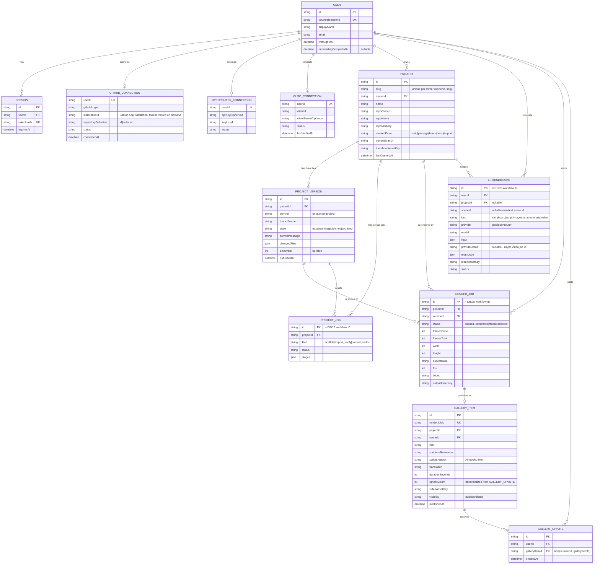
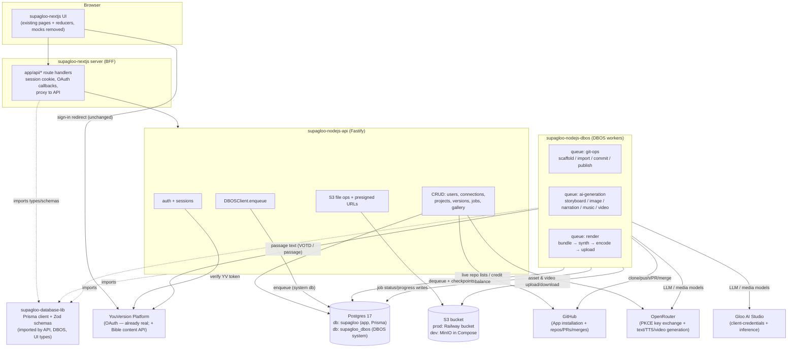
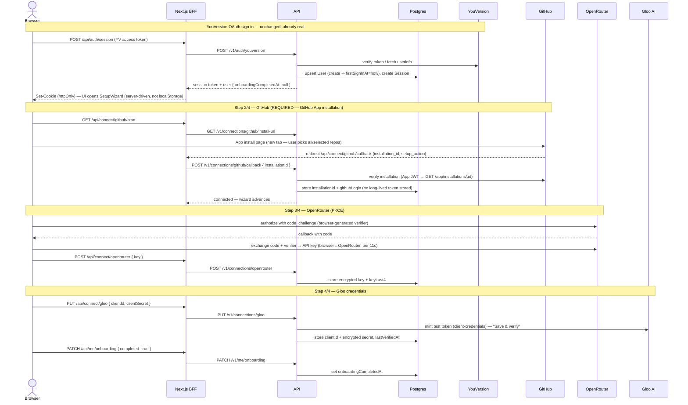
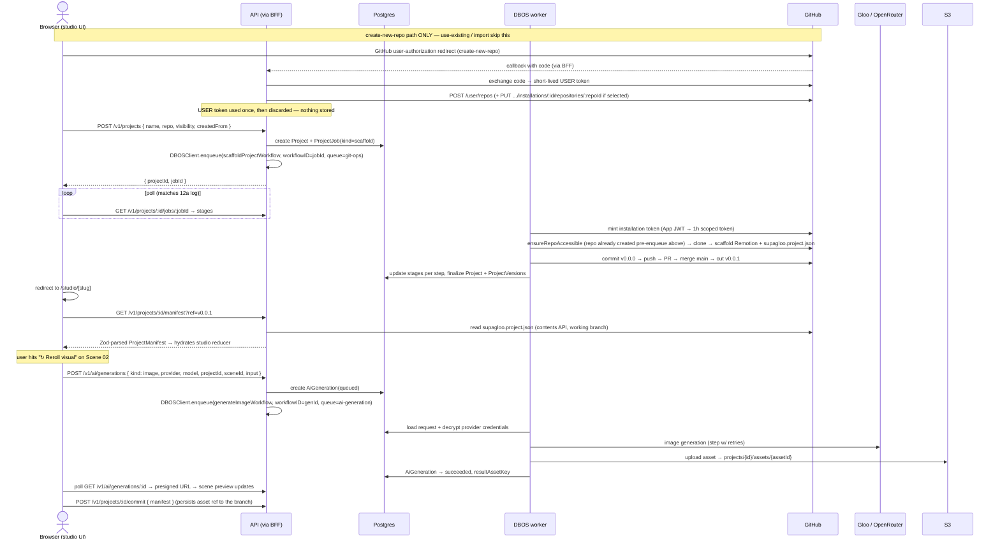
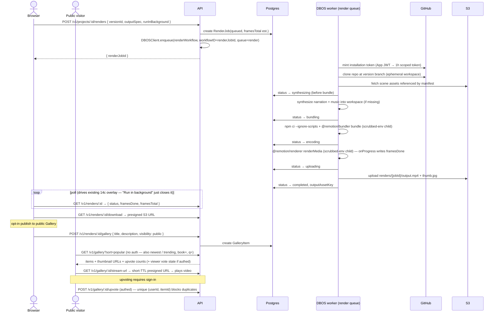
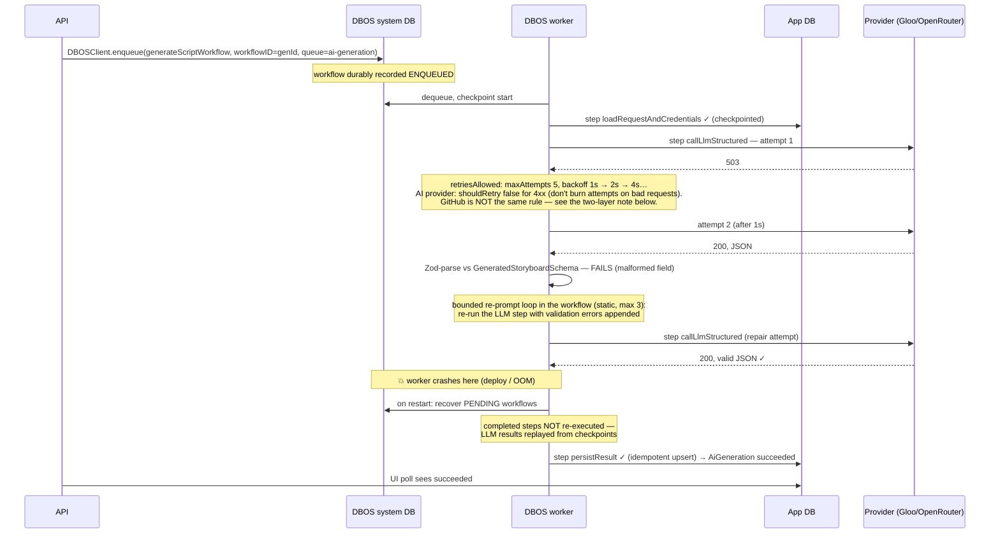
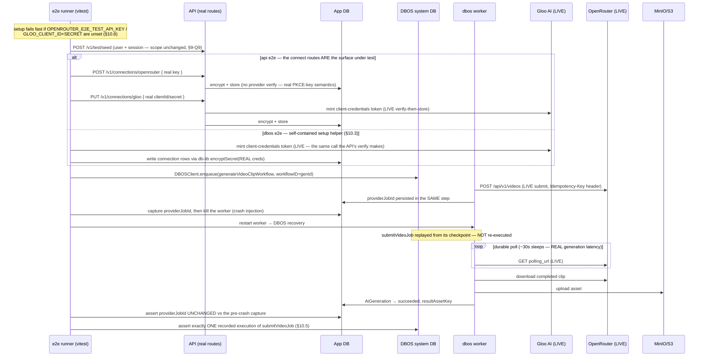
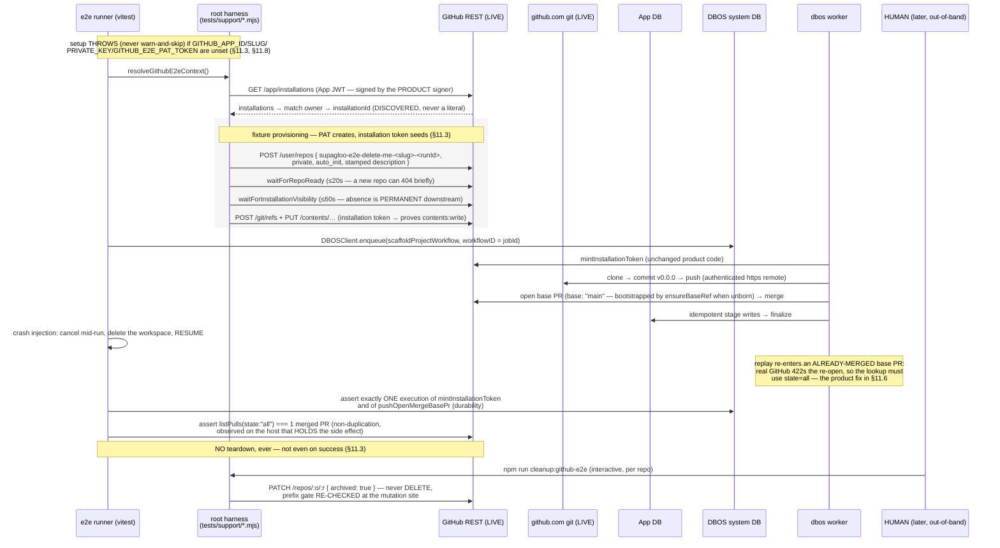

# Supagloo — Design Delta (mocks → real system)

*Written 2026-07-17 as Step 3 of the `/design` workflow. Builds on
[`current-design.md`](./current-design.md) (what exists) and
[`claude-design-review.md`](./claude-design-review.md) (canonical wireframes,
Turns 7–14). This is a delta: what to add/change to get from the mocked
prototype to the real system. It is a design for review — no code is written
by this step.*

*Update 2026-07-22 — **second delta round appended (§10, plus §6e, a §9-Q9
addendum, and §9-Q12).** The original round above/below (§1–§9) has since been
**fully realized**: plan tasks 1–34 are built and verified, and the refreshed
`current-design.md` (2026-07-22) documents the resulting real system as the new
baseline. §10 is a new delta layered on top of that baseline, driven by a new
requirement: all e2e tests must run against the real YouVersion / Gloo AI /
OpenRouter APIs, never provider stubs. §1–§9 are left as written — they are the
historical record of round 1, not pending work.*

*Update 2026-07-25 — **third delta round appended ([§11](#11-delta-round-3-2026-07-25-github-joins-the-real-provider-e2e-policy), plus §6f).** §10 has since
been fully realized (tasks 34-E1–34-E8). §11 extends §10's policy to the one
provider it explicitly carved out — **GitHub** — so e2e is now uniform across all
four. **§10 is likewise left as written**, including its "GitHub … stay exactly
as they are" scope line (§10.1): that is the historical record of round 2, and
§11 is what supersedes it. Anywhere §1–§10 describe `github-stub`, `git-server`,
`/__stub/*` or `/__admin/*` as live infrastructure, **§11 is the current
truth** — those services and the whole `tests/stubs/**` tree are deleted.*

---

## 1. Scope & mapping to the requested features

The good news first: the existing `supagloo-nextjs` UI is not throwaway. Its
client state machines (connections reducer with `connected/not-linked/pending`,
render model with the 4-stage checklist, publish provisioning log, studio
reducer) already match the wireframes *and* the job-stage models this delta
proposes. The delta is therefore mostly **replacing the `setTimeout` effect
layer behind those reducers with real HTTP calls**, plus building the three
empty repos and the local infra.

| # | Requested feature | Current state (current-design.md) | Wireframe basis (claude-design-review.md) | Delta |
|---|---|---|---|---|
| 1 | Postgres + Prisma + Zod in `supagloo-database-lib` | Empty scaffold; zero persistence anywhere | Entities implied across Turns 7–14 (consolidated data-model section) | New Prisma schema + migrations + shared Zod schemas (§2, §3) |
| 2 | Local dev parity via `docker compose up` | Compose runs only the `nextjs` service | n/a (infra) | Add `postgres`, `minio`, `minio-init`, `migrate`, `api`, `dbos` services (§4) |
| 3 | Node.js CRUD/queue API in `supagloo-nodejs-api` | Empty scaffold; no HTTP endpoint exists in any repo | Provisioning logs, status strips, job polling all imply an API | New Fastify service: CRUD + S3 + DBOS enqueue via `DBOSClient` (§8) |
| 4 | DBOS durable layer in `supagloo-nodejs-dbos` | Empty scaffold | 12a scaffold log, 14a publish log, 14c render overlay map 1:1 onto workflow stages | New DBOS app; statically-registered workflows only (§7) |
| 5 | Wire the Next.js UI to the real stack | Every data behavior is an in-memory mock | Wireframes are the target UX; UI already implements them visually | Replace mock seams; add BFF route handlers; server-side session (§5.3, §6a) |
| 6 | Real AI generation (Gloo / OpenRouter) | None in-app (the one real Gloo client only powers Stagehand tests) | Scene inspector: visual prompt "→ AI", "↻ Reroll visual", narrator voice, music bed | `AiGeneration` model + per-modality DBOS workflows + provider abstraction (§2.8, §7) |
| 7 | Real rendering + public Gallery | Fake frame ticker; Gallery exists only as a nav link | 14c render overlay (stages, frames, output spec, cancel, background); Gallery designed in **Turn 15** (15a) | `@remotion/renderer` in DBOS worker → S3 → `RenderJob` + `GalleryItem` + `GalleryUpvote` per Turn 15 (§2.7) |

Explicitly **out of scope** for this delta: the version-compare ("⇄ Compare")
screen (14b, not designed yet), the `recode.md`/`redesign.md` prompt files,
and any change to YouVersion sign-in itself (already real; we only add a
server-side session on top of it).

**Descoped for v1 — VOTD / passage / demo creation origins.** Of the five
`createdFrom` origins (Turn 9), v1 ships only **`blank`** and **`import`**.
`votd`, `passage`, and `demo` remain **reserved enum values** (so no
data-model churn when they land), but their project-creation entry points
render as **disabled "coming soon"** cards — the actual creation flows
(VOTD/passage passage-fetch + storyboard generation, demo seeding) are not
built in v1.

---

## 2. Data model (`supagloo-database-lib`)

Prisma schema + migrations live in `supagloo-database-lib`, published as
`@supagloo/database-lib` (git submodule + npm package consumed by the API,
DBOS, and Next.js repos). The package exports the generated Prisma client,
the Prisma types, and the shared Zod schemas. Consuming repos **must pin the
exact same Prisma version** as `database-lib` — exact version, not a semver
range; see §9-Q11 for the enforcement mechanism.

### Guiding decision: the repo is the source of truth for composition content

The wireframes state it outright (10a): *"Projects live in your GitHub repos…
Nothing is stored on our servers."* So **there are no `Composition`/`Scene`
tables in Postgres.** Instead:

- Each project repo carries a **`supagloo.project.json` manifest** at its
  root (alongside `remotion.config.ts`), Zod-validated by
  `ProjectManifestSchema` from `database-lib`. It holds the composition
  metadata, ordered scenes (script text + reference + translation, visual
  prompt, duration, captions flag, visual-asset reference), the
  project-scoped narrator-voice descriptor, the music bed, and the end card.
  The studio editor reads/writes this manifest; commit/publish write it back
  to the version branch.
- **Generated binary assets (scene images/video clips, narration audio,
  music) go to S3**, referenced from the manifest by asset key — *not*
  committed to git. Rationale: GitHub's 100 MB file limit, repo bloat, and
  render workers need them fetched anyway. This slightly softens the
  "nothing on our servers" marketing claim (composition *source* stays in
  the repo; generated *media* lives in Supagloo's bucket). **Resolved
  (§9-Q4):** the landing/workspace copy changes to the honest version —
  *"Your Remotion code lives in your GitHub repo, not our database.\*"* with
  the footnote *"\* Rendered videos are stored in Supagloo's S3 bucket."*
  (see the copy directive in §5.3).

Postgres therefore stores: identity/session, connections, project *metadata
and pointers*, version-branch records, job records (scaffold/import/commit/
publish/render/AI-generation), and gallery entries.

### v1 stated limitations (manifest ⇄ generated code ⇄ preview)

Two consequences of the manifest-as-source-of-truth model are **accepted
limitations for v1**, called out here so they are not mistaken for bugs:

1. **Hand-edits to generated scene sources are NOT preserved.**
   `applyManifest` (§7, workflow 3) **overwrites** the generated scene source
   files on every commit — the `supagloo.project.json` manifest is the *sole*
   source of truth in v1. A user who hand-edits `src/scenes/*.tsx` directly in
   their repo will see those edits regenerated away on the next studio commit.
   Round-tripping arbitrary hand-written Remotion code back into the manifest
   is explicitly out of scope for v1.
2. **Studio preview and the DBOS renderer are separate code paths, NOT
   guaranteed to produce identical output.** The studio preview uses
   `@remotion/player` (browser, live manifest state); the render pipeline uses
   `@remotion/renderer` (DBOS worker, committed branch). They are wired
   independently in v1 and may diverge (fonts, asset timing, codec-specific
   rendering). Unifying them behind one shared composition path is **v2 work**.

### 2.1 `User` — identity + first-time sign-in tracking

| Field | Notes |
|---|---|
| `id` | cuid PK |
| `youversionUserId` | unique — the external YouVersion account id |
| `displayName`, `email`, `avatarInitials` | from YouVersion profile at sign-in |
| `firstSignInAt` | set on row creation (this *is* the first-time-sign-in tracker) |
| `onboardingCompletedAt` | nullable; replaces today's `localStorage` `hasOnboarded` flag |
| `lastSeenAt`, `createdAt`, `updatedAt` | |

### 2.2 `Session` — server-side session (new; none exists today)

Opaque token, hashed at rest; issued by the API after verifying the
YouVersion access token; held by the browser as an httpOnly cookie set by the
Next.js BFF.

| Field | Notes |
|---|---|
| `id` | PK |
| `userId` | FK → User |
| `tokenHash` | unique; SHA-256 of the opaque bearer token |
| `expiresAt`, `createdAt`, `lastUsedAt` | sliding expiry |

### 2.3 `GithubConnection` (1:0..1 with User) — GitHub App installation

**Confirmed design (§9-Q1): a GitHub App with per-repo installation**, not a
classic OAuth app. The user installs the app via GitHub's hosted picker
(choosing "all repos" or specific repos); GitHub redirects back to our
callback with `installation_id` (+ `setup_action`), and that installation id
is what we store. **No long-lived repo token is ever stored.** Whenever the
API or a DBOS worker needs to touch GitHub, it signs a short-lived JWT with
the app's private key (App ID as issuer, ~10 min expiry), exchanges it via
`POST /app/installations/{installationId}/access_tokens`, and receives a
**~1-hour installation token scoped only to the granted repos** — used and
discarded. This is exactly wireframe 11a's promise: "Never touch repos you
don't select."

| Field | Notes |
|---|---|
| `userId` | unique FK |
| `githubLogin` | display: `@ashsrinivas` — captured at install time |
| `installationId` | **the** stored credential-pointer; all repo-operation tokens are minted on demand from it |
| `repositorySelection` | `all \| selected` — as granted at install |
| `status` (`connected`), `connectedAt` | wireframe 10b shows repo count — fetched live, not stored |

The App ID and private key are **app-level environment secrets**
(`GITHUB_APP_ID`, `GITHUB_APP_PRIVATE_KEY`) held by the API and DBOS
services — one pair per app registration, not per-user data — so they live
in env config, never in the database, and are outside §2.10's per-user
encryption scheme.

**Create-new-repo caveat (zero-storage user-token hop).** Installation tokens
have a hard limitation: they **cannot create repositories in a personal
account**, and a repo created out-of-band is **not automatically added to a
`selected` installation**. So the *create-new-repo* origin needs a
user-authorized action that installation tokens can't provide. Rather than
store a user OAuth/refresh token, create-new-repo does a **JIT (just-in-time)
zero-storage user-token hop** at project-creation time: a GitHub
user-authorization redirect → server-side code exchange → a **short-lived
user access token** → used **exactly once** for `POST /user/repos` (and, when
the installation is `selected`, `PUT /user/installations/{id}/repositories/{repoId}`
to add the new repo to the installation) → then **discarded**. **No user or
refresh token is ever stored** — this preserves the "no repo credential at
rest" property of the installation-token model. The *use-existing-empty-repo*
and *import* origins need **no** hop (the repo is already reachable by the
installation token). The alternative — storing an encrypted GitHub user
refresh token to re-mint user tokens — was **explicitly rejected** (it
reintroduces a per-user credential at rest for a one-time operation).

### 2.4 `OpenRouterConnection` (1:0..1 with User)

| Field | Notes |
|---|---|
| `userId` | unique FK |
| `apiKeyCiphertext` | the PKCE-obtained key, encrypted |
| `keyLast4` | plaintext, for the masked display `sk-or-••••••4f2a` |
| `status`, `connectedAt` | credit balance is fetched live from OpenRouter, never stored |

### 2.5 `GlooConnection` (1:0..1 with User)

| Field | Notes |
|---|---|
| `userId` | unique FK |
| `clientId` | plaintext (not a secret) |
| `clientSecretCiphertext` | encrypted; used only to mint short-lived tokens (per 11a step 4) |
| `status`, `connectedAt`, `lastVerifiedAt` | "Save & verify" mints a test token |

*(Three typed tables rather than one polymorphic `ProviderConnection` table:
the per-provider fields barely overlap, and typed columns beat a JSON blob
for encryption discipline and Prisma ergonomics. The UI's unified
`connections` reducer is served by a `GET /v1/connections` endpoint that
merges the three.)*

### 2.6 `Project` and `ProjectVersion`

**`Project`**

| Field | Notes |
|---|---|
| `id`, `slug` | slug drives `/studio/[slug]` (`psalm-121`). **Unique per `(ownerId, slug)`, NOT globally unique** — two different owners may both hold `psalm-121`. `/studio/[slug]` and `GET /v1/projects/:id` resolve **scoped to the authed owner** |
| `ownerId` | FK → User |
| `name` | editable in studio top bar |
| `repoOwner`, `repoName`, `repoVisibility` (`private\|public`) | 12a |
| `createdFrom` | enum `votd \| passage \| blank \| demo \| import` (Turn 9). **v1 ships `blank` + `import` only**; `votd`/`passage`/`demo` are **reserved enum values** with **disabled "coming soon"** entry points (§1) |
| `currentBranch` | the working `vX.Y.Z` branch |
| `thumbnailAssetKey` | S3 key from last render (or generated placeholder) |
| `lastRenderJobId` | nullable — drives the `RENDERED`/`DRAFT` badge on 10a cards |
| `lastOpenedAt`, `createdAt`, `deletedAt` | soft delete |

**`ProjectVersion`** — one row per version branch (14b dropdown)

| Field | Notes |
|---|---|
| `id` | PK |
| `projectId` | FK; unique `(projectId, semver)` |
| `semver` | `"0.0.0"`, `"0.0.1"`, … free-form semver for imports (`"0.2.3"`, per 12b) |
| `branchName` | `v0.0.1` |
| `state` | enum `base \| working \| published \| archived` |
| `commitMessage`, `autoSummary` | 14a step 1 |
| `changedFiles` | JSON array (`M src/scenes/Shelter.tsx`, …) |
| `headCommitSha`, `prNumber`, `prUrl`, `publishedAt` | |

### 2.7 `RenderJob` and `GalleryItem`

**`RenderJob`** — mirrors the 14c overlay exactly.

| Field | Notes |
|---|---|
| `id` | PK — also used as the **DBOS workflow ID** (idempotent enqueue) |
| `projectId`, `versionId`, `userId` | FKs |
| `status` | enum `queued \| bundling \| synthesizing \| encoding \| uploading \| completed \| failed \| canceled` |
| `framesDone`, `framesTotal` | updated by the render step's `onProgress` |
| `width`, `height`, `aspectRatio`, `fps`, `codec` | output spec (`1080×1920 · 9:16 · 30fps · H.264`) |
| `outputAssetKey`, `thumbnailAssetKey` | S3 keys on completion |
| `runInBackground` | UI hint only — the job is always async server-side |
| `error`, `createdAt`, `startedAt`, `completedAt` | |

**`GalleryItem`** — opt-in public publication of a completed render.
*(Designed per **Turn 15** (15a) in claude-design-review.md: a public,
unauthenticated grid with a Most popular / Newest / Trending sort control,
an "All books ▾" filter, search, per-card upvote pills, and rank badges.)*

| Field | Notes |
|---|---|
| `id` | PK |
| `renderJobId` | unique FK — one gallery entry per render |
| `projectId`, `ownerId` | FKs (denormalized for listing; creator handle/avatar come from the owner) |
| `title`, `description` | card display type ("LET THERE BE LIGHT") |
| `scriptureReference`, `translation` | e.g. "GENESIS 1:1–4" + "KJV" — card metadata, reflecting whichever translation the user actually selected (§9-Q10), not fixed to KJV/BSB. Turn 15's mock showing NIV/ESV/NLT/NASB cards is now directionally accurate rather than placeholder art. |
| `scriptureBook` | normalized book code (e.g. `GEN`), derived from the reference at publish time — drives the "All books ▾" filter without reference-parsing at query time |
| `durationSeconds` | the `mm:ss` badge |
| `videoAssetKey`, `thumbnailAssetKey` | copied from the render job |
| `visibility` | enum `public \| unlisted` (private = just don't publish) |
| `publishedAt` | drives the **Newest** sort |
| `upvoteCount` | denormalized counter — the `▲ 2.4k` pill, the **Most popular** sort, and the rank badges; updated in the same transaction as `GalleryUpvote` writes |
| `viewCount` | |

**Trending** is computed at query time as time-decayed popularity (an SQL
expression over `upvoteCount` + `publishedAt`) — no stored score in v1; a
materialized trending column is a later optimization if the gallery grows.

**`GalleryUpvote`** — one row per viewer-vote; the source of truth behind
`upvoteCount`.

| Field | Notes |
|---|---|
| `id` | PK |
| `userId`, `galleryItemId` | FKs; **composite unique** — prevents duplicate votes and renders the viewer's own filled-vs-outlined pill state |
| `createdAt` | |

Browsing is public/unauthenticated; **upvoting requires a session** (the
unique constraint needs a real `userId` — anonymous visitors get a sign-in
prompt).

*~~Still undesigned, per Turn 15's own "try next" list — non-blocking future
work, not blockers for this delta: the gallery item detail/watch page, the
"Share yours" publish-to-gallery dialog, and a creator profile page.~~*
**AMENDED 2026-07-26 — all three are now DESIGNED; 16a and 16b are built.** The design
author added **Turn 16** ("Watch page + share dialog — 16a: gallery video detail
/ watch page · 16b: 'Share yours' publish-to-gallery dialog — both from 15a") and
**Turn 17** ("Creator profile + gallery states — 17a: a creator's public profile ·
17b: gallery empty state & moderation states — from 15a"). The two deferrals this
paragraph recorded are therefore **discharged as deferrals** — the same treatment
rows 63–68 got — and replaced by the build status in §2.7.1 below. A **new**
deferral takes their place: 17a's creator profile and 17b's three moderation
states, which are designed and **out of scope by explicit user decision** —
recorded, with the data gaps behind them, in `docs/plan.md` §5.

#### 2.7.1 Turn 16 / Turn 17 — the gallery follow-on screens, as built

Recorded here because §2.7's paragraph above no longer describes reality.
Transcription of record: `scratch/step4-claude-design-v2.md` (a second DesignSync
pull on 2026-07-26; `list_files` returned a byte-identical path set, so the new
turns are pure HTML wireframe markup inside `Supagloo Wireframes.dc.html`, and the
`uploads/pasted-*.png` files are referenced by neither).

| Option | Design author's own title | Status |
|---|---|---|
| **16a** | Watch page (gallery video detail) | **BUILT** — `/gallery/[id]` |
| **16b** | "Share yours" publish-to-gallery dialog | **BUILT** — `app/_components/gallery/publish-to-gallery-dialog.tsx`, one dialog replacing **both** task-41 placeholders |
| **17a** | Creator profile | **DESIGNED, NOT BUILT** — and not buildable as drawn |
| **17b** | Gallery empty + moderation states | **card 4a (empty state) BUILT**; the other **3 cards DESIGNED, NOT BUILT** — they contradict the shipped contract |

*Build status **corrected 2026-07-26 at release** (`docs/plan.md` row 71). The
earlier version of this table said 16b was NOT BUILT with a footnote that its
implementation was "in flight"; it landed, along with 17b's card 4a, so both cells
are now settled rather than provisional. `share-yours-dialog.tsx` and the inline
publish form in `your-videos-list.tsx` — task 41's two placeholders — were deleted
in the same pass. The remaining "NOT BUILT" cells are **out of scope by explicit
user decision**, not merely unscheduled; `docs/plan.md` §5 carries the reasons and
the data gaps (D1/D5/D7/D9/D10/D11/D12) behind them.*

**16a was TRANSCRIBED, not invented.** This matters for precedence: it is not a
hand-designed extension a later turn may freely overrule, it is an implementation
of an existing wireframe, and a future turn that changes it is changing a designed
screen. What shipped: a real route (the author's own word is "page", and it is
drawn with a full frame and nav), a 9:16 portrait player, the creator line, the
upvote pill, `↗ Share`, a **disabled** `⑂ Remix this` (drawn disabled, with the
wireframe's own `title="Remixing is disabled"`), and the SCRIPTURE / HOW IT WAS
MADE sections. `GalleryPlayerModal` was retired in the same pass — a card's ▶ now
navigates — so there is exactly one playback surface, not two.

Two elements 16a draws are **omitted rather than faked**, because no field backs
them: `@maryk` (no handle column on `User`) and `🎬 Cosmic visuals` (no global
visual-style field; the manifest has only per-scene `visualPrompt`). The verse
text and the scene breakdown, which live in the creator's GitHub manifest rather
than Postgres, are served from a **publish-time snapshot** —
`GalleryItem.makingOf`, a `version: 1` jsonb column added in db-lib `525ae49` —
so a watch page never depends on that repo still existing, and never issues a
page-view manifest read.

**17b's contradiction is recorded, not resolved.** Its `PENDING REVIEW` card says
a new upload is *not* live ("we check every new upload against the community
guidelines… you'll get an email when it's live"). The shipped system publishes
immediately and synchronously: `POST /v1/renders/:id/gallery` returns **201 with
the finished item** (§7), and `GalleryVisibility` is `public|unlisted` only. 17b
is therefore a **feature request for a moderation subsystem** — review queue,
appeals, reports, notification email — not a state that can be rendered against
today's contract. Only its card 4a (`GALLERY · NO RESULTS`) is buildable, and it
is not yet built.

**Turn 16's own "try next" line**, verbatim: `"add a creator profile page (their
public videos)" · "show the remix confirmation (fork into my workspace)" · "add a
gallery empty/moderation state"`. **Turn 17's**: `"show the remix confirmation
(fork into my workspace)" · "add a moderator review queue" · "design the follow
feed"`.

### 2.8 `AiGeneration` — AI-generation requests/results

| Field | Notes |
|---|---|
| `id` | PK — also the DBOS workflow ID |
| `userId`, `projectId` (nullable), `sceneId` (nullable string — the manifest scene id) | |
| `kind` | enum `storyboard \| script \| image \| narration \| music \| video` |
| `provider` | enum `gloo \| openrouter` (user-selected per request), **constrained per `kind` by a compatibility matrix**: `storyboard`/`script` accept `gloo` **or** `openrouter`; `image` accepts `gloo` **or** `openrouter`; `narration`/`music`/`video` accept `openrouter` **ONLY** (**corrected 2026-07-28** — see §9-Q2). Enforced **at enqueue**, encoded once as a shared `database-lib` constant (see §7 "Provider call patterns" and §8) |
| `model` | provider model id |
| `input` | JSON — the prompt/spec, Zod-validated at enqueue |
| `status` | enum `queued \| running \| succeeded \| failed \| canceled` |
| `providerJobId` | nullable string — the provider-side async job id (OpenRouter video jobs return one on submission); persisted immediately after submit so the polling steps survive DBOS replay / worker restart without re-submitting (§7, workflow 8) |
| `resultJson` | JSON — for text/structured outputs (Zod-validated) |
| `resultAssetKey` | S3 key — for binary outputs (image/audio/video) |
| `error`, `tokenUsage` (JSON), `createdAt`, `completedAt` | |

### 2.9 `ProjectJob` — staged git-ops jobs (scaffold / import / commit / publish)

One table backs all four provisioning-log UIs (12a, 12b, studio commit, 14a),
since they share the shape "async job with an ordered stage checklist".

| Field | Notes |
|---|---|
| `id` | PK — also the DBOS workflow ID |
| `projectId`, `userId`, `versionId` (nullable) | |
| `kind` | enum `scaffold \| import_verify \| commit \| publish` |
| `status` | enum `queued \| running \| succeeded \| failed \| canceled` |
| `stages` | JSON array of `{ key, label, state: pending\|running\|done\|failed }` — the UI log rows |
| `error`, `createdAt`, `completedAt` | |

**Per-project git-ops serialization (409 guard).** The API **rejects with 409**
a new git-ops job (scaffold/import/commit/publish) for a project that already
has a `queued` or `running` ProjectJob — this **serializes git-ops per
project** so two commits/publishes can't race on the same repo's branches.
`baseHeadSha`-style optimistic concurrency (rejecting a commit whose base no
longer matches the branch head) is **explicitly deferred**: exposure is low
(a single user rarely drives concurrent git-ops on one project) and any bad
outcome is git-recoverable.

### 2.10 Secrets encryption

The OpenRouter key and the Gloo client secret are encrypted **at the
application level** (AES-256-GCM, random nonce per value, key from
`SECRETS_ENCRYPTION_KEY` env — 32 bytes, distinct per environment).
`database-lib` exports the `encryptSecret`/`decryptSecret` helpers so API and
DBOS use the same primitive. Display-safe fragments (`keyLast4`,
`githubLogin`, `clientId`) are stored plaintext. GitHub needs **no per-user
secret at rest**: installation tokens are minted on demand (§2.3), and the
app private key is an env-level secret, not a database row.

### 2.11 Zod schemas (shared, mostly NOT persisted models)

All in `database-lib` (e.g. `src/schemas/`), exported alongside Prisma types:

| Schema | Purpose |
|---|---|
| `ProjectManifestSchema` | The `supagloo.project.json` file format (composition size/fps/aspect, ordered scenes, narrator voice, music bed, end card, captions). Validated on every read (studio open, import verify) and write (commit). Versioned (`manifestVersion: 1`). The scene `translation` field holds whatever translation abbreviation the user selected via the YouVersion Bible-collection picker (§9-Q10) — validated against the live collection response at generation time, not a fixed enum. Defaults to `BSB` for new projects. |
| `GeneratedStoryboardSchema` | **LLM structured output**: scene breakdown from a passage — per-scene `name`, `scriptText`, `reference`, `translation`, `visualPrompt`, `suggestedDurationSeconds`, plus whole-video `narratorVoice` and `musicStyle` suggestions. Used with structured-output generation; the LLM response is parsed against this before persisting. |
| `SceneVisualPromptSchema` | LLM structured output for "↻ Reroll visual" — a refined image/video prompt. |
| `NarrationSpecSchema`, `MusicSpecSchema` | Inputs to audio synthesis (voice descriptor + per-scene scripts; music style label + duration). |
| `RenderOutputSpecSchema` | resolution / aspect / fps / codec — request validation + stored on RenderJob. |
| API DTO schemas | Request/response bodies for every endpoint in §8 (`CreateProjectRequest`, `CommitRequest`, `RenderRequest`, `GenerationRequest`, connection payloads, job/stage status shapes). Shared by the API (Fastify + zod type provider) and the Next.js BFF for end-to-end type safety. |
| Job/status enums | Mirror the Prisma enums so the existing UI reducers keep their state-machine vocabularies. |

**Distinction:** Prisma models are what Postgres persists; Zod schemas are
(a) contracts with LLMs (structured outputs), (b) the repo-manifest file
format, and (c) API wire contracts. Only `AiGeneration.input`/`resultJson`
and `ProjectJob.stages` persist Zod-shaped JSON inside Prisma JSON columns.

---

## 3. ER diagram


```mermaid
erDiagram
    USER ||--o{ SESSION : "has"
    USER ||--o| GITHUB_CONNECTION : "connects"
    USER ||--o| OPENROUTER_CONNECTION : "connects"
    USER ||--o| GLOO_CONNECTION : "connects"
    USER ||--o{ PROJECT : "owns"
    USER ||--o{ AI_GENERATION : "requests"
    USER ||--o{ RENDER_JOB : "starts"
    PROJECT ||--o{ PROJECT_VERSION : "has branches"
    PROJECT ||--o{ PROJECT_JOB : "has git-ops jobs"
    PROJECT ||--o{ RENDER_JOB : "is rendered by"
    PROJECT ||--o{ AI_GENERATION : "scopes"
    PROJECT_VERSION ||--o{ RENDER_JOB : "is source of"
    PROJECT_VERSION ||--o{ PROJECT_JOB : "targets"
    RENDER_JOB ||--o| GALLERY_ITEM : "publishes as"
    USER ||--o{ GALLERY_UPVOTE : "casts"
    GALLERY_ITEM ||--o{ GALLERY_UPVOTE : "receives"

    USER {
        string id PK
        string youversionUserId UK
        string displayName
        string email
        datetime firstSignInAt
        datetime onboardingCompletedAt "nullable"
    }
    SESSION {
        string id PK
        string userId FK
        string tokenHash UK
        datetime expiresAt
    }
    GITHUB_CONNECTION {
        string userId UK
        string githubLogin
        string installationId "GitHub App installation; tokens minted on demand"
        string repositorySelection "all|selected"
        string status
        datetime connectedAt
    }
    OPENROUTER_CONNECTION {
        string userId UK
        string apiKeyCiphertext
        string keyLast4
        string status
    }
    GLOO_CONNECTION {
        string userId UK
        string clientId
        string clientSecretCiphertext
        string status
        datetime lastVerifiedAt
    }
    PROJECT {
        string id PK
        string slug "unique per owner (ownerId, slug)"
        string ownerId FK
        string name
        string repoOwner
        string repoName
        string repoVisibility
        string createdFrom "votd|passage|blank|demo|import"
        string currentBranch
        string thumbnailAssetKey
        datetime lastOpenedAt
    }
    PROJECT_VERSION {
        string id PK
        string projectId FK
        string semver "unique per project"
        string branchName
        string state "base|working|published|archived"
        string commitMessage
        json changedFiles
        int prNumber "nullable"
        datetime publishedAt
    }
    PROJECT_JOB {
        string id PK "= DBOS workflow ID"
        string projectId FK
        string kind "scaffold|import_verify|commit|publish"
        string status
        json stages
    }
    RENDER_JOB {
        string id PK "= DBOS workflow ID"
        string projectId FK
        string versionId FK
        string status "queued..completed|failed|canceled"
        int framesDone
        int framesTotal
        int width
        int height
        string aspectRatio
        int fps
        string codec
        string outputAssetKey
    }
    AI_GENERATION {
        string id PK "= DBOS workflow ID"
        string userId FK
        string projectId FK "nullable"
        string sceneId "nullable manifest scene id"
        string kind "storyboard|script|image|narration|music|video"
        string provider "gloo|openrouter"
        string model
        json input
        string providerJobId "nullable - async video job id"
        json resultJson
        string resultAssetKey
        string status
    }
    GALLERY_ITEM {
        string id PK
        string renderJobId UK
        string projectId FK
        string ownerId FK
        string title
        string scriptureReference
        string scriptureBook "All-books filter"
        string translation
        int durationSeconds
        int upvoteCount "denormalized from GALLERY_UPVOTE"
        string videoAssetKey
        string visibility "public|unlisted"
        datetime publishedAt
    }
    GALLERY_UPVOTE {
        string id PK
        string userId FK
        string galleryItemId FK "unique (userId, galleryItemId)"
        datetime createdAt
    }
```

---

## 4. Local dev / infra: Postgres + S3 in Docker Compose

**Recommendation: MinIO for local S3, with separate dev/prod buckets.
Postgres 17 in a container with two logical databases (app + DBOS system).**

### Why MinIO (vs LocalStack, vs a cloud dev bucket)

- **MinIO** is a production-grade, S3-API-compatible object store in a single
  small container. It supports everything we use — put/get/delete, multipart
  upload, **presigned URLs** — with the real AWS SDK v3 client. The only code
  difference vs prod is configuration: `endpoint` override +
  `forcePathStyle: true` + static credentials, all via env vars. Same code
  path in prod (drop the endpoint override).
- **LocalStack** emulates most of AWS; we need exactly one service. It's a
  heavier container, slower to start, and its S3 is an emulation layer rather
  than a real object store. Rejected as unnecessary weight.
- **A second cloud bucket for dev** breaks the explicit requirement
  ("`docker compose down && docker compose up --build`, no manual cloud
  dependency") and breaks offline dev. Rejected.

### Dev vs prod buckets: yes, separate — trivially so

Local dev uses a MinIO bucket (`supagloo-dev`) that exists only inside the
Compose network; prod keeps the existing Railway bucket (confirmed, §9-Q7:
Railway Buckets are private, S3-API-compatible object storage — the parity
plan holds). They can never
collide, local tests can never touch prod user videos, and the app only ever
knows `S3_ENDPOINT` / `S3_BUCKET` / `S3_ACCESS_KEY` / `S3_SECRET_KEY` /
`S3_REGION` env vars — parity is achieved by configuration, not shared
infrastructure. **Never point local dev at the prod bucket.**

One practical detail that bites everyone with MinIO: presigned URLs generated
by the API must be reachable from the **host browser**, but inside the
Compose network MinIO is `minio:9000`. So the API takes two endpoint vars:
`S3_ENDPOINT` (internal, used for server-side ops) and `S3_PUBLIC_ENDPOINT`
(`http://localhost:9000` locally; the real bucket URL in prod) used when
signing browser-facing URLs.

### Postgres: one server, two databases

DBOS requires a **system database** for its checkpoints/queues. Run one
Postgres 17 container with two databases created by an init script:
`supagloo` (app schema, Prisma-managed) and `supagloo_dbos` (DBOS-managed,
untouched by Prisma). Same split in prod on the existing Railway Postgres.
*Implementation-time check (not a design blocker):* verify the Railway plan
permits `CREATE DATABASE supagloo_dbos`; if it only exposes one database,
DBOS's schema-level isolation in the same database is the fallback (§9-Q7).

### Target `docker-compose.yml` shape (illustrative)

```yaml
services:
  postgres:
    image: postgres:17-alpine
    environment: { POSTGRES_USER: supagloo, POSTGRES_PASSWORD: supagloo }
    volumes:
      - pgdata:/var/lib/postgresql/data
      - ./infra/pg-init:/docker-entrypoint-initdb.d   # creates supagloo + supagloo_dbos
    healthcheck: { test: ["CMD-SHELL", "pg_isready -U supagloo"] }
    ports: ["5432:5432"]

  minio:
    image: minio/minio
    command: server /data --console-address ":9001"
    environment: { MINIO_ROOT_USER: supagloo, MINIO_ROOT_PASSWORD: supagloo-dev }
    volumes: [minio-data:/data]
    ports: ["9000:9000", "9001:9001"]

  minio-init:            # one-shot: mc mb --ignore-existing local/supagloo-dev
    image: minio/mc
    depends_on: [minio]

  migrate:               # one-shot: prisma migrate deploy (from database-lib)
    build: ./supagloo-nodejs-api
    command: npx prisma migrate deploy
    depends_on: { postgres: { condition: service_healthy } }

  api:
    build: ./supagloo-nodejs-api
    ports: ["4000:4000"]
    depends_on: { migrate: { condition: service_completed_successfully }, minio-init: { condition: service_completed_successfully } }

  dbos:
    build: ./supagloo-nodejs-dbos
    depends_on: { migrate: { condition: service_completed_successfully } }

  nextjs:
    build: ./supagloo-nextjs
    ports: ["8000:3000"]
    depends_on: [api]

volumes: { pgdata: {}, minio-data: {} }
```

`docker compose down && docker compose up --build` then yields the full
stack: UI on :8000, API on :4000, Postgres, MinIO (+ its console on :9001),
migrations applied, bucket created. Railway prod runs the same three app
images against Railway Postgres + the existing bucket.

**A second public/internal endpoint pair (plan row 66).** `S3_ENDPOINT` /
`S3_PUBLIC_ENDPOINT` exist because a URL signed against `minio:9000` is unreachable
from a browser. The GitHub user-authorization host has the *same* shape of problem and
now has the same shape of answer: **`GITHUB_OAUTH_BASE_URL`** is the value the
**browser** opens (the install picker and the authorize redirect), and
**`GITHUB_OAUTH_INTERNAL_BASE_URL`** is the value the **api process** POSTs the
code→token exchange to. One variable served both until row 66, which is why a
containerised api could not have its exchange redirected without also moving the
browser's redirect target — row 62 item (e)'s `DNS_PROBE_FINISHED_NXDOMAIN` in one
sentence.

Two DELIBERATE differences from the S3 pair, both recorded because they look like
inconsistencies until you know why:

1. **The naming is inverted relative to S3.** Under the S3 convention the *unsuffixed*
   name is internal and the suffixed one is public; §11.4 originally proposed mirroring
   that exactly. Doing so would have silently changed the meaning of a variable every
   deployed environment already sets, so the new NAME is given to the new MEANING
   instead. That is the only direction that leaves already-deployed environments
   untouched.
2. **It is defaulted, not required.** The S3 pair is required-no-default because there
   is no correct default endpoint. Here there is: the public value. Unset ⇒
   `GITHUB_OAUTH_INTERNAL_BASE_URL` resolves to `GITHUB_OAUTH_BASE_URL` ⇒ behaviour
   identical to before the split, so "real-by-default ⇒ prod needs zero config" (§11.2)
   survives. Overriding only the public one (a GitHub Enterprise host, say) still moves
   both halves together.

Only `docker-compose.test.yml` sets the internal one, to `http://api:4000` — the api
calls **itself**, so there is no new container to build, run or later mistake for a
revived stub (§10.7, §10.9). dbos never receives it: dbos has no OAuth base URL at all,
and a `providers.e2e.ts` guard keeps any dbos-visible GitHub variable free of local
hostnames.

---

## 5. System architecture (target)

### 5.1 Service responsibilities

- **`supagloo-nextjs`** — UI + thin BFF. Gets its first-ever
  `app/api/**/route.ts` handlers, which (a) hold the httpOnly session cookie
  and forward requests to the API with the bearer token, and (b) host the
  **GitHub callback route(s)** — the **App installation callback** *and* (per
  §6b) the **JIT user-authorization callback used only for create-new-repo**
  (§2.3) — staying on the user-facing origin. **OpenRouter's PKCE exchange is
  entirely browser-side** (per 11c / §6a / §9-Q5): the browser completes the
  exchange and POSTs the resulting key to the BFF, so there is **no OpenRouter
  server-side callback route**. No business logic; no direct DB/S3 access.
- **`supagloo-nodejs-api`** — Fastify + Prisma (`database-lib`) + AWS SDK S3
  client + **`DBOSClient`** (enqueue-only; it does *not* run the DBOS
  runtime). Owns auth/session, all CRUD, OAuth exchanges + the GitHub App
  installation callback, presigned URLs, and job enqueueing. Stateless;
  scales horizontally.
- **`supagloo-nodejs-dbos`** — the DBOS application: statically-registered
  workflows + queues (§7). Workers do all git operations (ephemeral clones
  in the worker's temp dir — this is the wireframes' "temporary Railway
  workspace"), all LLM/media-model calls, and Remotion rendering
  (`@remotion/bundler` + `@remotion/renderer`). Writes job progress to
  Postgres via the same `database-lib` client; uploads outputs to S3.
- **`supagloo-database-lib`** — Prisma schema/migrations/client + Zod
  schemas + secret-crypto helpers. No runtime service.
- **API ↔ DBOS contract:** no HTTP between them. The API enqueues via
  `DBOSClient` against the DBOS **system database** (`supagloo_dbos`), with
  `workflowName` + `queueName` + `workflowID` = the domain-record id
  (RenderJob/AiGeneration/ProjectJob id), making enqueue idempotent. Status
  flows back through the **app database** rows the workflows update, which
  the API reads and the UI polls.

### 5.2 Architecture diagram


```mermaid
graph TD
    subgraph Browser
        UI["supagloo-nextjs UI<br/>(existing pages + reducers, mocks removed)"]
    end

    subgraph NextJS["supagloo-nextjs server (BFF)"]
        BFF["app/api/* route handlers<br/>session cookie, OAuth callbacks,<br/>proxy to API"]
    end

    subgraph API["supagloo-nodejs-api (Fastify)"]
        Auth["auth + sessions"]
        CRUD["CRUD: users, connections,<br/>projects, versions, jobs, gallery"]
        Files["S3 file ops + presigned URLs"]
        Enq["DBOSClient.enqueue"]
    end

    subgraph DBOS["supagloo-nodejs-dbos (DBOS workers)"]
        QG["queue: git-ops<br/>scaffold / import / commit / publish"]
        QA["queue: ai-generation<br/>storyboard / image / narration / music / video"]
        QR["queue: render<br/>bundle → synth → encode → upload"]
    end

    DBLib["supagloo-database-lib<br/>Prisma client + Zod schemas<br/>(imported by API, DBOS, UI types)"]

    PG[("Postgres 17<br/>db: supagloo (app, Prisma)<br/>db: supagloo_dbos (DBOS system)")]
    S3[("S3 bucket<br/>prod: Railway bucket<br/>dev: MinIO in Compose")]

    YV["YouVersion Platform<br/>(OAuth — already real; + Bible content API)"]
    GH["GitHub<br/>(App installation + repos/PRs/merges)"]
    OR["OpenRouter<br/>(PKCE key exchange + text/TTS/video generation)"]
    GLOO["Gloo AI Studio<br/>(client-credentials + inference)"]

    UI --> BFF
    UI -->|"sign-in redirect (unchanged)"| YV
    BFF --> API
    Auth -->|"verify YV token"| YV
    CRUD --> PG
    Files --> S3
    Enq -->|"enqueue (system db)"| PG
    CRUD -->|"live repo lists / credit balance"| GH
    CRUD --> OR

    DBOS -->|"dequeue + checkpoints"| PG
    DBOS -->|"job status/progress writes"| PG
    DBOS -->|"asset & video upload/download"| S3
    DBOS -->|"clone/push/PR/merge"| GH
    DBOS -->|"LLM / media models"| OR
    DBOS -->|"LLM / media models"| GLOO
    DBOS -->|"passage text (VOTD / passage)"| YV

    API -.imports.-> DBLib
    DBOS -.imports.-> DBLib
    BFF -.imports types/schemas.-> DBLib
```

### 5.3 UI wiring: mock seam → real seam (feature 5)

| Today's mock (current-design.md) | Replacement |
|---|---|
| `localStorage` `hasOnboarded` flag | `User.onboardingCompletedAt` via `GET /v1/me`; sign-in mints a server session (§6a) |
| `connections-model.ts` `setTimeout` → `completeConnect` with hardcoded detail | Keep the reducer; effects become BFF calls to the real connect endpoints; `pending` now spans a real OAuth round-trip |
| `findStudioProject()` → hardcoded `DEMO_STORYBOARD` | `GET /v1/projects/:id` + `GET /v1/projects/:id/manifest` → Zod-parsed `ProjectManifest` hydrates the studio reducer |
| New-project / import wizard fake `provisioning-log.ts` ticker | `POST /v1/projects` / `/projects/import` → poll `GET .../jobs/:id`; `stages` JSON renders the same log rows |
| Studio `commit()` `setTimeout` | `POST /v1/projects/:id/commit` (manifest payload) → poll ProjectJob |
| Publish wizard fake 4-stage log | `POST /v1/projects/:id/publish` → poll ProjectJob (stages mirror 14a) |
| `render-model.ts` fake frame ticker | `POST /v1/projects/:id/renders` → poll `GET /v1/renders/:id` (status + framesDone/framesTotal drive the existing overlay); cancel button → `POST /v1/renders/:id/cancel` |
| — (new) | Gallery page (Turn 15): public `GET /v1/gallery?sort=&book=&q=`; upvote pill → `POST`/`DELETE /v1/gallery/:id/upvote` (authed); "Your videos": authed `GET /v1/renders?mine=1` |

**Copy directive (§9-Q4 resolved):** landing and workspace copy that today
implies "nothing is stored on our servers" changes to: *"Your Remotion code
lives in your GitHub repo, not our database.\*"* with the footnote
*"\* Rendered videos are stored in Supagloo's S3 bucket."*

The flag-gated Stagehand mock-session seam stays for UI e2e tests, but e2e
against the real stack becomes possible via Compose (see §9-Q9 on test
seeding).

---

## 6. Sequence diagrams — key new flows

### (a) First-time sign-in + provider connection setup


```mermaid
sequenceDiagram
    actor U as Browser
    participant N as Next.js BFF
    participant A as API
    participant DB as Postgres
    participant YV as YouVersion
    participant GH as GitHub
    participant OR as OpenRouter
    participant GL as Gloo AI

    Note over U,YV: YouVersion OAuth sign-in — unchanged, already real
    U->>N: POST /api/auth/session (YV access token)
    N->>A: POST /v1/auth/youversion
    A->>YV: verify token / fetch userinfo
    A->>DB: upsert User (create ⇒ firstSignInAt=now), create Session
    A-->>N: session token + user { onboardingCompletedAt: null }
    N-->>U: Set-Cookie (httpOnly) — UI opens SetupWizard (server-driven, not localStorage)

    Note over U,GH: Step 2/4 — GitHub (REQUIRED — GitHub App installation)
    U->>N: GET /api/connect/github/start
    N->>A: GET /v1/connections/github/install-url
    U->>GH: App install page (new tab — user picks all/selected repos)
    GH-->>N: redirect /api/connect/github/callback (installation_id, setup_action)
    N->>A: POST /v1/connections/github/callback { installationId }
    A->>GH: verify installation (App JWT → GET /app/installations/:id)
    A->>DB: store installationId + githubLogin (no long-lived token stored)
    A-->>N: connected — wizard advances

    Note over U,OR: Step 3/4 — OpenRouter (PKCE)
    U->>OR: authorize with code_challenge (browser-generated verifier)
    OR-->>U: callback with code
    U->>OR: exchange code + verifier → API key (browser↔OpenRouter, per 11c)
    U->>N: POST /api/connect/openrouter { key }
    N->>A: POST /v1/connections/openrouter
    A->>DB: store encrypted key + keyLast4

    Note over U,GL: Step 4/4 — Gloo credentials
    U->>N: PUT /api/connect/gloo { clientId, clientSecret }
    N->>A: PUT /v1/connections/gloo
    A->>GL: mint test token (client-credentials) — "Save & verify"
    A->>DB: store clientId + encrypted secret, lastVerifiedAt

    U->>N: PATCH /api/me/onboarding { completed: true }
    N->>A: PATCH /v1/me/onboarding
    A->>DB: set onboardingCompletedAt
```

### (b) Create project + generate AI content for a scene


```mermaid
sequenceDiagram
    actor U as Browser (studio UI)
    participant A as API (via BFF)
    participant DB as Postgres
    participant W as DBOS worker
    participant GH as GitHub
    participant LLM as Gloo / OpenRouter
    participant S3 as S3

    Note over U,GH: create-new-repo path ONLY — use-existing / import skip this
    U->>GH: GitHub user-authorization redirect (create-new-repo)
    GH-->>A: callback with code (via BFF)
    A->>GH: exchange code → short-lived USER token
    A->>GH: POST /user/repos (+ PUT .../installations/:id/repositories/:repoId if selected)
    Note over A: USER token used once, then discarded — nothing stored

    U->>A: POST /v1/projects { name, repo, visibility, createdFrom }
    A->>DB: create Project + ProjectJob(kind=scaffold)
    A->>A: DBOSClient.enqueue(scaffoldProjectWorkflow, workflowID=jobId, queue=git-ops)
    A-->>U: { projectId, jobId }
    loop poll (matches 12a log)
        U->>A: GET /v1/projects/:id/jobs/:jobId → stages
    end
    W->>GH: mint installation token (App JWT → 1h scoped token)
    W->>GH: ensureRepoAccessible (repo already created pre-enqueue above) → clone → scaffold Remotion + supagloo.project.json
    W->>GH: commit v0.0.0 → push → PR → merge main → cut v0.0.1
    W->>DB: update stages per step, finalize Project + ProjectVersions
    U->>U: redirect to /studio/[slug]

    U->>A: GET /v1/projects/:id/manifest?ref=v0.0.1
    A->>GH: read supagloo.project.json (contents API, working branch)
    A-->>U: Zod-parsed ProjectManifest → hydrates studio reducer

    Note over U: user hits "↻ Reroll visual" on Scene 02
    U->>A: POST /v1/ai/generations { kind: image, provider, model, projectId, sceneId, input }
    A->>DB: create AiGeneration(queued)
    A->>A: DBOSClient.enqueue(generateImageWorkflow, workflowID=genId, queue=ai-generation)
    W->>DB: load request + decrypt provider credentials
    W->>LLM: image generation (step w/ retries)
    W->>S3: upload asset → projects/{id}/assets/{assetId}
    W->>DB: AiGeneration → succeeded, resultAssetKey
    U->>A: poll GET /v1/ai/generations/:id → presigned URL → scene preview updates
    U->>A: POST /v1/projects/:id/commit { manifest } (persists asset ref to the branch)
```

### (c) Render a project → appears in the Gallery


```mermaid
sequenceDiagram
    actor U as Browser
    actor V as Public visitor
    participant A as API
    participant DB as Postgres
    participant W as DBOS worker (render queue)
    participant GH as GitHub
    participant S3 as S3

    U->>A: POST /v1/projects/:id/renders { versionId, outputSpec, runInBackground }
    A->>DB: create RenderJob(queued, framesTotal est.)
    A->>A: DBOSClient.enqueue(renderWorkflow, workflowID=renderJobId, queue=render)
    A-->>U: { renderJobId }

    W->>GH: mint installation token (App JWT → 1h scoped token)
    W->>GH: clone repo at version branch (ephemeral workspace)
    W->>S3: fetch scene assets referenced by manifest
    W->>DB: status → synthesizing (before bundle)
    W->>W: synthesize narration + music into workspace (if missing)
    W->>DB: status → bundling
    W->>W: npm ci --ignore-scripts + @remotion/bundler bundle (scrubbed-env child)
    W->>DB: status → encoding
    W->>W: @remotion/renderer renderMedia (scrubbed-env child) — onProgress writes framesDone
    W->>DB: status → uploading
    W->>S3: upload renders/{jobId}/output.mp4 + thumb.jpg
    W->>DB: status → completed, outputAssetKey

    loop poll (drives existing 14c overlay — "Run in background" just closes it)
        U->>A: GET /v1/renders/:id → { status, framesDone, framesTotal }
    end
    U->>A: GET /v1/renders/:id/download → presigned S3 URL

    Note over U: opt-in publish to public Gallery
    U->>A: POST /v1/renders/:id/gallery { title, description, visibility: public }
    A->>DB: create GalleryItem

    V->>A: GET /v1/gallery?sort=popular (no auth — also newest / trending, book=, q=)
    A-->>V: items + thumbnail URLs + upvote counts (+ viewer vote state if authed)
    V->>A: GET /v1/gallery/:id/stream-url → short-TTL presigned URL → plays video
    Note over V,A: upvoting requires sign-in
    V->>A: POST /v1/gallery/:id/upvote (authed) — unique (userId, itemId) blocks duplicates
```

### (d) DBOS-queued job with retry + crash recovery (LLM structured output)


```mermaid
sequenceDiagram
    participant A as API
    participant SYS as DBOS system DB
    participant W as DBOS worker
    participant DB as App DB
    participant LLM as Provider (Gloo/OpenRouter)

    A->>SYS: DBOSClient.enqueue(generateScriptWorkflow, workflowID=genId, queue=ai-generation)
    Note over SYS: workflow durably recorded ENQUEUED
    W->>SYS: dequeue, checkpoint start
    W->>DB: step loadRequestAndCredentials ✓ (checkpointed)
    W->>LLM: step callLlmStructured — attempt 1
    LLM-->>W: 503
    Note over W: retriesAllowed: maxAttempts 5, backoff 1s → 2s → 4s…<br/>AI provider: shouldRetry false for 4xx (don't burn attempts on bad requests).<br/>GitHub is NOT the same rule — see the two-layer note below.
    W->>LLM: attempt 2 (after 1s)
    LLM-->>W: 200, JSON
    W->>W: Zod-parse vs GeneratedStoryboardSchema — FAILS (malformed field)
    Note over W: bounded re-prompt loop in the workflow (static, max 3):<br/>re-run the LLM step with validation errors appended
    W->>LLM: step callLlmStructured (repair attempt)
    LLM-->>W: 200, valid JSON ✓
    Note over W,SYS: 💥 worker crashes here (deploy / OOM)
    W->>SYS: on restart: recover PENDING workflows
    Note over W: completed steps NOT re-executed —<br/>LLM results replayed from checkpoints
    W->>DB: step persistResult ✓ (idempotent upsert) → AiGeneration succeeded
    A->>DB: UI poll sees succeeded
```

### (e) Real-provider e2e: credential seeding + flagship crash/replay (delta round 2 — §10)

*Added 2026-07-22. Shows the redesigned e2e setup (§10.3) and the replacement
exactly-once proof (§10.5) for `generateVideoClipWorkflow` against LIVE
OpenRouter/Gloo. All provider participants here are the real hosts — no stubs.*


```mermaid
sequenceDiagram
    participant T as e2e runner (vitest)
    participant A as API (real routes)
    participant DB as App DB
    participant SYS as DBOS system DB
    participant W as dbos worker
    participant GL as Gloo AI (LIVE)
    participant OR as OpenRouter (LIVE)
    participant S3 as MinIO/S3

    Note over T: setup fails fast if OPENROUTER_E2E_TEST_API_KEY /<br/>GLOO_CLIENT_ID+SECRET are unset (§10.8)
    T->>A: POST /v1/test/seed (user + session — scope unchanged, §9-Q9)
    alt api e2e — the connect routes ARE the surface under test
        T->>A: POST /v1/connections/openrouter { real key }
        A->>DB: encrypt + store (no provider verify — real PKCE-key semantics)
        T->>A: PUT /v1/connections/gloo { real clientId/secret }
        A->>GL: mint client-credentials token (LIVE verify-then-store)
        A->>DB: encrypt + store
    else dbos e2e — self-contained setup helper (§10.3)
        T->>GL: mint client-credentials token (LIVE — the same call the API's verify makes)
        T->>DB: write connection rows via db-lib encryptSecret(REAL creds)
    end

    T->>SYS: DBOSClient.enqueue(generateVideoClipWorkflow, workflowID=genId)
    W->>OR: POST /api/v1/videos (LIVE submit, Idempotency-Key header)
    W->>DB: providerJobId persisted in the SAME step
    T->>DB: capture providerJobId, then kill the worker (crash injection)
    T->>W: restart worker → DBOS recovery
    Note over W,SYS: submitVideoJob replayed from its checkpoint — NOT re-executed
    loop durable poll (~30s sleeps — REAL generation latency)
        W->>OR: GET polling_url (LIVE)
    end
    W->>OR: download completed clip
    W->>S3: upload asset
    W->>DB: AiGeneration → succeeded, resultAssetKey
    T->>DB: assert providerJobId UNCHANGED vs the pre-crash capture
    T->>SYS: assert exactly ONE recorded execution of submitVideoJob (§10.5)
```

### (f) Real-GitHub e2e: fixture-repo lifecycle + the two-axis exactly-once proof (delta round 3 — §11)

*Added 2026-07-25. The §6e analogue for GitHub. Every GitHub participant is the
real host; there is no stub anywhere in this diagram. The repo lifecycle lane is
the part §6e has no equivalent for — it is the one provider that leaves durable
objects behind (§11.9).*


```mermaid
sequenceDiagram
    participant T as e2e runner (vitest)
    participant H as root harness<br/>(tests/support/*.mjs)
    participant GH as GitHub REST (LIVE)
    participant GIT as github.com git (LIVE)
    participant DB as App DB
    participant SYS as DBOS system DB
    participant W as dbos worker
    participant HU as HUMAN (later, out-of-band)

    Note over T,H: setup THROWS (never warn-and-skip) if GITHUB_APP_ID/SLUG/<br/>PRIVATE_KEY/GITHUB_E2E_PAT_TOKEN are unset (§11.3, §11.8)
    T->>H: resolveGithubE2eContext()
    H->>GH: GET /app/installations (App JWT — signed by the PRODUCT signer)
    GH-->>H: installations → match owner → installationId (DISCOVERED, never a literal)

    rect rgb(245,245,245)
        Note over H,GH: fixture provisioning — PAT creates, installation token seeds (§11.3)
        H->>GH: POST /user/repos { supagloo-e2e-delete-me-<slug>-<runId>,<br/>private, auto_init, stamped description }
        H->>GH: waitForRepoReady (≤20s — a new repo can 404 briefly)
        H->>GH: waitForInstallationVisibility (≤60s — absence is PERMANENT downstream)
        H->>GH: POST /git/refs + PUT /contents/… (installation token → proves contents:write)
    end

    T->>SYS: DBOSClient.enqueue(scaffoldProjectWorkflow, workflowID = jobId)
    W->>GH: mintInstallationToken (unchanged product code)
    W->>GIT: clone → commit v0.0.0 → push (authenticated https remote)
    W->>GH: open base PR (base: "main" — bootstrapped by ensureBaseRef when unborn) → merge
    W->>DB: idempotent stage writes → finalize

    T->>T: crash injection: cancel mid-run, delete the workspace, RESUME
    Note over W: replay re-enters an ALREADY-MERGED base PR:<br/>real GitHub 422s the re-open, so the lookup must<br/>use state=all — the product fix in §11.6
    T->>SYS: assert exactly ONE execution of mintInstallationToken<br/>and of pushOpenMergeBasePr (durability)
    T->>GH: assert listPulls(state:"all") === 1 merged PR (non-duplication,<br/>observed on the host that HOLDS the side effect)

    Note over T,GH: NO teardown, ever — not even on success (§11.3)
    HU->>H: npm run cleanup:github-e2e (interactive, per repo)
    H->>GH: PATCH /repos/:o/:r { archived: true } — never DELETE,<br/>prefix gate RE-CHECKED at the mutation site
```

---

## 7. DBOS workflow/step boundaries — static registration only

**Constraint honored: zero dynamic workflow registration.** Every workflow
below is a fixed, code-defined function registered **at module load time**
via `DBOS.registerWorkflow(fn, { name })` (or the equivalent
`@DBOS.workflow()` decorator on a class), all before `DBOS.launch()` runs.
Nothing constructs or registers a workflow shape at runtime. All variability
— which provider, which model, which scene, which repo — flows through
**workflow arguments**, and the API's enqueue path maps request kinds to
workflow names through a **static lookup table** of the registered names.
This is also the operationally sound choice: DBOS ties recovery to the
application version and the statically-known workflow graph, so recovery
after a deploy or crash is well-defined; dynamically-registered workflows
would make replay dependent on runtime state we'd have to reconstruct.

Queues (also declared statically at module load):

| Queue | Concurrency | Carries |
|---|---|---|
| `git-ops` | ~4 per worker | scaffold, import-verify, commit, publish |
| `ai-generation` | ~8 per worker (tune per provider rate limits) | all `AiGeneration` kinds |
| `render` | **1 per worker** (`workerConcurrency: 1` — CPU/memory heavy) | renders |

Enqueue side: `supagloo-nodejs-api` uses **`DBOSClient.enqueue`** with
explicit `workflowName`/`queueName` and `workflowID` set to the domain-record
id — idempotent, exactly-once submission without running the DBOS runtime in
the API.

### Provider call patterns (§9-Q2 resolution)

- **Structured text** (storyboard/script generation — the `callLlmStructured`
  step): use the Vercel AI SDK's `generateObject` with the target Zod schema,
  through an OpenAI-compatible provider wrapper (OpenRouter directly; Gloo
  too if it exposes an OpenAI-compatible chat-completions endpoint). This
  gives Zod-validated structured output and slots straight into the bounded
  repair loop of workflow 5 / diagram (d).
- **Media generation** (TTS, music, video — workflows 7–8): call OpenRouter's
  REST endpoints **directly with `fetch`**, not through the AI SDK. These are
  provider-specific patterns — an async job + polling flow with unsigned
  URLs for video, a raw byte-stream response for speech — that don't map
  onto the AI SDK's synchronous `generateText`/`generateObject`/image
  primitives; force-fitting them buys nothing.
- **Model ids are never hardcoded.** They change frequently; every concrete
  model id (text, speech, video) is looked up at implementation time via
  OpenRouter's discovery endpoints (`GET /api/v1/models?output_modalities=…`,
  `GET /api/v1/videos/models`). Any model id appearing in this document is
  illustrative only.
- **Kind→provider compatibility matrix.** `storyboard`/`script` →
  `gloo` **or** `openrouter` (structured text via AI SDK `generateObject`);
  **`image` → `gloo` or `openrouter`**; `narration`/`music`/`video` →
  **`openrouter` ONLY**. Defined **once** as a shared `database-lib` constant
  and enforced (**422**) at `POST /v1/ai/generations` **before** any row or
  workflow is created (§2.8, §8).

  **CORRECTION, 2026-07-28 (genesis-1 Inspector).** This document previously
  said "Gloo has no media modalities" and put `image` in the openrouter-only
  group. Half of that sentence is false, and the halves were separated by
  measuring the live host rather than re-reading the docs:

  - **`image` — Gloo CAN generate images.** Its catalogue carries 11
    image-capable models (6 image-only, 5 text+image), and a real 1024x768
    8-bit RGB PNG was generated from one and decoded, twice. The reason the
    capability went unnoticed for four milestones is the ROUTING: image models
    are unreachable through chat/completions, which answers `400 … does not
    support text output and cannot be used with the Chat Completions API. Use
    the POST /v2/responses endpoint instead` — and `/ai/v2/responses` is a
    surface nothing in this system had ever called.
  - **`narration`/`music`/`video` — genuinely absent, and now positively so.**
    Zero catalogue entries match `audio|speech|tts|voice|narrat|music|video`,
    and `/ai/v2/audio/speech`, `/ai/v2/audio/transcriptions` and
    `/ai/v2/videos/generations` all answer **404** (route absent) rather than
    405 (route exists, wrong method). Gloo's backend is FastAPI, so that
    distinction is what makes these NEGATIVES evidence instead of an absence of
    evidence. Requesting `modalities: ["text","audio"]` returns 200 with
    `message.audio` simply missing, and invented model ids return `Unknown
    model`. So openrouter-only is *correct* here, not merely cautious — and the
    Inspector shows Gloo present-but-disabled with a plain reason rather than
    hiding it.

- **Faith alignment (`tradition`).** Gloo's chat and responses surfaces both
  accept a top-level `tradition` body field taking exactly
  `evangelical | catholic | mainline | not_faith_specific`. Measured by injected
  system-prompt size: omitted and `not_faith_specific` both give 757 prompt
  tokens; `catholic` 11253, `evangelical` 11289, `mainline` 11275. **There is no
  `protestant` and no `orthodox`**, and — the trap — **the field is not validated
  server-side**: every unrecognised value returns **200** and silently collapses
  to the neutral baseline. There is no 422 to catch a typo, so the vocabulary is
  enforced on OUR side (a Zod enum at the manifest boundary, an independent enum
  at the wire boundary) and the wire value is never free text. The user-facing
  word is **"faith-aligned"**, the design's own term — never "denomination".

- **Per-model pricing exists on BOTH providers.** OpenRouter publishes
  `pricing.prompt`/`.completion` per token and `pricing.image` per image (a
  NEGATIVE value means variable/auto-priced and is not a price; a ZERO
  `pricing.image` marks a "free" model that returns 500 in practice). Gloo
  publishes `pricing.input|output.rate_per_1k_tokens` as decimal strings on
  **106/106** catalogue entries. **Video is the exception: OpenRouter publishes
  no video pricing at all**, so any cost estimate must degrade honestly there
  rather than produce a number.

### Workflow inventory

Every step that touches the network or filesystem is a `DBOS.runStep` with an
explicit name; steps that update job-stage rows do so with idempotent writes
so replays are safe. Typed *permanent* failures (e.g. "repo is not a Supagloo
project") are thrown as non-retryable via `shouldRetry` predicates.

**The GitHub two-layer retry rule (plan row 64).** An earlier draft of this
document stated a blanket *"`shouldRetry`: false for 4xx"* and repeated it in the
git-ops classifier's own doc-comment. **For GitHub that was wrong**, and the
correction is not "retry 4xx" but "retry it one layer down":

- **The client sleeps.** Four product GitHub callers — db-lib's
  `mintInstallationToken`, the API's App client, the DBOS git-ops REST client, and
  `publish-version`'s tag creator — route their requests through db-lib's
  `withGithubRetry` (§11.7), which honours GitHub's own `Retry-After` /
  `x-ratelimit-reset` with a bounded budget of 4 attempts, capped at 60 s per wait
  (30 s for the blind exponential fallback). GitHub returns its **secondary (abuse)
  rate limit as `403 + Retry-After`**, so a 403 genuinely can change on retry.
- **There is a FIFTH GitHub caller, and it is deliberately NOT wrapped (round-4
  review R7).** Earlier drafts of this bullet said "**all** four", which was false and
  invited a reader to assume coverage that does not exist. The API's
  `github-user-auth-client.ts` — `exchangeCode` (the user-authorization code→token
  POST) plus `createUserRepo` / `addRepoToInstallation` (which really do **create**
  repositories) — makes raw `fetchImpl` calls with no retry wrapper, by design:
  - it is the only caller authenticating with a **zero-storage USER token** rather
    than an installation token, inside a **synchronous request the user's browser is
    waiting on** — not a durable DBOS step. `withGithubRetry` can sleep up to 60 s
    per attempt; doing that here would hold `POST /v1/projects/create-repo` open past
    what wireframe 12a's wizard is built to wait for;
  - `exchangeCode`'s failures do not present as retryable **statuses** at all: GitHub
    answers a bad code with **HTTP 200 + `{"error":…}`** (D18-2), and the `code` is
    single-use and short-lived, so replaying the same POST returns
    `bad_verification_code` rather than succeeding. A status-based classifier has
    nothing to act on;
  - `createUserRepo` is a **non-idempotent CREATE**. A retry after an ambiguous 5xx
    can hit a repo GitHub already made, turning the retry into the `422 name already
    exists` that `isRetryableGithubStatus` refuses to retry anyway.
  It is the same rule the App client's emptiness probe states in its own docblock —
  **retry what you cannot fall back from; degrade what you can** — and that probe is
  itself the one request inside a *wrapped* client that is deliberately left unwrapped.
  If this caller ever needs throttle handling, it needs a different shape (surface the
  retry to the wizard), not `withGithubRetry`.
- **The DBOS classifier still says `403 ⇒ permanent`** (`isPermanentHttpStatus`),
  so the two layers do not multiply. It is also the only workable split: the step
  budget is `{maxAttempts: 4, intervalSeconds: 1, backoffRate: 2}` ≈ **7 s total**,
  which structurally cannot honour a typical 60 s `Retry-After`. `429` stays
  transient at both layers — a primary rate limit is worth a durable re-attempt.
- **A bare `403` is retried by neither layer.** With no `Retry-After` and no
  exhausted `x-ratelimit-remaining` it is a permission denial, and §11.3 makes that
  an *expected* behaviour: the installation deliberately holds no `administration`
  scope. `422` is never retried at all — it is a real conflict.

The **AI provider** classifier (`callLlmStructured`, `providers/errors.ts`) is a
separate function with no `Retry-After` path, and it keeps the strict 4xx rule
unchanged; the sentence above about 4xx applies to it and to it alone.

Every `git-ops` workflow (and `renderWorkflow`'s clone) starts with a
**`mintInstallationToken`** step: sign a short-lived App JWT with
`GITHUB_APP_PRIVATE_KEY`, exchange it via
`POST /app/installations/{installationId}/access_tokens` for a ~1-hour token
scoped to the user's granted repos, and pass it to the subsequent git/API
steps. Minted fresh per run, never persisted (§2.3).

1. **`scaffoldProjectWorkflow(projectJobId)`** — queue `git-ops`. Steps:
   `mintInstallationToken` (see above) →
   `ensureRepoAccessible` (idempotent confirmation that the installation token
   can reach the already-created repo — replaces the earlier `createGithubRepo`
   step) → `cloneToWorkspace`
   → `writeRemotionScaffold` (template + `supagloo.project.json`) →
   `commitBaseVersion` (v0.0.0) → `pushOpenMergeBasePr` →
   `cutWorkingBranch` (v0.0.1, push) → `finalizeRecords` (Project,
   ProjectVersions, job stages). Stages mirror the 12a log row-for-row.

   **Note — repo creation happens *before* this workflow, not inside it.** The
   *create-new-repo* origin cannot be done with an installation token (§2.3),
   so it is performed at the **API/BFF layer via the JIT zero-storage
   user-token hop** (§6b/§2.3) **before** the workflow is enqueued; by the time
   `scaffoldProjectWorkflow` runs, the repo exists and the installation token
   can reach it. The *use-existing-empty-repo* and *import* origins skip the
   hop entirely. **Implementation-time verification** (mirroring §9-Q7b's
   pattern): confirm the exact GitHub App **user** permission required for
   `POST /user/repos`; **named fallback if infeasible** — offer
   use-existing-empty-repo / import only (drop create-new-repo).
2. **`importProjectWorkflow(projectJobId)`** — queue `git-ops`. Steps:
   `cloneRepo` → `verifySupaglooProject` (requires `remotion.config.ts` +
   ≥1 `vN.N.N` branch; failure is typed + non-retryable → 12b's "NOT A
   SUPAGLOO PROJECT" state) → `resolveLatestVersionBranch` →
   `parseManifest` (Zod) → `finalizeRecords`.
3. **`commitVersionWorkflow(projectJobId, manifestPayload)`** — queue
   `git-ops`. Steps: `cloneBranchShallow` → `applyManifest` (write manifest
   + regenerate scene source files) → `commitAndPush` →
   `updateVersionRecord` (changed-files list, head SHA).
4. **`publishVersionWorkflow(projectJobId, commitMessage)`** — queue
   `git-ops`. Steps: `commitPendingChanges` → `pushBranch` →
   `openPullRequest` → `mergePullRequestAndTag` → `cutNextVersionBranch`
   (pull main, then **bump the patch component of the highest existing
   version** — e.g. highest `v0.2.3` → `v0.2.4`; highest `v0.0.1` → `v0.0.2`
   — **not** a hardcoded `v0.0.(n+1)`, which breaks for imported projects
   carrying free-form semver; push) → `finalizeRecords`. Stages mirror
   the 14a publishing log exactly.
5. **`generateScriptWorkflow(generationId)`** — queue `ai-generation`.
   Steps: `loadRequestAndCredentials` (decrypt; Gloo path mints a
   short-lived token) → optional `fetchScripturePassage` (YouVersion Data
   Exchange API, for VOTD/passage origins — sources whatever translation
   the user selected, resolved via the "Get a Bible collection" endpoint
   at request time and never hardcoded; see §9-Q10 for the licensing
   posture) → `callLlmStructured`
   (`retriesAllowed`, `maxAttempts: 5`, exponential backoff, `shouldRetry`
   rejects 4xx — the AI-provider rule, **not** the GitHub one; see the
   two-layer note above) → in-workflow Zod validation with a **bounded static
   re-prompt loop** (max 3 repair attempts — a plain `for` loop over the
   same registered step, not a dynamic workflow) → `persistResult`.
   Handles both `storyboard` (full scene breakdown) and `script`
   (single-scene text) kinds via the schema selected by the request row.

   **Implementation-time verification** (mirroring §9-Q7b): the base URL
   (`https://api.youversion.com`) and the `X-YVP-App-Key` auth header
   requirement are confirmed against YouVersion's published docs — see
   §9-Q10 for the full update. Still open: the exact licensing/
   redistribution posture per translation. **Fallback:** if the live API
   is unavailable, restrict that request to KJV/BSB (public domain)
   rather than guessing at another translation's licensing.
6. **`generateImageWorkflow(generationId)`** — queue `ai-generation`.
   Steps: `loadRequestAndCredentials` → `callImageModel` (retries as above)
   → `fetchAssetBytes` → `uploadAssetToS3` → `persistResult`.
7. **`generateAudioWorkflow(generationId)`** — queue `ai-generation`; covers
   `narration` and `music`, both via OpenRouter (§9-Q2 resolved).
   - **Narration (TTS):** `loadRequestAndCredentials` → one
     `synthesizeNarrationScene:{sceneId}` step **per scene** (retries as
     above) → `persistResult`. Each step calls the dedicated speech endpoint
     (`POST https://openrouter.ai/api/v1/audio/speech` — OpenAI Audio
     Speech-compatible: `model`, `input` text, `voice`, `response_format:
     "mp3"`, optional provider-dependent `speed`; the response is a **raw
     audio byte stream** — `audio/mpeg` body + `X-Generation-Id` header, not
     JSON) and uploads the bytes in the SAME step, so the audio never lands
     in a DBOS checkpoint. One `AiGeneration` row, N assets: each clip goes
     to `buildSceneNarrationAssetKey(projectId, generationId, sceneId)` and
     the `{sceneId, assetKey, durationSeconds?}` list rides in
     `resultJson.narration.scenes`; `resultAssetKey` holds scene 1's clip.
     - **The dedicated endpoint is MANDATORY for narration, not a
       preference.** An earlier revision of this section framed it as a
       recommendation over the chat-completions audio-modality path
       (`modalities: ["text","audio"]`, which mandates streaming and delivers
       base64 audio in SSE `delta.audio.data` chunks). That framing was
       wrong, and taking it as optional CAUSED the shipped narration bug: the
       chat path is built for conversational voice replies, so the model
       *answered* the verse instead of reading it. The speech endpoint has no
       `messages` array, so a conversational reply is structurally
       unreachable — that is the fix, not prompting.
     - **Speech model discovery:**
       `GET /api/v1/models?output_modalities=speech` (verified live: 15
       models). This catalogue is **disjoint** from
       `output_modalities=audio`, which lists the conversational
       audio-modality chat models — the two are different catalogues, not
       aliases. An earlier revision of this line said `=audio`.
     - Music continues to use the chat-completions audio-modality path
       below, because the music models have no entry in the speech
       catalogue.
   - **Music:** same step shape; OpenRouter exposes music-generation-capable
     models, but the concrete model/endpoint is resolved at implementation
     time via model discovery — not assumed here.
8. **`generateVideoClipWorkflow(generationId)`** — queue `ai-generation`;
   per-scene generated video clips via OpenRouter's **async video-job API**.
   Steps: `loadRequestAndCredentials` → `submitVideoJob`
   (`POST https://openrouter.ai/api/v1/videos` with `model`, `prompt`, and
   optionally `duration`/`resolution`/`aspect_ratio`/`frame_images` (for
   image-to-video from a scene image)/`generate_audio`/`seed`; returns
   **202** with `{ id, polling_url, status: "pending" }` — the job id is
   persisted to `AiGeneration.providerJobId` **in the same step**, so
   polling survives worker crash/replay without re-submitting) →
   `pollVideoJob` (bounded loop with durable ~30s sleeps between
   `GET {polling_url}` calls, through `pending → in_progress → completed`) →
   `downloadVideoContent` (`GET /api/v1/videos/{jobId}/content?index=0`,
   from the completion response's `unsigned_urls`) → `uploadAssetToS3` →
   `persistResult`. OpenRouter also supports a `callback_url` webhook that
   could replace polling later; polling is the simpler v1 choice (no public
   callback endpoint required). Video model discovery:
   `GET /api/v1/videos/models` (or `/api/v1/models?output_modalities=video`).
9. **`renderWorkflow(renderJobId)`** — queue `render`. Steps:
   `markStarted` → `loadCredentials` (**NEW step** — decrypt the provider
   credentials needed for audio synthesis) → `cloneAtVersion` →
   `installDependencies` (`npm ci --ignore-scripts`, retryable) →
   `downloadSceneAssets` (S3 → workspace) → `ensureNarrationAudio` /
   `ensureMusicAudio` (**BEFORE bundling**; synthesize only if the manifest
   lacks cached asset refs) → `bundleComposition` (`@remotion/bundler`) →
   `renderMedia` (one long step; `@remotion/renderer`'s `onProgress` writes
   monotonic `framesDone` to the RenderJob row — safe on replay) →
   `generateThumbnail` → `uploadOutputs` (mp4 + thumb to S3) →
   `markCompleted`. Cancel = API calls DBOS cancel for
   `workflowID = renderJobId`; the job row flips to `canceled`.
   "Run in background" is purely a UI affordance — the workflow is always
   asynchronous.

   **Why audio before bundle.** Remotion's `bundle()` **snapshots assets at
   bundle time**; audio synthesized *after* bundling is excluded from the
   bundle unless referenced via `inputProps` URLs. Synthesizing narration/music
   into the workspace **before** `bundleComposition` guarantees the audio is
   present in the bundle. Consequently the RenderJob status sequence now
   reports **`synthesizing` before `bundling`** (matching §6c).

   **Untrusted-code isolation.** The cloned repo is **user-controlled code**,
   so: (1) `npm ci` always runs with **`--ignore-scripts`** (no lifecycle
   scripts execute); and (2) `bundleComposition` / `renderMedia` run in a
   **child process with a scrubbed environment** — no `SECRETS_ENCRYPTION_KEY`,
   `GITHUB_APP_PRIVATE_KEY`, provider keys, or DB credentials are exposed to
   the child. Full sandboxing (microVM / container-per-render) is **explicitly
   post-v1**.
10. **`cleanupOrphanedAssetsWorkflow()`** — statically-registered
    **scheduled** workflow (daily): deletes S3 objects belonging to failed/
    canceled jobs past a retention window, **and purges expired `Session` rows
    (past `expiresAt`)** — not just orphaned S3 objects. (Phase-2 candidate;
    listed for completeness.)

Deliberately **not** workflows: publishing a render to the Gallery (single
Postgres insert — plain API CRUD), reading manifests (synchronous GitHub
contents-API read in the API), and connection CRUD (synchronous OAuth
exchanges with provider-side latency well under HTTP timeout).

---

## 8. API surface (`supagloo-nodejs-api`, conceptual)

Fastify + `database-lib` Zod DTOs for request/response validation. All
routes under `/v1`; auth via bearer session token (forwarded by the BFF)
except the public gallery + health. The API is the **only** writer of the
app database besides DBOS workflows, and the only S3 URL signer.

**Auth & user**
- `POST /v1/auth/youversion` — YV token → verify → upsert User → session token (+ `firstSignIn` flag)
- `POST /v1/auth/signout` · `GET /v1/me` · `PATCH /v1/me/onboarding`

**Connections** (drives the wizard, profile page, and workspace status strip)
- `GET /v1/connections` — merged status for all three providers
- GitHub: `GET /v1/connections/github/install-url` (GitHub App installation page) · `POST /v1/connections/github/callback { installationId }` (verify via App JWT, then store) · `DELETE /v1/connections/github`
- OpenRouter: `POST /v1/connections/openrouter { key }` (after browser-side PKCE exchange) · `GET /v1/connections/openrouter/credits` (live proxy) · `DELETE …`
- Gloo: `PUT /v1/connections/gloo { clientId, clientSecret }` (verify-then-store) · `DELETE …`
- `GET /v1/github/repos?filter=empty|all&q=` — live repo listing for wizards 12b/13a

**Projects, versions, git-ops jobs**
- `GET /v1/projects` (workspace grid) · `POST /v1/projects` (⇒ enqueue scaffold) · `POST /v1/projects/import` (⇒ enqueue import-verify)
- **Create-new-repo JIT user-token hop** (zero storage — §2.3/§6b; illustrative names): `GET /v1/projects/repo-authorize-url` (returns the GitHub user-authorization redirect URL) · `POST /v1/projects/create-repo { code }` (server-side code→short-lived **user** token exchange → `POST /user/repos` (+ `PUT …/installations/:id/repositories/:repoId` if `selected`) → token **discarded, nothing stored**). Only *create-new-repo* uses this; use-existing-empty-repo and import skip it.
- `GET/PATCH/DELETE /v1/projects/:id` (rename, soft delete)
- `GET /v1/projects/:id/manifest?ref=` — Zod-parsed `ProjectManifest` from the branch
- `POST /v1/projects/:id/commit { manifest, message }` (⇒ enqueue commit)
- `POST /v1/projects/:id/publish { message }` (⇒ enqueue publish)
- `GET /v1/projects/:id/versions` (14b dropdown) · `GET /v1/projects/:id/jobs/:jobId` (stage polling)
- **Per-project git-ops concurrency (409):** the four git-ops-enqueuing endpoints (`POST /v1/projects`, `POST /v1/projects/import`, `POST /v1/projects/:id/commit`, `POST /v1/projects/:id/publish`) return **409** if the project already has a `queued`/`running` ProjectJob (§2.9).

**AI generation**
- `POST /v1/ai/generations` — validate against kind-specific Zod input schema, create row, enqueue via static kind→workflow map. **Rejects out-of-matrix `{kind, provider}` pairs with 422 before creating a row** (kind→provider compatibility matrix, §2.8/§7 "Provider call patterns" — e.g. `{ kind: image, provider: gloo }`).
- `GET /v1/ai/generations/:id` · `GET /v1/projects/:id/generations` · `POST /v1/ai/generations/:id/cancel`

**Renders**
- `POST /v1/projects/:id/renders { versionId, outputSpec, runInBackground }` (⇒ enqueue render)
- `GET /v1/renders/:id` (status/progress poll) · `POST /v1/renders/:id/cancel`
- `GET /v1/renders?mine=1` ("Your videos") · `GET /v1/renders/:id/download` (presigned GET)

**Gallery (public reads, authed votes — Turn 15)**
- `GET /v1/gallery?sort=popular|newest|trending&book=&q=&cursor=` — public; paginated ("Load more"); `popular` is the default and also feeds the rank badges; `book` matches `GalleryItem.scriptureBook`; `q` is free-text search
- `GET /v1/gallery/:id` · `GET /v1/gallery/:id/stream-url` (short-TTL presigned URL)
- `POST /v1/gallery/:id/upvote` · `DELETE /v1/gallery/:id/upvote` — authed; idempotent via the unique `(userId, galleryItemId)` constraint; `upvoteCount` updated in the same transaction
- `POST /v1/renders/:id/gallery` (owner publishes) · `DELETE /v1/gallery/:id` (owner removes)

**Files (S3 download presigning, ownership-scoped)**
- `GET /v1/files/presign-download?key=` — ownership-scoped presigned GET **only**. (`presign-upload` and `DELETE /v1/files` are intentionally **dropped**: uploads are server-side worker operations, and deletes are handled by the cleanup workflow, §7 workflow 10 — no client-facing upload/delete surface.)
- S3 key layout: `projects/{projectId}/assets/{assetId}`, `renders/{renderJobId}/output.mp4|thumb.jpg`

**Ops**
- `GET /healthz`

**Test-only, and OUTSIDE `/v1` (plan row 66)**
- `POST /login/oauth/access_token` — the user-authorization code→token exchange,
  answered by the api **itself**. Registered only when BOTH `NODE_ENV !== 'production'`
  and `SUPAGLOO_ENABLE_TEST_SEED === '1'` (the literal `'1'`, §9-Q9), enforced by *not
  registering the route*, so a failed gate is a true 404 from Fastify's own not-found
  handler rather than a 401/403 that would leak its existence. Returns
  `{ access_token, token_type, scope }` — GitHub's own envelope, shape-for-shape — with
  `access_token` taken from **`GITHUB_E2E_EXCHANGE_TOKEN`**; if both gates pass and that
  variable is missing or blank the api **refuses to boot, naming the variable**, because
  a placeholder token would let a browser spec go green while `POST /user/repos` 401s
  minutes later.
- **No bearer**, for the same reason `POST /v1/test/seed` cannot require one: the route's
  purpose *is* to hand back a credential. **But it is not unauthenticated (round-4 review
  R5).** It verifies the POSTed `client_id` and `client_secret` against
  `GITHUB_APP_CLIENT_ID`/`GITHUB_APP_CLIENT_SECRET` with a length-independent
  timing-safe comparison, and answers a mismatch with GitHub's **own** rejection shape —
  HTTP **200** and `{"error":"incorrect_client_credentials", …}`, the same 200-with-error
  envelope D18-2 found for `bad_verification_code`, so a misconfigured lane surfaces as
  the product's typed `GithubUserAuthExchangeError` with no test-only status branch. The
  original handler took **no arguments at all**: it discarded the pair `exchangeCode`
  faithfully sends and returned the live credential to anyone who could reach the api's
  published `4000:4000`. The check costs the real client nothing and moves the bar to
  "already holds the App's OAuth client secret". The gate is still evaluated FIRST, so a
  wrong pair against a gated-off deployment is the same true 404 as a right one — the
  credential check can never be used to probe whether the route exists. Nothing is logged:
  not the exchange token, not either secret, and the refusal body echoes no input.
- **Not under `/v1`, and that is structural, not stylistic:** the client requests a fixed
  `${base}/login/oauth/access_token` — GitHub's own URL shape, with no version prefix —
  so a `/v1`-scoped registration could never be reached. It therefore also gets its own
  `buildApp` deps carrier rather than riding on `AuthDeps`, whose whole scope only exists
  when the session surface is wired.
- Why it exists at all: see §11.4 tier 2. It is the api half of the OAuth
  public/internal base-URL split, and it is what closes the reported deviation that the
  product's headline designed path shipped un-exercised at browser level.

---

## 9. Open questions / risks — round 1 (Q1–Q11) all resolved 2026-07-17

*User answers received 2026-07-17. Each item keeps its original text as the
paper trail; the bolded annotation records the decision. Numbering is
unchanged. None of these remain blocking.*

*(2026-07-22, delta round 2: Q9 gained an addendum, and Q12 was added — the
only §9 item postdating the round-1 resolutions. Round 2's accepted risks live
inline in §10, following Q10's "accepted risk, not resolved" pattern.)*

1. **GitHub OAuth App vs GitHub App.** Wireframe 11a promises "Never touch
   repos you don't select" — classic OAuth `repo` scope **cannot** deliver
   that (it grants all repos). A **GitHub App with per-repo installation**
   matches the promise and gives short-lived tokens, at the cost of a more
   complex install flow. My recommendation is the GitHub App; if you choose
   classic OAuth for speed, the wizard copy must be softened. Decide before
   the connection schema is finalized (`installationId` column).

   **RESOLVED: GitHub App.** §2.3 now stores only `installationId` (+
   display fields) — no long-lived repo token at rest; repo-operation tokens
   are ~1-hour installation tokens minted on demand (App JWT →
   `POST /app/installations/{id}/access_tokens`) by the API and by a
   `mintInstallationToken` step at the head of every git-ops workflow (§7).
   The app private key lives in `GITHUB_APP_ID`/`GITHUB_APP_PRIVATE_KEY`
   env config. §6a, §7, and §8 updated accordingly.
2. **Audio/video model providers are underspecified.** OpenRouter is
   text/image-focused and (today) does not proxy TTS or music generation;
   Gloo's media capabilities need verification. Narration TTS and music gen
   likely need either (a) specific models exposed through the two chosen
   backends, or (b) an explicit third provider (e.g. ElevenLabs) — which
   would contradict the "pick Gloo or OpenRouter" framing. The design keeps
   `generateAudioWorkflow` provider-agnostic, but **which concrete service
   synthesizes narration/music is unresolved** and blocks feature 6/7
   completion. Needs a decision (I'd verify Gloo's catalog first).

   **RESOLVED: OpenRouter alone covers all three media modalities** — video
   generation (`POST /api/v1/videos`, async job + polling), TTS
   (`POST /api/v1/audio/speech`, raw byte-stream response), and
   music-capable models — so no third provider is needed and the "pick Gloo
   or OpenRouter" framing survives. Workflows 7–8 rewritten with the real
   API shapes; `AiGeneration.providerJobId` added (§2.8, §3); AI SDK vs
   direct-REST split and the no-hardcoded-model-ids rule documented in §7
   "Provider call patterns".
3. **Gallery design is extrapolated.** Turns 7–14 contain only the Gallery
   nav link. §2.7's `GalleryItem` (opt-in publish per render, public/unlisted,
   scripture-reference metadata, presigned streaming) is my conservative
   proposal — check it against wireframe Turns 1–6 if the Gallery was
   designed there, and sign off on opt-in-per-render as the publishing model.

   **RESOLVED: the user added Turn 15 to the Claude Design project** — it is
   the real Gallery design (see claude-design-review.md, Turn 15). §2.7
   replaced accordingly: sort-relevant fields (`upvoteCount`, `publishedAt`),
   a derived `scriptureBook` for the "All books" filter, and a new
   `GalleryUpvote` join entity (unique `(userId, galleryItemId)`); §3, §5.3,
   §6c, and §8 updated (sort/filter/search params + upvote endpoints).
   ~~Still undesigned per Turn 15's own "try next" list — future work, not
   blockers for this delta: the item detail/watch page, the "Share yours"
   publish dialog, and a creator profile page.~~

   **AMENDED 2026-07-26.** All three are now designed — the author added
   **Turn 16** (16a watch page, 16b "Share yours" dialog) and **Turn 17** (17a
   creator profile, 17b empty + moderation states). This clause is therefore
   discharged as a *deferral*; §2.7.1 carries the per-screen build status. Short
   version: **16a and 16b are built** (`/gallery/[id]` and the one
   publish-to-gallery dialog, both transcribed from the wireframes), and so is
   **17b's card 4a** (the `GALLERY · NO RESULTS` empty state). **17a and 17b's
   three moderation cards are out of scope by explicit user decision** — the
   moderation cards presume an asynchronous review queue, which contradicts the
   immediate-201 publish contract in §7, so building them is a product decision
   about whether publishing stops being immediate. Turn 15 remains the authority
   for the grid itself (15a); nothing in Turns 16–17 changes it.
4. **"Nothing is stored on our servers" vs S3 assets** (deviation flag).
   Generated media and rendered videos live in Supagloo's bucket; only
   composition *source* stays in the user's repo. The landing/workspace copy
   should be adjusted, or we accept git-committed media (rejected here for
   repo-bloat/100 MB-limit reasons).

   **RESOLVED: adjust the copy.** Landing and workspace copy becomes *"Your
   Remotion code lives in your GitHub repo, not our database.\*"* with the
   footnote *"\* Rendered videos are stored in Supagloo's S3 bucket."* (copy
   directive in §5.3; §2 preamble updated — its earlier cross-reference
   mislabeling this as Q6 is fixed). Git-committed media stays rejected.
5. **OpenRouter PKCE final hop.** The wireframe (11c) says the exchange is
   browser↔OpenRouter, but the resulting key is then POSTed to our API for
   encrypted storage — Supagloo *does* end up holding the key (masked in
   UI). That's what the profile page implies (`sk-or-••••••4f2a`), but
   confirm you're comfortable with server-side key custody vs a
   browser-only key (which would break server-side generation entirely).

   **RESOLVED: server-side encrypted key custody confirmed** — §2.4 stands
   as designed (AES-256-GCM at rest, `keyLast4` for the masked display).
6. **Session strategy.** Proposed: API-minted opaque token in a `Session`
   table, httpOnly cookie via the BFF, sliding expiry. Alternative (stateless
   JWT) avoids a table but complicates revocation. Sign off on the boring
   DB-backed option.

   **RESOLVED: DB-backed `Session` table confirmed** — §2.2 stands as
   designed.
7. **Railway specifics.** (a) Confirm the existing "S3 bucket" on Railway is
   S3-API-compatible (endpoint + keys) so the MinIO-parity plan holds.
   (b) Confirm we can `CREATE DATABASE supagloo_dbos` on the existing
   Railway Postgres; if the plan only exposes one database, DBOS also
   supports schema-level isolation in the same database as a fallback.

   **(a) RESOLVED:** Railway Buckets are private, S3-API-compatible object
   storage — the MinIO-parity plan in §4 holds as designed.
   **(b) Downgraded to an implementation-time verification note** (not a
   design blocker): confirm `CREATE DATABASE supagloo_dbos` is permitted
   when provisioning; §4's schema-level-isolation fallback covers the
   negative case.
8. **Render worker sizing.** Remotion rendering is Chromium-based and
   memory-hungry; Railway instance size and `render` queue concurrency
   (proposed: 1/worker) need load-testing. Long renders also test DBOS
   step-timeout settings — the `renderMedia` step must be configured with a
   generous timeout.

   **ACKNOWLEDGED — accepted as proposed.** Not an open design question:
   worker sizing, `render` queue concurrency (1/worker), and `renderMedia`
   timeout tuning move to the implementation/TDD plan as a load-testing
   task.
9. **E2E test seeding.** Real-stack e2e (Compose) needs deterministic seed
   data + a test-auth seam in the API (the existing `NEXT_PUBLIC_SUPAGLOO_DEMO`
   seam only fakes the browser session). Proposed: a flag-gated
   `POST /v1/test/seed` available only when `NODE_ENV !== 'production'`.

   **RESOLVED: flag-gated seed endpoint confirmed as proposed.**
   **Refinement:** the seed endpoint requires **BOTH** `NODE_ENV !== 'production'`
   **AND** an explicit opt-in flag (`SUPAGLOO_ENABLE_TEST_SEED=1`). Absent the
   flag it **hard-404s regardless of `NODE_ENV`** — so a misconfigured non-prod
   deployment still cannot seed unless the flag is deliberately set.

   **Round-2 addendum (2026-07-22 — see §10.3):** with e2e going real-provider,
   the seed endpoint's scope was reconsidered — and deliberately **stays
   Users + sessions only**. Provider connections are NOT added to it: api e2e
   establishes them by calling the **real connect routes** with real
   credentials, and dbos e2e uses a **live-verifying setup helper** (§10.3).
   Rationale: the connect routes are themselves the surface under test, and
   keeping the test-seed seam minimal keeps its production-exposure risk
   minimal. No dbos-side seed endpoint is added (dbos still has no HTTP
   surface).
10. **YouVersion Bible content API.** VOTD/passage project origins and
    script generation need actual verse text; only the auth SDK is
    integrated today. API availability/licensing for verse text (per
    translation) must be verified — affects `fetchScripturePassage` in the
    script workflow.

    **RESOLVED (updated 2026-07-18, supersedes the original KJV/BSB-only
    resolution): generation sources any translation YouVersion licenses to
    our app for the user's chosen language** — not restricted to KJV/BSB.
    `fetchScripturePassage` (§7 workflow 5) and the UI translation picker
    (§2.11) both call the YouVersion Data Exchange API's "Get a Bible
    collection" endpoint (`GET /v1/bibles?language_ranges[]=<lang>`,
    **without** `all_available=true`) and only ever offer translations that
    endpoint actually returns — i.e. whatever YouVersion has licensed to our
    registered app for that language. **KJV and BSB remain the pre-selected
    default** for new projects (public domain, zero licensing ambiguity,
    safest quick-start), but users may override to any translation the
    collection endpoint lists, in any language, and the generated video
    renders whatever translation was actually selected — no silent KJV/BSB
    substitution. Bible ids are never hardcoded (not even for KJV/BSB) —
    always resolved via the collection endpoint at request time. Turn 15's
    gallery mock showing NIV/ESV/NLT/NASB cards, previously called out as
    placeholder art, is now directionally accurate.

    **Accepted risk, not resolved by YouVersion's public docs**: the API
    distinguishes bibles by `license_id` and only returns bibles "available
    to your app" (per `developers.youversion.com/api-usage` / `/api/bibles`),
    but nowhere documents whether that availability covers *redistribution
    in derivative video content* specifically, versus read-only in-app
    display — Supagloo's use case is the former. We are proceeding on the
    assumption that "available to your app" via the (non-`all_available`)
    collection endpoint is a usable redistribution signal. If YouVersion's
    actual licensing terms turn out to distinguish a display-only tier from
    a redistribution tier, this needs a follow-up conversation with
    YouVersion and a possible narrowing back toward the public-domain-only
    posture this replaces.

    **Implementation-time verification** (mirroring §9-Q7b, and matching §7
    workflow 5): the base URL (`https://api.youversion.com`) and the
    `X-YVP-App-Key` auth-header requirement are now confirmed against
    YouVersion's published docs. Still open: how our app's YouVersion
    license grant is actually configured/expanded (a YouVersion-side
    process, not a public API call), and the redistribution-tier question
    above. **Fallback:** if the live API is unavailable for a given
    request, restrict that request to KJV/BSB (public domain) rather than
    guessing at another translation's licensing.
11. **`database-lib` packaging.** Proposed: the package builds to `dist/`
    with the generated Prisma client included, consumed as git submodule +
    `file:` npm dependency; only the API runs `prisma migrate deploy`.
    Watch-out: Prisma client generation is version-coupled — consumers must
    pin the same Prisma version.

    **RESOLVED — and the watch-out is elevated to a requirement:**
    `supagloo-nodejs-api` and `supagloo-nodejs-dbos` **MUST pin the exact
    same `prisma`/`@prisma/client` version as `database-lib`** — exact
    version match, never a semver range. Enforcement: `database-lib` exports
    its pinned Prisma version (a `PRISMA_VERSION` constant plus a
    `supagloo.prismaVersion` field in its package.json); each consumer runs
    a CI check (or postinstall script) that fails the build when its own
    pinned version differs. (Also stated in the §2 preamble.)
12. **Secrets-into-CI story — explicitly deferred (added 2026-07-22, delta
    round 2).** Real-provider e2e (§10) needs real secrets:
    `OPENROUTER_E2E_TEST_API_KEY`, `GLOO_CLIENT_ID`/`GLOO_CLIENT_SECRET`,
    `YOUVERSION_APP_KEY`, and the optional `YOUVERSION_E2E_ACCESS_TOKEN`
    (§10.4). No CI exists in any of the five repos today (zero
    `.github/workflows` anywhere), so there is nothing to wire them into. The
    local-dev / manual-run `.env` story **is** designed now (§10.8); how these
    secrets reach a future CI (secret store, log masking, per-run spend caps,
    key rotation) is flagged as an open question to be answered when CI itself
    is designed — deliberately **not** designed here.

---

## 10. Delta round 2 (2026-07-22): e2e always runs against real provider APIs

### 10.1 Context and scope

Round 1 (§1–§9) is fully built (plan tasks 1–34; see the refreshed
`current-design.md`, whose §5 documents today's stub-based e2e practice and
whose §5.4 lists the exact couplings this section resolves). This round changes
**testing posture only** — no product features, no data-model changes, no UI
changes (the Step-2 wireframes check confirmed no test-mode/stub-vs-real UI
concept exists; §5.3 is untouched).

**New requirement:** every e2e test runs against the **real YouVersion, Gloo
AI, and OpenRouter APIs — never provider stubs.**

In scope: those three providers, across api / dbos / root harness e2e (and the
server-side egress behind nextjs real-stack specs). **Explicitly out of scope:**

- **GitHub.** Not named in the requirement. `github-stub` and `git-server`
  (the local git smart-HTTP server) stay exactly as they are.
- **CI secrets.** No CI exists project-wide; deferred as §9-Q12.

This supersedes the round-1 policy line now recorded in `docs/plan.md` §1
("live-provider smoke tests are manual/optional, never gating") **for these
three providers**: real-provider e2e *becomes* the gating suite. plan.md is
updated in a later step of this process, not here.

| Coupling (current-design.md §5.4) | Resolution | Where |
|---|---|---|
| Credential seeding bypasses real connect flows | Real creds via real routes (api) / live-verifying helper (dbos) | §10.3, §6e |
| YouVersion Data Exchange routes unverified | Groundwork task: verify/fix against the live API | §10.4a |
| YouVersion userinfo needs interactive OAuth | Unit-level contract tests + optional env-gated live spec; accepted risk | §10.4b |
| Flagship crash/replay test reads `/__stub/calls` | providerJobId stability + DBOS system-DB step introspection | §10.5 |
| Stub-only failure injection (503/repair/timing) | Reclassified as unit tests (injected-fetch mocks) | §10.6 |
| `docker-compose.test.yml` stub services + URL overrides | Remove the three stubs and their overrides | §10.7 |

### 10.2 The policy, restated precisely

**An e2e test either exercises the real provider or does not exercise that
provider at all.** There is no stub middle ground for
YouVersion/Gloo/OpenRouter. Deterministic *provider misbehavior* (injected
failures, controlled timing) is by definition a simulation, so it is a **unit**
concern (§10.6); e2e proves real integration — auth, request/response shapes,
happy paths, and durability properties — against live hosts.

No new configuration is needed to point at real hosts: both backend env
loaders already default every provider base URL to the real host
("real-by-default ⇒ prod needs zero config"). The delta is **removing** the
test-side overrides, not adding config. One narrow exception category exists:
**interactive browser logins** (YouVersion OAuth sign-in, OpenRouter's PKCE
login page) cannot be automated with static credentials; UI specs may shim
*only that interactive hop*, and everything after it — the key POST, encrypted
storage, live credits fetch — is real (§10.4b).

### 10.3 Credential seeding — OpenRouter and Gloo

Secrets (all real, from `.env` — §10.8): `OPENROUTER_E2E_TEST_API_KEY` (a
dedicated, low-balance key) and `GLOO_CLIENT_ID`/`GLOO_CLIENT_SECRET` (real,
live-verifiable credentials).

**api e2e** seeds by calling its own real routes (they are the surface under
test): `POST /v1/test/seed` for user+session (scope unchanged — §9-Q9
addendum), then `POST /v1/connections/openrouter` with the real key (the route
performs no provider-side verify — faithfully matching real PKCE-obtained-key
semantics) and `PUT /v1/connections/gloo` with the real client credentials
(the route's **verify-then-store mints a live Gloo token** — the verify is now
a real-API assertion on every run). `providers.e2e.ts`-style credit/verify
proxies hit live OpenRouter/Gloo.

**dbos e2e** gets a shared **setup helper** replacing today's fabricated
`prisma.openRouterConnection.create()` ciphertexts:

- **Gloo:** first mint a **live client-credentials token** against the real
  Gloo host — the exact call the API's `verifyClientCredentials` makes (reuse
  dbos's own `mintGlooToken`) — and **fail setup** if it doesn't succeed; only
  then write the row with `encryptSecret(<real secret>)`. Seeding therefore
  goes through real verification; no unverified Gloo row ever exists.
- **OpenRouter:** write the row with `encryptSecret(OPENROUTER_E2E_TEST_API_KEY)`
  directly — semantically identical to the real route, which also stores
  without provider-side verification.

**Rejected alternative:** having dbos e2e call the API container's connect
routes. It would exercise one more real hop, but couples the dbos harness to a
built API image and collides with the known in-flight constraint that the
containerized API cannot build against uncommitted db-lib — breaking the
sibling-repo dev loop for no additional proof (the API routes are already
covered by api e2e). The helper keeps dbos e2e self-contained while every
credential in the DB is live-valid.

Net effect: **no fabricated ciphertexts or dummy keys anywhere in e2e.** §6e
shows both paths.

### 10.4 YouVersion — two separate resolutions

**(a) Data Exchange client (dbos → passage text): go real, after a
route-verification groundwork task.** The client is explicitly built to the
STUB's route shapes (`/data-exchange/v1/bibles`, `/passages`) with a code
comment admitting three sources disagree and none were verifiable. Flipping
`generateScriptWorkflow`'s passage-fetch e2e to the live host is therefore
gated on a **prerequisite task**: verify the real routes/response shapes with
the real `YOUVERSION_APP_KEY` (already wired as an env var) and correct the
client to match. This is server-to-server with an app-level key — no
interactive login — so once the shapes are fixed, this goes fully real. If the
live routes differ, **the client changes, not the tests**. (The §9-Q10
licensing posture is unaffected.)

**(b) Userinfo verification (api sign-in): narrowly-scoped exception, plus an
optional live spec.** `GET /auth/v1/userinfo` needs a live OAuth access token,
which only comes from an interactive browser login. Resolution:

- `auth.e2e.ts` keeps testing **session/bearer mechanics** (opaque tokens,
  sliding expiry, sign-out) via the `/v1/test/seed` seam — with **zero
  YouVersion egress**, consistent with §10.2's "real or not at all". Its
  backwards stub dependency and hardcoded stub fallback are deleted.
- The userinfo request/response mapping (success parse, 401 handling) moves to
  **unit tests with injected fetch** against the documented contract.
- A **dedicated YouVersion test account** provides an out-of-band token stored
  as `YOUVERSION_E2E_ACCESS_TOKEN`; when set, an env-gated spec runs the real
  `POST /v1/auth/youversion` → live userinfo round trip; when unset it skips
  **loudly** (this is the one deliberately-optional real spec — verify at
  implementation time whether YouVersion issues long-lived or refreshable
  tokens, and prefer a stored refresh token if available).

**Accepted risk, not resolved:** the userinfo contract — itself an invented
contract, per `current-design.md` §5.4 — remains unproven in the *always-on*
gating suite; a YouVersion-side contract change would surface first in real
sign-ins (or in the optional spec when its token is fresh), not in every e2e
run. Accepted because the alternatives are worse: a stub proves nothing about
the real contract, and making the gating suite depend on a manually-refreshed
third-party token makes it fail for reasons no code change caused.

### 10.5 The flagship crash/replay test — replacement exactly-once proof

The `generateVideoClipWorkflow` crash/replay e2e (task 34) currently proves
no-re-submission by reading the stub's `/__stub/calls` `videoJobsCreated`
counter. Real OpenRouter has no introspection endpoint. Replacement proof
(§6e):

1. **`providerJobId` stability.** Capture `AiGeneration.providerJobId`
   after submit, kill the worker, restart, let the workflow run to completion —
   assert the final row carries the **same** `providerJobId`, and that the
   completed asset was downloaded from that job. The resumed workflow polled
   the original provider job; it did not start a second one.
2. **DBOS system-DB introspection.** Query the workflow's recorded step
   executions in `supagloo_dbos` and assert **exactly one** execution of the
   `submitVideoJob` step for `workflowID = generationId`. The submit step was
   checkpointed once and replayed, never re-run.

**Accepted risk, not resolved:** what is no longer *empirically observed* is
"OpenRouter received exactly one create-job HTTP request." A crash landing in
the sub-second window between the HTTP submit succeeding and the step
checkpoint committing would re-run the step on replay, orphaning (and paying
for) the first job — and neither assertion above would see it, because the row
and checkpoints would only reflect the second submission. That window was
exactly what the stub counter measured. The property now rests on the
persist-in-same-step design, DBOS checkpoint semantics, and the
`Idempotency-Key` header as **unverified defense-in-depth** (whether the real
video endpoint honors it is unconfirmed). Accepted: the window is sub-second,
the blast radius is one duplicate paid job (no correctness impact — the
workflow tracks one `providerJobId` either way), and the only stronger proof
would require provider-side introspection that does not exist.

Incidental upside: real generation latency makes the crash window (between
submit and completion) far easier to hit reliably than the stub's fast state
machine did.

### 10.6 Failure-injection tests move to unit level

The stub-dependent deterministic-failure e2e cases — the 503-then-200 retry
sequence, the malformed-then-valid schema-repair loop, and the async
video-job state machine's controlled timing — are **reclassified as unit
tests** using the injected-fetch mock pattern both backend repos already use.
This is a reclassification, not a coverage loss: those tests simulate provider
behavior by construction, which is definitionally not end-to-end. E2e retains,
per workflow: the real happy path, the crash/replay durability proofs, and
real auth/verify failures where a statically-wrong credential produces them
deterministically. Resolution is deliberate and unambiguous: **no
failure-injection e2e survives; no stub is retained to support one.**

### 10.7 Harness simplification — docker-compose.test.yml and the stubs

- **`docker-compose.test.yml`:** delete the `api` service's
  `OPENROUTER_BASE_URL` / `GLOO_BASE_URL` / `YOUVERSION_BASE_URL` overrides
  (real-by-default takes over); delete the `openrouter-stub`, `gloo-stub`,
  and `youversion-stub` services. **`github-stub` and `git-server` remain
  untouched** (out of scope), so the overlay and the shared `STUB_KIND` stub
  image survive with two kinds instead of five.
- **Both repos' `tests/e2e/global-setup.ts`:** stop defaulting the three
  provider vars to localhost stub ports; instead **fail fast** when the
  required real secrets are missing (§10.8). GitHub/git-server stub wiring
  stays.
- **Specs:** remove hardcoded stub-URL fallbacks from `auth.e2e.ts`,
  `generate-*.e2e.ts`, `providers.e2e.ts`. Invert `providers.e2e.ts`'s
  now-backwards `beforeAll` assertion: assert `env.OPENROUTER_BASE_URL` (and
  Gloo/YouVersion) carry **no stub override** — a guard against the stub
  pattern silently creeping back.
- **Spec bodies — the third coupling category:** stub coupling is not only
  URL/config wiring; the e2e test bodies themselves call constructs that do
  not exist on real provider hosts: `/__stub/reset` + `/__stub/calls`
  introspection (call counters such as `chatCompletions`, `tokensIssued`,
  `videoJobsCreated`) and `/__admin/chat-script` / `/__admin/speech-script`
  response **programming**, plus assertions on stub-fabricated literals
  (`stub/*` discovery-catalog ids, `FAKE_MP4` magic bytes, `vid_` job-id
  prefixes). The migration tasks must remove these, not just the URLs — an
  implementation that only swaps base URLs would still call these endpoints
  against real hosts and fail immediately. Resolution per kind: response
  programming disappears with §10.6's unit-level reclassification;
  introspection counters are replaced by real-observable proofs (persisted
  rows, DBOS system-DB step-execution introspection — the §10.5 pattern) or
  deleted where the property is provider-introspection-only (the
  `Idempotency-Key` double-submit proof — §10.5 accepted risk); exact
  programmed-content assertions become schema-valid/structural assertions.
  Nuance: `global-setup.ts`'s `/__admin/*-script` calls are stub-image
  **staleness probes**, not response programming — they are deleted together
  with the three-provider stub wiring, no replacement needed.
- **`providers.e2e.ts` disposition — rework, not delete:** it is the only
  spec exercising real Gloo `.chat()` at the provider-primitive level (the
  workflow e2e default to OpenRouter), a genuine coverage niche, and it
  hosts the inverted no-stub guard — so it survives, slimmed: the OpenRouter
  and Gloo chat round-trips (run-time-resolved model ids, schema-valid
  result assertions) and the discovery assertions (non-empty catalogs,
  structural shape — no `stub/*` literals) flip to real hosts; the
  media-client section (speech/video primitives + the `Idempotency-Key`
  double-submit test) is **deleted** as duplicative of workflow-level
  real-host coverage (§10.2/§10.5) and, for the idempotency proof,
  impossible without provider-side introspection.
- **Stub sources:** delete the three provider stub kinds from `tests/stubs`
  and their root-harness self-tests (git history preserves them; with §10.6
  they have zero remaining consumers). Keeping dead stubs invites quiet
  re-adoption.

### 10.8 Secrets — local-dev and manual-run story (CI deferred)

`.env` (gitignored) at the supagloo root and in each backend repo, with
`.env.example` documenting: `OPENROUTER_E2E_TEST_API_KEY`,
`GLOO_CLIENT_ID`/`GLOO_CLIENT_SECRET`, `YOUVERSION_APP_KEY` (already wired),
and optional `YOUVERSION_E2E_ACCESS_TOKEN`. Required vars **fail the e2e
global-setup fast with an actionable message** rather than skipping — a
gating suite that silently skips its provider tests is a green lie. The single
designed exception is `YOUVERSION_E2E_ACCESS_TOKEN` (§10.4b), whose spec skips
loudly when unset. Naming caveat for implementation: in `supagloo-nextjs`,
`GLOO_CLIENT_ID`/`GLOO_CLIENT_SECRET` already configure **Stagehand's own
LLM** — the app-under-test's Gloo credentials need a distinct name there.
Everything CI-shaped is §9-Q12, out of scope.

### 10.9 Accepted tradeoff: cost, latency, flakiness

Following Q10's pattern — **accepted risk, consciously not solved away**:

- **Cost.** Every e2e run spends real money: OpenRouter LLM/media calls
  (video generation dominates — the crash/replay test alone pays for a full
  real video job every run) and live Gloo token mints/inference.
- **Latency.** Suite runtime is bound by real generation time — minutes, not
  the stub's milliseconds.
- **Flakiness.** The gating suite can now go red for reasons no code change
  caused: network incidents, provider outages, rate limits, model
  deprecations, account balance exhaustion.

Mitigations shape cost without diluting the policy: resolve the
cheapest/fastest adequate models at run time via the existing discovery
endpoints (no hardcoded ids — the standing rule), request minimal
durations/resolutions for media, keep the dedicated key low-balance so a
runaway suite is capped, and keep failure-injection at unit level (§10.6) so
the expensive suite stays small. What is explicitly **not** a mitigation:
reintroducing stubs, marking provider e2e optional, or a "fast mode" that
skips real calls. This is the price of the requirement, accepted with eyes
open.

---

## 11. Delta round 3 (2026-07-25): GitHub joins the real-provider e2e policy

### 11.1 Context and scope

Round 2 (§10) made e2e real for **three** providers and explicitly left the
fourth alone: *"**GitHub.** Not named in the requirement. `github-stub` and
`git-server` (the local git smart-HTTP server) stay exactly as they are"*
(§10.1). Round 3 closes that carve-out.

**New requirement:** every e2e test — in **root, api, dbos and nextjs** —
reaches **real github.com / api.github.com**. `tests/stubs/**` is deleted in
full; the provider-stub concept leaves the project's vocabulary entirely.
**Unit suites keep every stub and mock**: no real egress enters any unit lane
(§10.6 is unchanged and is load-bearing here).

Round 3 also closes `docs/plan.md` **row 62** — the browser-driven render lane
that had never once executed — because the two halves are the same work: the
render lane could not run until a real GitHub backend replaced the stub whose
404 was row 62's open blocker (item (d)).

In scope: GitHub egress across all four repos, the fixture-repo lifecycle it
creates, and the three product defects real GitHub exposed. **Out of scope,
deliberately:** db-lib changes of any kind (no release, no pin bump, no
`ARG DATABASE_LIB_REF` sync — nothing in it needed to change), the
create-new-repo *browser* leg (§11.4, plan row 66), client-side rate-limit
retry (row 64), the `empty = size === 0` derivation (row 65), and plan rows
59/60/61 (render UI copy, render driver lifecycle, and the heavy-lane render
fixture). *This paragraph records **task 62's** scope and is historical: rows
63-68 have all since landed (§11.4, §11.7-§11.9), including a db-lib release for
row 64. Do not read it as a list of open work.*

| Coupling (`current-design.md` §5.4 + round-2 residue) | Resolution | Where |
|---|---|---|
| GitHub egress pointed at `github-stub` + `git-server` by env override | Both services and the whole `tests/stubs/**` tree deleted; real-by-default takes over by **removing** config | §11.2, §11.7 |
| `installationId: "42"` / `githubLogin: "acme"` / `acme/*` fixture repos | Runtime-**discovered** installation + owner; per-run PAT-created fixture repos on the real account | §11.3 |
| Fixture repo content seeded via `POST /__admin/repos` + `/__admin/contents` | Real `POST /user/repos` (PAT) + real refs/contents (installation token) | §11.3 |
| Exactly-once proven by `/__stub/calls` counters | DBOS system-DB step counts **and** real-host artifact reads — two independent axes | §11.5 |
| Stub-only failure injection (401/404/422/405/409) | Unit tests with injected `fetch` | §11.6 |
| `docker-compose.test.yml` stub services + six GitHub URL/credential overrides | Deleted; the file is re-identified as the **test-enablement** overlay | §11.7 |
| Row 62 (a)-(e): the render lane could not reach a render | (a)-(c) fixed pre-task; (d) dissolves with runtime discovery; (e) dissolves with the override deletion | §11.7, §11.9 |

### 11.2 The policy, restated once more — now uniform across all four providers

§10.2's sentence now applies without exception: **an e2e test either exercises
the real provider or does not exercise that provider at all.** There is no
stub middle ground for YouVersion, Gloo, OpenRouter **or GitHub**. Deterministic
provider *misbehavior* remains a **unit** concern (§10.6, §11.6); e2e proves
real integration — auth, request/response shapes, happy paths, and durability
properties — against live hosts.

As in round 2, **the delta is REMOVING the test-side overrides, not adding
config.** Both backend env loaders already default `GITHUB_API_BASE_URL` to
`https://api.github.com`, `GITHUB_GIT_BASE_URL` and `GITHUB_OAUTH_BASE_URL` to
`https://github.com` ("real-by-default ⇒ prod needs zero config"). Not one
GitHub variable was *added* anywhere; six were deleted.

**Amendment (plan row 66) — the one exception, named rather than left as drift.**
Row 66 is the only follow-up that ADDS configuration: two lines on the api service
(`GITHUB_OAUTH_INTERNAL_BASE_URL`, `GITHUB_E2E_EXCHANGE_TOKEN`) and one new optional
env key. It cuts against this paragraph and is recorded here so nobody has to
rediscover it as an inconsistency. The justification is that the deviation it closes
(§11.4 tier 2) is *unclosable* without it: the property that made the browser leg
impossible was precisely that ONE variable had to serve a browser target and a server
target at once, and no amount of removal fixes a variable that is overloaded. The
addition is also constrained to keep this paragraph's spirit — the new base URL
defaults to the existing one (so production still needs zero config, and nothing is
"pointed at" anything in any non-test lane), and the credential is optional, absent in
production, and read by a route that does not exist there.

Worth recording because it cost a debugging cycle: the **dbos worker was
already real** — nothing in Compose ever pointed it at the stub. The stub wiring
lived entirely in the *specs*, so the worker had been 404ing on the fabricated
installation `42` all along. That, and not any stub-routing bug, is the whole of
row 62 item (d).

GitHub has **two** interactive hops, and they are shimmed differently:

1. **The App installation picker** (`https://github.com/apps/supagloo/
   installations/new`). Not shimmed at all, and not needed: the App is already
   installed on the target account, and the harness **discovers** the
   installation at run time (§11.3). A one-time human install is a
   precondition, like a live API key.
2. **The create-new-repo user authorization** (`GET /login/oauth/authorize` →
   `POST /login/oauth/access_token`). Two tiers, per §11.4.

### 11.3 Credential **and fixture** seeding — two halves, where §10.3 had one

§10.3 had only a credential half because OpenRouter/Gloo have no server-side
objects to seed. GitHub has both.

**Credential half — there is nothing to seed.** `GithubConnection` stores an
`installationId` and a login, never a token (§2.3, §2.10); every workflow mints
a short-lived installation token on demand. So what replaces §10.3's seeding
helper is a **live-verifying setup helper** that mints a real installation token
through the **product's own code path** and **fails setup** if it cannot:

- `discoverInstallation()` signs a real App JWT, calls
  `GET /app/installations?per_page=100`, and matches `account.login`
  case-insensitively. Owner resolution: `SUPAGLOO_E2E_GITHUB_OWNER` when set;
  else exactly one installation ⇒ adopt it; else throw.
- It takes an **optional `signJwt` callback**, and api + dbos pass db-lib's own
  `signAppJwt` — so the harness exercises the **product signer**. A broken
  product signer fails the harness loudly instead of being masked by a second
  implementation. (Root and nextjs have no db-lib and use the harness's local
  `signAppJwtLocal`; a unit test fences it by asserting the escaped-`\n` and
  real-newline PEM forms produce a **byte-identical signature** — precisely row
  62 item (c)'s bug class.)
- **Five distinct fail-fast throws**, each naming its remediation: a missing/
  blank secret (names the var *and* the root `.env` path); a `401` from
  `/app/installations` (*"does `GITHUB_APP_ID` match this PEM?"*); zero
  installations (names the install URL); installations that exist but none
  matching (lists the logins found); more than one with no owner var set.
  **Every one throws — none warns and skips.** §10.8 already required this; plan
  row 56 item (2) is the reason it is restated: vitest's default reporter
  collapses a skipped file's console output, so a "loud skip" is invisible under
  `npm run test:e2e` — a green lie.

The literal `148906100` (and `ashtable`, and `42`) appears in **no** file.

**Fixture half — real, private, per-run throwaway repos.** The stub's
`POST /__admin/repos` and `/__admin/contents` are replaced by real API calls
under a deliberate **credential split** (live-verified: the installation grants
`contents:write` + `pull_requests:write` + `metadata:read` and no
`administration`):

| operation | credential | why |
|---|---|---|
| `GET /app/installations` | App JWT | discovery only |
| `POST /user/repos` (create) | **PAT** | the installation has no `administration`, and `/user/repos` is user-scoped regardless |
| archive (`PATCH /repos/:o/:r`) | **PAT** | same; cleanup script only |
| branch + file seeding | **installation token** | exercises the granted `contents:write` for real |
| everything under test | **installation token minted by unchanged product code** | the thing being proven |
| assertion **reads** | **installation token** | a PAT is a STRONGER credential than production ever holds; reading with it could green-light a permission the product does not have. A read that succeeds is itself a scoping proof |

Repos are created as
`supagloo-e2e-delete-me-<slug>-<runId>`, `private: true`, `auto_init: true`,
with a stamped description carrying the run id, the spec and an ISO timestamp.
Three properties are load-bearing rather than cosmetic:

- **`auto_init: true` — the load-bearing DEFAULT.** `scaffoldProjectWorkflow`
  opens its base PR with `base: "main"`; a commit-less repo has no `main`. This
  is exactly what the retired git-server fixture did with
  `{seed: true, defaultBranch: "main"}`. Anyone flipping the DEFAULT to `false`
  breaks scaffold, commit, publish and the render lane at once. Plan row 63 added
  an explicit, **additive** `autoInit: false` opt-out (plus a matching
  `requireBranch: false` on the readiness gate, since a commit-less repo has no
  branch to wait for), used by exactly one spec — `dbos
  scaffold-project.e2e.ts`'s commit-less case, which proves the workflow's own
  unborn-base-ref bootstrap. Since row 63 that case scaffolds to `succeeded`
  rather than 422ing.
- **Per-run names.** The scaffold's v0.0.0 commit is byte-deterministic by
  design (a crash-safety property), so a **reused** repo rejects a second run.
  Any "cache the fixture repo" optimisation silently reintroduces that
  rejection.
- **Two ordered readiness gates before any enqueue**: `waitForRepoReady`
  (bounded 20 s — a just-created repo can 404 briefly) then
  `waitForInstallationVisibility` (bounded 60 s — a new repo is visible to the
  installation but not instantly). `ensureRepoReachable` classifies absence as
  **PERMANENT**, so a missing gate produces non-retryable scaffold failures
  rather than a retry.

**No in-suite teardown, ever** — not even on success. The user mandated per-repo
interactive confirmation; a red run's repo is usually the only way to debug it;
and automated mutation in an account that also holds the user's real repos is
unacceptable. The **only** lifecycle-ending path is the interactive
`npm run cleanup:github-e2e` (§11.8). The accumulation this causes is an accepted
cost, not an oversight (§11.9, plan row 67).

Respecting §10.3's rejected alternative (dbos e2e calling the api container's
routes): the dbos helper is **self-contained** and never asks the api to create a
repo on its behalf.

### 11.4 The two interactive hops, and a §10.4a-style groundwork item

**Hop 1 — the installation picker.** Covered in §11.2: not shimmed, not needed.

**Hop 2 — create-new-repo's user authorization. TWO TIERS.**

**Tier 1 (api, kept as e2e):** `repo-provisioning.e2e.ts` builds the user-auth
client in-process, so the **narrowest available seam** is an injected `fetchImpl`
that intercepts **exactly** `POST https://github.com/login/oauth/access_token`
and returns the PAT as the access token. Everything downstream is real:
`POST https://api.github.com/user/repos` really creates a repo, with real
name-collision 422s and real permission behaviour. The shim is ONE named,
heavily-commented helper that **throws if asked for any other URL**, so it cannot
drift into general-purpose stubbing. This is §10.2's "shim *only* the interactive
hop" exception, applied to GitHub.

**Tier 2 (the nextjs BROWSER leg): was a REPORTED DEVIATION — CLOSED in plan row
66.** The browser drives real BFF → **containerised** api → github.com. A
containerised api exposes no `fetchImpl` seam, and the only container-level seam
was `GITHUB_OAUTH_BASE_URL` — which is *simultaneously* the browser's
authorize-redirect target, so overriding it re-created the very
`DNS_PROBE_FINISHED_NXDOMAIN` artifact (row 62 item (e)) this round deletes.
Round 3 therefore switched the nextjs specs to the existing-empty-repo path,
deleted the `?code=e2e-create-repo-code` callback helper (it could never work
against real GitHub), and left the create-new **client** half to the mock lane
and its **server** half to tier 1 — booking the consequence plainly: *the
product's headline designed path shipped un-exercised at browser level.*

**Row 66 landed the closing fix, in the shape this paragraph named, with ONE
deviation from it.** The two halves:

1. **The base-URL split** (§4). `GITHUB_OAUTH_BASE_URL` is the BROWSER's host;
   the new `GITHUB_OAUTH_INTERNAL_BASE_URL` is the api's, used by `exchangeCode`
   and nothing else. **Deviation, recorded deliberately:** this paragraph
   proposed *"mirroring `S3_ENDPOINT`/`S3_PUBLIC_ENDPOINT`"*, under which the
   unsuffixed name would become the INTERNAL one. That was rejected: it silently
   changes the meaning of a variable every deployed environment already sets,
   whereas naming the NEW variable for the NEW meaning leaves them untouched and
   preserves §11.2's "prod needs zero config". §4 records both differences from
   the S3 pair (the inverted suffix, and defaulted rather than required).
2. **The double-gated test-only exchange route** (§8). `POST
   /login/oauth/access_token`, registered **outside** `/v1` because the client
   requests a fixed unversioned suffix, gated by *exactly* `POST /v1/test/seed`'s
   pair — `NODE_ENV !== 'production'` AND the literal
   `SUPAGLOO_ENABLE_TEST_SEED === '1'` — and never registered when either fails.
   The test overlay points the api's internal base at **itself**
   (`http://api:4000`), so the exchange never leaves the Compose network and no
   new container exists to be mistaken for a revived stub (§10.7, §10.9).

The nextjs spec restored as **E-RNP1b** now drives the whole 11-hop round trip:
CTA → nonce → localStorage stash → authorize popup → the BFF's 302 → *[the one
simulated hop]* → the callback page → `/api/projects/create-repo` → result poll →
job poll → ready card → `/studio/<id>`, and then reads the repository back off
github.com. Exactly one hop is simulated — a HUMAN clicking "Authorize" — which
is the same §10.2 exception tier 1 and the OpenRouter/YouVersion helpers already
use. Everything after it is real, `POST /user/repos` included: the substituted
thing is the token's PROVENANCE, not its validity.

**The cost, stated rather than buried (§11.8):** this puts a GitHub credential
inside the api container for the first time. It is NOT `GITHUB_E2E_PAT_TOKEN` —
that property is preserved, not reversed — but a second, separate
`GITHUB_E2E_EXCHANGE_TOKEN`. Round 4 corrected what that second token *is*: it is
**not** narrower in scope (no create-without-delete GitHub credential exists — see
§11.8's correction), only separate, independently revocable, gate-dependent, and
since round 4 also client-secret-checked at the route.

**Groundwork item, the §10.4a analogue — LANDED in plan row 65.** §10.4a's
standing rule is *"if the live routes differ, **the client changes, not the
tests**."* Round 3 applied it to `empty = size === 0` (`github-app-client.ts`)
and deferred: GitHub reports `size` in KB and computes it asynchronously, but a
live read-only probe found small real repos genuinely reporting `size: 0`, so an
`auto_init` fixture did list as `empty: true` and the minimal-diff choice was to
leave it. Row 65 has since made the change, and **the earlier "no product change
is correct here" conclusion no longer stands** — `size: 0` is not evidence of
emptiness, only the *absence* of evidence of content, and the live finding it
rested on is exactly the coincidence that hid the defect.

The implemented derivation is D16's, not the plan row's:

- `size > 0` ⇒ **definitively not empty, and no probe is issued.** `size` lags
  upward and never overstates, so a positive reading is trustworthy alone.
- `size === 0` ⇒ **a candidate**, resolved by
  `GET /repos/:o/:r/commits?per_page=2`: **409** ("Git Repository is empty.")
  ⇒ empty; **200 with ≤1 commit** ⇒ empty; **200 with ≥2 commits** ⇒ not empty;
  anything else ⇒ **unknown**, falling back to the `size` verdict so a transient
  probe failure can never be worse than the pre-probe behaviour.
- The fan-out is bounded (`EMPTINESS_PROBE_CONCURRENCY = 8`) and **skipped
  entirely when there are no candidates**, which is what preserves D9's
  *"two listings ⇒ exactly TWO mints and TWO listing GETs"* request budget.

The **`≤1 commit ⇒ empty`** clause is load-bearing and was chosen against the
plan row's own wording (*"a repo with `size: 0` but a non-empty ref list is NOT
reported empty"*). Every fixture repo in the system is `auto_init: true`, and
since row 63 so is every repo the product itself creates — one README commit,
one branch. The row's literal rule would flip all of them to `empty: false`,
disabling the picker row that is the sole project-acquisition path for the whole
nextjs `test:e2e:real` lane, and contradicting wireframe 13a, which designs
"Empty · created just now" as **selectable**. The row's stated unit acceptance is
therefore defective and is corrected where the row is marked done.

Measured cost on the live installation (2026-07-26): 582 visible repos over 6
pages, of which **55 report `size: 0`** ⇒ one page load is 1 mint + 6 listing
GETs + 55 probes, issued 8 at a time. The candidate count is dominated by this
account's accumulated e2e fixture repos (§11.9), not by anything a real user
would have.

What round 3 added around this, and which stays: a render-lane setup gate that
fails fast if the api's own `filter=empty` listing omits a fixture repo, and a
spec-level assertion that the repo's row carries no `data-disabled` before it is
clicked — both still necessary, because the failure mode is silent either way (a
disabled wizard row whose click is a no-op, surfacing as an opaque timeout).

Newly in play, and recorded because the stub never exercised them: the Contents
API's 1 MB inline cap and representation switch, and multi-segment content paths
(the stub handled one segment). Every fixture is far under the cap.

### 11.5 Exactly-once proofs — **stronger** than §10.5's, not at parity

§10.5 replaced the OpenRouter stub counter with two proofs and accepted a
residual risk: *"the only stronger proof would require provider-side
introspection that does not exist."* **For GitHub it does exist.** Every
`/__stub/calls` counter is therefore replaced by **two** assertions, along two
independent axes:

1. **Durability** — DBOS system-DB step counts (`countStepExecutions`, the
   34-E4/34-E7 helper): one `StepInfo` row per `functionID`, so neither an
   internal `retriesAllowed` retry nor a replayed resume can inflate it.
2. **Non-duplication** — a **real-host artifact read**: exactly one PR (queried
   `state: "all"`), exactly one `refs/tags/v<semver>`, an unchanged commit count
   across a resume. Observed on the host that actually holds the side effect.

The stub's single counter conflated the two and could not attribute a call to a
workflow at all. The crash/replay proof gains from this concretely: where it used
to assert `preResume.pullsOpened === 0`, it now observes the **absence of the PR
on real github.com**.

One reading rule is mandatory and is itself a bug class: **assertion reads always
pass `state: "all"`.** A merged PR is `closed`, so a `state=open` read would
report zero PRs for a successfully scaffolded repo and turn the non-duplication
assertion into a green lie. The identical mistake existed in the **product** —
see §11.6.

Import is the one workflow with only the durability half, and deliberately so:
`importProjectWorkflow` is read-only (it checks out, never pushes), so there is
no artifact to count. That is stated in the spec rather than left to inference.

Every real-host read is wrapped in a **bounded retry**: GitHub's pulls/refs
indexes are near-real-time but not transactional.

### 11.6 Failure injection at unit level — and the three product bugs the stub hid

Per §10.6, GitHub's deterministic misbehaviours are **unit** concerns with
injected `fetch`: `401` (bad JWT / unsupported PEM — row 62 item (c)'s class),
`404` (unknown installation — item (d)'s class), `422` (repo/ref/PR already
exists), `405`/`409` on merge, `403 + Retry-After`, `429`, and 5xx. Two api e2e
call-count assertions the stub used to serve (`installationTokensIssued === 2`,
`byRoute["GET /installation/repositories"] === 2`) were **reclassified to unit**
against a counting `fetchImpl`; the e2e gained in exchange a proof the stub could
never give — a real `Link: rel=next` pagination walk against an account with 100+
repos.

Pointing the suites at reality surfaced three real defects. Each was fixed
unit-first:

1. **dbos `findOpenPrByHead` → `findPrByHead`, `state=open` → `state=all`**
   (`scaffold-project/github-rest.ts`). On a retry or replay *after* the base PR
   was opened **and merged**, real GitHub 422s the re-open; the `state=open`
   lookup then finds nothing, and `openPullRequest` re-throws it as a
   **permanent** error — killing a workflow that was in fact recoverable. The
   stub never emitted 422, so the path was believed production-only. This is the
   same bug class as §11.5's reading rule, in product code.
2. **api `exchangeCode` (`github-user-auth-client.ts`)** only checked `!res.ok`.
   Real GitHub returns HTTP **200** with `{"error":"bad_verification_code"}`, so
   the failure surfaced as an opaque Zod parse error. Fixed with a typed
   `GithubUserAuthExchangeError` raised on an `error` field in a 200 body.
3. **root `docker-compose.yml`**: the `dbos` service waited only on `migrate`,
   though `renderWorkflow` uploads `output.mp4` + `thumb.jpg` to a bucket only
   `api` waited for. Added
   `minio-init: { condition: service_completed_successfully }`.

Deliberately **not** fixed here, each filed as a plan row rather than absorbed:
create-new-repo's missing `auto_init` (**row 63** — the highest-severity of them,
see §11.9; **since closed**, with an unborn-base-ref bootstrap in the workflow as
well as the `auto_init` flag), client-side `403`/`429` retry (**row 64**), the
emptiness derivation (**row 65**), and the OAuth public/internal split
(**row 66**).

### 11.7 Harness simplification, and the inverted no-stub guards

- **`tests/stubs/**` is deleted in full** — `github-stub.ts`, `git-server.ts`,
  `stub-server.ts`, `http-util.ts`, `call-log.ts`, `main.ts`, the `Dockerfile`,
  `package.json`, `tsconfig.json`, `.dockerignore` — together with its five
  root-harness self-tests. §10.7's own standard applies: zero consumers, git
  history preserves them, and **keeping dead stubs invites quiet re-adoption**.
  The three already-stale 34-E8 orphans in `.env.example`
  (`OPENROUTER_STUB_URL`/`GLOO_STUB_URL`/`YOUVERSION_STUB_URL`) proved that risk
  was real — they outlived their stubs by a whole task.
- **`docker-compose.test.yml` SURVIVES, re-identified.** Deleted from it: the
  `github-stub` and `git-server` services, `GITHUB_API_BASE_URL`,
  `GITHUB_OAUTH_BASE_URL`, `GITHUB_APP_ID: "123456"`,
  `GITHUB_APP_SLUG: supagloo-test`, the client id/secret pair, and the all-zeros
  `SECRETS_ENCRYPTION_KEY`. **Kept:** the six `S3_*` values (the render lane's
  in-page presigned fetch runs in the BROWSER, so `S3_PUBLIC_ENDPOINT:
  http://localhost:9000` is load-bearing) plus `NODE_ENV: development` and
  `SUPAGLOO_ENABLE_TEST_SEED: "1"`. Those last two are the file's surviving
  reason to exist — they double-gate `POST /v1/test/seed`, which every nextjs
  real-stack spec obtains its session through, and they must NEVER merge into a
  plain `docker compose up`. The header now says so explicitly, because without
  that sentence a future reader deletes the file as vestigial and re-breaks row
  62 item (a).
  - Deleting the all-zeros `SECRETS_ENCRYPTION_KEY` was not required by row 62,
    and was done anyway: the api was **encrypting** with all-zeros while dbos
    **decrypted** with the compose dev key, so any api-written provider
    credential failed `decryptSecret` — which the AI-generation spec in this very
    lane would have hit.
- **The overlay guard test is INVERTED, not deleted** (§10.7's precedent): it
  asserts the overlay defines **no** stub service and **no**
  `SECRETS_ENCRYPTION_KEY`. It is a permanent no-stub guard, and it went **red
  first** — that RED step was this round's TDD entry point. A second guard asserts
  base compose's `api` and `dbos` encryption keys are equal.
  - **Correction (plan row 66).** This bullet used to claim the guard asserted
    "no `GITHUB_*` key", and `current-design.md` said the same. It did not: it was
    a **fixed eight-name forbidden list**, so a ninth, differently-named GitHub
    variable would have slipped past in silence — the documentation was strictly
    stronger than the code, which is the failure mode a guard is supposed to
    prevent. Row 66 needed to add two such variables, so rather than let them slip
    past under a prose claim that would then have been false, the guard was
    rewritten as an **allow-list over every `GITHUB_*` key present**: the eight
    named forbidden ones still fail individually, and any GitHub key that is not
    one of the two row-66 exceptions (`GITHUB_OAUTH_INTERNAL_BASE_URL`,
    `GITHUB_E2E_EXCHANGE_TOKEN`, each commented with the reason it is safe) fails
    the suite. It also gained POSITIVE assertions — the internal base **is** set
    on `api`, the public `GITHUB_OAUTH_BASE_URL` is **still absent everywhere**,
    `GITHUB_E2E_PAT_TOKEN` reaches **no** service, the token arrives by `${VAR}`
    substitution, and no token literal appears in the file — so deleting either
    addition fails loudly here instead of presenting as a browser spec that cannot
    complete the create-new-repo round trip.
- **An anti-drift guard on the prefix.** The throwaway-repo prefix
  `supagloo-e2e-delete-me-` lives in exactly ONE authored file, in root
  (`tests/support/e2e-github-naming.mjs`); api, dbos and nextjs dynamic-import it
  through the established root-resolution seam and never re-type the literal. A
  root unit test greps all four checkouts and fails if it appears anywhere else,
  reporting "checkout not present" distinctly from "the literal drifted". It is a
  **constant, never an env var**: a mistyped `SUPAGLOO_E2E_REPO_PREFIX=supagloo-`
  would make the cleanup gate match `supagloo-nextjs`. The gate must be reviewed
  code.
- **One network harness, in root** (`tests/support/e2e-github-api.mjs`):
  discovery, fixture creation, the readiness/visibility gates, ref + content
  seeding, the assertion readers, `Link: rel=next` walking, and
  `Retry-After`/`x-ratelimit-reset` backoff — one implementation, four consumers,
  each with a thin (~40-60 line) adapter. **Plan row 64 realised the same shape on
  the product side**, in `supagloo-database-lib/src/github-retry.ts`
  (`isRetryableGithubStatus` / `githubRetryDelayMs` / `withGithubRetry`), consumed
  by db-lib's own `mintInstallationToken`, the API's App client, the DBOS git-ops
  REST client and `publish-version`'s tag creator. **Four consumers, not "all" the
  product's GitHub callers (round-4 R7):** the API's `github-user-auth-client.ts`
  (the code→token exchange and `POST /user/repos`) is a fifth and is deliberately
  unwrapped — see §7's two-layer rule for the three reasons. The harness keeps its own copy —
  it is test code and the product must never depend on it — and the two are kept
  semantically identical on purpose; a divergence means one of them is honouring
  GitHub wrongly.
- **nextjs splits into THREE lanes** — mock (Docker-free, must stay green), real,
  and heavy render — with a **coverage guard** asserting the union of the three
  configs' `include`/`exclude` covers every `tests/e2e/*.e2e.ts` exactly once.
  Without it a new spec silently belongs to no lane and never reports: a
  green-lie generator. The render spec keeps its filename, because row 62's
  acceptance criterion names that exact path.
- **Root gains a worker proof.** `tests/e2e/dbos-worker.e2e.ts` asserts the
  `noop_proof` table exists in the app DB — the cheapest honest proof that the
  containerised worker booted against *this* stack, closing a root-level blind
  spot. The worker's launch line is exported as a constant from dbos and pinned
  by a dbos unit test, so a reword fails loudly in dbos rather than silently
  breaking the nextjs readiness gate.

### 11.8 Secrets, and the fixture-repo lifecycle

Two new variables, documented in `.env.example` by **name only** (§10.8's
posture; no value is ever inlined into tracked config, printed, or logged) — and a
third added later by plan row 66:

- **`GITHUB_E2E_PAT_TOKEN`** — a classic PAT that creates (and, from the cleanup
  script, archives) fixture repos. It is **host-side harness-only and never
  enters any container**; dbos's env-override helper deliberately omits it, and
  the render child-process env allowlist keeps it out of render children by
  construction. Round 3 noted that closing tier 2 would require putting it *into*
  the api container — a cost to weigh, not a free upgrade. **That cost was not
  paid.** Row 66 closed tier 2 with a second, SEPARATE credential instead, so this
  sentence stands unchanged and unreversed: this PAT still enters no container.
  ("Separate", not "narrower" — see the correction in the next bullet.)
- **`GITHUB_E2E_EXCHANGE_TOKEN`** (plan row 66) — the **only** GitHub credential
  that ever enters a product container, read by exactly one place: the api's
  double-gated test-only exchange route (§8), which hands it back as the user
  access token. It reaches the container by `${GITHUB_E2E_EXCHANGE_TOKEN}`
  substitution from the untracked root `.env`; the overlay guard asserts that (and
  that no literal token appears in the file). Absent or blank while both gates
  pass, the api **refuses to boot, naming the variable** — never a placeholder,
  never a silent self-disable, because a spec that quietly stopped exercising the
  real exchange is a green lie (§10.8).

  **Correction (round-4 review R6) — this bullet used to claim a narrowness the
  credential does not and *cannot* have.** It said "a **fine-grained** token with
  repository-**creation** rights only and deliberately **no `delete_repo`**", and
  that "its blast radius is deliberately smaller than the PAT's in both directions:
  it cannot delete anything". Five other documents repeated it. **It is not
  obtainable.** Any GitHub token that can create repositories on an account can also
  delete them: fine-grained **`Administration: write` is the same permission
  `DELETE /repos/{owner}/{repo}` requires**, and **`delete_repo` is a
  classic-PAT-only scope**, so "deliberately no `delete_repo`" is a no-op phrase for
  a fine-grained token. There is no create-without-delete GitHub credential to mint,
  so nothing should be minted in response to this correction. What is deployed is a
  **classic PAT with `repo`** — the same shape as `GITHUB_E2E_PAT_TOKEN`, and a
  *distinct value* from it.

  **The mitigations that are actually real**, none of which is "the token is narrow":
  1. the **double gate** — the route is not registered, so it does not exist, in any
     image where `NODE_ENV === 'production'` or the flag is not the literal `'1'`;
  2. the variable is **read only when that route registers** — a plain
     `docker compose up` never sets the flag, so the value is never read at all;
  3. the route **verifies the POSTed `client_id`/`client_secret`** against
     `GITHUB_APP_CLIENT_ID`/`GITHUB_APP_CLIENT_SECRET` with a timing-safe comparison
     before answering (round-4 R5 — before it, the handler read nothing from the
     request and any caller who could reach the api's published `4000:4000` got a
     live credential);
  4. **`GITHUB_E2E_PAT_TOKEN` still enters no container**, and the two are separate
     values, so either can be revoked without the other.

  **Residual risk, stated plainly:** while the test overlay is up, a broadly-scoped
  GitHub credential for a personal account that also holds real repositories sits in
  the api container's environment, on a port published on every interface. Factor 3
  raises the bar to "already holds the App's OAuth client secret", but it does not
  remove the exposure. The mitigation that would genuinely shrink the blast radius is
  the **dedicated throwaway org or bot account** §11.9 already names as row 67's only
  design-compatible exit — **not** a narrower scope, because no narrower scope exists.
- **`SUPAGLOO_E2E_GITHUB_OWNER`** — optional; only needed when the App has more
  than one installation.

Root's `.env` is the single credential source for every lane. Because vitest runs
`globalSetup` in the main process and specs in **workers**, each backend lane
gained a `setupFiles` entry that loads root's `.env` into the worker
(`process.loadEnvFile`, which does not override an already-set var, so an
explicit `GITHUB_APP_ID=… npm run test:e2e` still wins). The nextjs **mock** lane
deliberately does not load it — that lane must stay runnable with no secrets at
all.

Required vars **throw**, with a message naming the var and the file. Restating
§10.8's rule because plan row 56 item (2) proved it is not self-enforcing: a
`console.warn`-only "loud skip" is invisible under the default reporter.

**Fixture-repo lifecycle.** `npm run cleanup:github-e2e`
(`scripts/cleanup-e2e-repos.mjs`, zero-dependency ESM, no build step) pages the
account's repos, filters through `isE2eRepoName` **imported** from the single
naming module, prints each candidate's visibility/timestamps/description/archived
state, and **prompts per repo**. On "yes" it **re-checks the prefix gate
immediately before acting**, so the prefix is a code invariant *at the mutation
site* rather than a filtering side effect — a mistyped `y` on a mis-listed row is
structurally incapable of touching a real repo. It **archives, never deletes**
(archiving is reversible), honours `Retry-After`, and has `--dry-run` but
deliberately **no `--yes-to-all`**: no non-interactive fast path may defeat the
review step. Being interactive means it cannot run in CI, so reclamation depends
on a human — the accepted cost of the binding decision (§11.9, plan row 67).

One credential-hygiene rule the round had to learn twice, recorded so it is not
re-learned: **`execFileSync` builds its rejection message from argv**
(`Command failed: <cmd> <args>`), so passing an
`https://x-access-token:<token>@github.com/...` remote as an argv element puts a
live token into a thrown message that vitest prints verbatim. `stdio: "pipe"`
does not help — that string never came from the child's streams. Every
fixture-side `git` call therefore goes through one redacting wrapper that reuses
the product's own `redactUrlCredentials()`, pinned by a unit test that runs a
real failing `git` (with the transport denied, so zero egress) and asserts a
token-shaped sentinel is absent from the thrown message. Residual, stated rather
than implied: the credential is still in the child's argv while it runs and in a
clone's `.git/config` under the temp dir; closing those needs the credential out
of the URL entirely.

### 11.9 Accepted tradeoffs — including one axis §10.9 never had

§10.9's three axes still apply, and GitHub adds to them differently from the
paid providers:

- **Monetary cost ≈ 0.** GitHub charges nothing for this. §10.9's cost axis does
  not extend here.
- **Rate limits, but the *secondary* kind.** Repo creation and archiving fall
  under GitHub's secondary/abuse limits, which are account-scoped and far tighter
  than the verified 12500/hr core limit. Mitigated **in the harness** (creation
  funnelled through a module-level mutex with ~1 s spacing; `403`/`429` honour
  `Retry-After`/`x-ratelimit-reset` with capped backoff, and the header value is
  surfaced verbatim, never asserted on). **Product-side handling landed with plan
  row 64** and is now the same rule in the same shape: db-lib's `withGithubRetry`
  backs four product GitHub callers, honouring `Retry-After` /
  `x-ratelimit-reset` over 4 bounded attempts capped at 60 s per wait, surfacing the
  header verbatim on exhaustion. **Not the fifth:** the API's
  `github-user-auth-client.ts` (code→token exchange + `POST /user/repos`) is
  deliberately unwrapped — a user-facing synchronous hop, a single-use code whose
  failure is a 200-with-error rather than a status, and a non-idempotent create
  (round-4 R7; the reasons are in §7's two-layer rule). The DBOS step classifier deliberately keeps
  `403 ⇒ permanent` so the client's backoff and the step budget do not multiply, and
  a bare (unthrottled) 403 is still retried by neither layer — see the two-layer
  rule in §7.
- **Real latency.** Clone/push/PR/merge against github.com pushed the wizard's
  `project-ready-card` wait from 120 s to **240 s**, against wireframe 12a's
  designed ~20 s local ideal. The design's own latency assumption is now
  test-visible.
- **GitHub incidents become test failures**, exactly as §10.9 accepted for the
  other three providers.
- **Loss of hermetic offline e2e for git-ops** — §4's `docker compose up` promise
  (and the round-1 posture plan.md recorded) no longer holds for GitHub. §10.9's
  three forbidden mitigations are forbidden here too: **not** reintroducing
  stubs, **not** marking the lane optional, **not** adding a "fast mode" that
  skips real calls. Stated plainly and accepted.
- **Durable third-party side effects — a brand-new risk axis.** No other provider
  leaves persistent objects behind. Each full sweep creates ~18-23 private repos
  in a **personal account that also holds the user's real repos**, reclaimed only
  by a human. Mitigated only by the unmistakable prefix, private visibility, the
  stamped description, the hard gate re-checked at the mutation site, and
  archive-never-delete. Recorded as an accepted cost in plan row 67; the exits
  (a dedicated throwaway org or bot account) are listed there.
  - The same axis has a safety corollary that had to be fixed, not merely noted:
    one nextjs import spec selected `[data-testid^="repo-row-"]` — literally the
    **first** row — which against an all-repos installation is one of the user's
    real repos. It now types the fixture repo's name and clicks it explicitly.
  - **Measured, rather than assumed (2026-07-26T00:07Z, read-only — a `--dry-run`
    plus a scratch owner-repo listing; nothing mutated).** The account holds
    **563** owned repos, of which **180** match the fixture prefix: **0 archived,
    180 active, 180 private, 0 public**, oldest `created_at`
    **2026-07-25T10:21:05Z**, newest **2026-07-26T00:07:19Z**. That reading
    confirmed the "~15-20 per full sweep" figure **as the suite stood at that
    instant**; the band above is now **~18-23** because three specs landed *after*
    the reading, each adding exactly one create per run — dbos
    `tests/e2e/scaffold-project.e2e.ts`'s commit-less
    `provisionFixtureRepo("scaffold-unborn", …)` (row 63), api
    `tests/e2e/github-connection.e2e.ts`'s dedicated
    `provisionFixtureRepo("ghempty", …)` (row 65, whose file header now declares
    **two** throwaway repos per run), and nextjs E-RNP1b's repo created *through
    the product itself* via the restored create-new-repo round trip (row 66). That
    **+3** is derived from those three call sites, not re-measured: the standing
    totals above remain the untouched 00:07Z snapshot, and the age-based-exit
    conclusion below is unaffected by it.
  - **Re-measured after this sweep (2026-07-26T04:57Z, read-only), and the
    lifecycle-ending path has now actually ended lifecycles.** The account holds
    **601** owned repos, of which **218** match the fixture prefix: **199 archived,
    19 active, 218 private, 0 public**. Between the two readings the user ran
    `npm run cleanup:github-e2e` for the first time and archived **199** repos
    interactively, one confirmation at a time. So the earlier "zero archived means
    the script has never been run" is now **superseded**: the script has been run,
    it worked exactly as designed, and the standing population fell from 180 active
    to 19 despite this sweep's own runs adding ~38 more in the interval. Recorded
    because §11.9's whole argument is that the accumulation is an *accepted,
    reclaimable* cost rather than an unbounded one — that claim has now been
    demonstrated rather than merely asserted. The **archive-never-delete** property
    means all 199 remain recoverable.
  - **The shape of the accumulation kills one of row 67's three suggested exits
    outright.** All 180 candidates were created inside a **~14-hour window**, so
    the pain is *volume within a single day of iteration*, not *staleness*: an
    **age-based auto-archive sweep matches 0 of 180 repos** on this data, at any
    threshold a human would pick. It also collides head-on with §11.3's binding
    user decision (*"No in-suite teardown, ever"*, per-repo interactive
    confirmation) and with §11.8's *"deliberately no `--yes-to-all`: no
    non-interactive fast path may defeat the review step"* — an automated sweep
    **is** a non-interactive fast path. The **scheduled janitor** option carries
    the same collision and additionally **has no host**: §9-Q12 records that no
    CI exists in any of the five repos (zero `.github/workflows` anywhere).
    So the **only** design-compatible exit remains the one this bullet's parent
    already names — a **dedicated throwaway org or bot account**, which isolates the
    artifacts entirely at the cost of re-installing the App and re-pointing the
    harness's context resolution. The real friction today is 180 sequential
    `[y/N]` prompts with no batch mode, and that batch mode is precisely what the
    binding decision forbids. **Plan row 67 therefore closes as documentation:
    the accounting was wrong, the cost is not.**

**Honest coverage losses, stated rather than glossed:**

- **The product's headline designed path shipped un-exercised against real
  GitHub — CLOSED by plan row 63.** As round 3 left it, `createUserRepo` sent
  `{name, private}` with no `auto_init`, so the repo it created had no commits
  and no `main`, and `scaffoldProjectWorkflow`'s `base: "main"` PR 422'd. The
  stub had masked this completely: it *claimed* `default_branch: "main"` in its
  create response while a **separate** git-server fixture independently seeded a
  real `main` — two fake backends sharing no storage, so the gap was invisible.
  Row 63 landed **both halves**, because neither alone is sufficient: the api
  now sends `auto_init: true` on that same single `POST /user/repos`, **and**
  `scaffoldProjectWorkflow` bootstraps an unborn base ref itself
  (`scaffold-project/workspace.ts` `ensureBaseRef`, inside the existing
  `cloneToWorkspace` step) — which is the only thing that also fixes wireframe
  13a's "Empty · created just now" *existing*-repo path, where there is no create
  call to send `auto_init` on. **No `ProjectVersion` schema change was involved:
  `prNumber` was already nullable at every layer, and the bootstrap preserves the
  base PR, so it stays non-null in practice and 12a step 2's designed row 5
  ("Pushed → opened & merged PR into `main`") stays literally true.** Proven by
  `dbos tests/e2e/scaffold-project.e2e.ts`'s commit-less case, which provisions a
  fixture with `autoInit: false` and reaches `succeeded`.
- **The create-new-repo browser leg was uncovered** between tier 1's server half
  and the mock lane's client half — **CLOSED by plan row 66.** The public/internal
  base-URL split plus the double-gated test-only exchange route mean `nextjs`
  **E-RNP1b** now drives all 11 hops, with exactly one simulated (a human clicking
  "Authorize"). It is no longer a coverage loss; what it left behind is a *cost*, one
  GitHub credential inside the api container under the test overlay, accounted for in
  §11.8 rather than here (§11.4).
- **The render lane's "overlay tracks real frames" is weak.** Row 62's acceptance
  is met — every number the overlay shows now comes from the server rather than a
  fake ticker — but the render fixture is a blank manifest, and the template
  clamps `durationInFrames` to `Math.max(1, …) === 1`, so there is essentially
  one frame to count. **Do not overclaim it.** The multi-scene cached-audio
  fixture that fixes it is **plan row 61**, deliberately out of scope.
- **The nextjs mock lane was flaky** (~50% on one spec, apparently two unrelated
  signatures), pre-existing and unrelated to this round — it surfaced only
  because the lane was run repeatedly enough. **Plan row 68, now fixed**, and the
  round-3 write-up above was **wrong about the cause in both halves**: the two
  signatures were ONE bug, and it was not a budget being too tight. `gotoStudio`
  waited on the **SSR'd** `studio-frame` testid, which is present in the first
  HTML byte, so it returned before React hydrated; the lost `input` event and the
  `-32000 Node does not have a layout object` are both consequences of acting on
  a cold island. Measured 2/16 navigations, 100 % correlated with the node having
  no `__reactProps$` key. The fix is a shared, unit-tested hydration gate
  (`nextjs tests/e2e/helpers.ts`: `pollUntil` + `isHydratedSnapshot` +
  `waitForHydrated`, gated on a non-zero box AND a `__reactProps$` key), and the
  rule it encodes is **wait on a mount-gated testid or an explicit hydration
  predicate, never on an SSR'd one**. The prior guidance — "until it lands, a
  single green mock-lane run is weak evidence" — no longer applies; the row's
  acceptance was met at 30/30 consecutive green.
- **PEM normalisation now exists in three harness-visible places** (db-lib's,
  root's `signAppJwtLocal`, and the api's long-standing local one). Fenced by the
  byte-identical-signature unit test, but the drift risk is structural.

---

*Update 2026-07-17: user review complete — all §9 open questions resolved
(annotations inline above). Next step in the `/design` process: commit, then
`docs/plan.md` sequencing. Nothing in this document has been implemented.*

*Update 2026-07-22: the statement above is superseded — round 1 (§1–§9) is
fully implemented (tasks 1–34, verified). Second delta round added: §10
(real-provider e2e policy), §6e, the §9-Q9 addendum, and §9-Q12. Round 2 is
awaiting user review before this doc is committed and `docs/plan.md` gains its
corresponding tasks.*

*Update 2026-07-25: round 2 (§10) is fully implemented (tasks 34-E1–34-E8).
Third delta round added: **§11** (GitHub joins the real-provider e2e policy) and
**§6f**. Round 3 was implemented as plan task 62 in the same pass, so unlike
rounds 1 and 2 this section documents shipped code rather than intent — the
verified end state is real GitHub across every e2e lane in root/api/dbos/nextjs,
`tests/stubs/**` deleted, and plan row 62's render proof green. Its deliberate
deferrals are plan rows **63-68**; its deliberate exclusions are rows 59-61.
§11 is the DURABLE record of that round's decisions: the working TDD plan lived
in `scratch/`, which is gitignored.*
